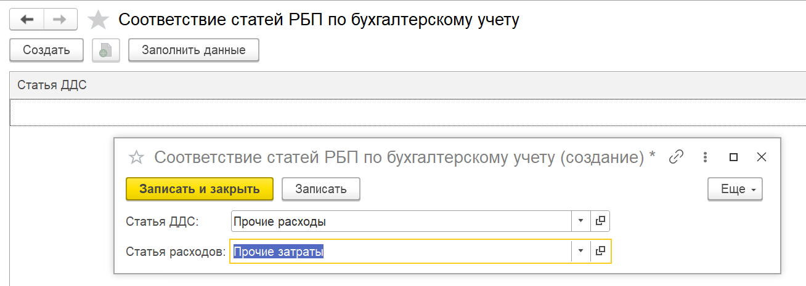

При закрытии месяца в бухгалтерии предприятия выполняется регламентная операция по списанию расходов будущих периодов. Однако данные по этим расходам могут не попадать в отчёт о прибылях и убытках (P&L), что искажает финансовый результат и требует ручной корректировки. 

Для корректного отражения расходов будущих периодов в отчёте P&L необходимо однократно настроить соответствие между статьями РБП и статьями расходов по бухгалтерскому учёту, после чего выполнить заполнение данных за нужный период. В дальнейшем все операции при закрытии месяца будут обрабатываться автоматически.

## **Шаг 1. Настройка соответствия статей**

1. Откройте раздел **«Настройки»** программы.

2. Перейдите в блок **«PnL»**

3. Выберите пункт **«Соответствие статей РБП по бухгалтерскому учету»**.

   [image:./raskhod-buduschikh-periodov-po-bukh-uchetu.webp:::0,0,100,100::square,1.1278,70.9125,45.0376,15.2091,,top-left&square,50.3759,83.0798,37.0677,7.7947,,top-left:1330px:526px:center]

4. В открывшемся справочнике заполните соответствие:

   -  Статья -- выберите статью из справочника для отчета ОПиУ.

   -  Соответствующую статью расходов по бухгалтерскому учету

      {width=1308px height=465px}

      

:::quote 

**Важно:** настройка выполняется **один раз**. В дальнейшем она будет использоваться автоматически при всех операциях.

:::

### **Шаг 2. Первичное заполнение данных**

1. После заполнения соответствия выделите нужные строки и нажмите кнопку **«Заполнить данные»**.

   [image:./raskhod-buduschikh-periodov-po-bukh-uchetu-3.webp:::0,0,100,100::square,0.9009,52.3026,99.0991,28.2895,,top-left&square,12.1321,17.1053,13.8138,18.4211,,top-left:1665px:304px:center]

2. В появившемся диалоге укажите **дату начала периода**, с которого нужно заполнить данные по РБП.

3. Программа автоматически:

   -  проанализирует все документы по указанным статьям РБП;

   -  сформирует движения для **ОПиУ (метод начисления)**.

### **Шаг 3. Автоматическая работа в дальнейшем**

-  После выполнения первичного заполнения **все последующие документы**, создаваемые при закрытии месяца, будут автоматически обрабатываться модулем P&L.

-  Регламентная операция **«Закрытие месяца»** с видом «Расходы будущих периодов» теперь будет корректно передавать данные в отчёт P&L без дополнительных ручных действий.

## **Итог**

Настройка соответствия статей и однократное заполнение данных обеспечивают:

-  автоматический перенос расходов будущих периодов в отчёт P&L;

-  исключение ручных корректировок при закрытии месяца;

-  корректное формирование финансового результата по методу начисления.