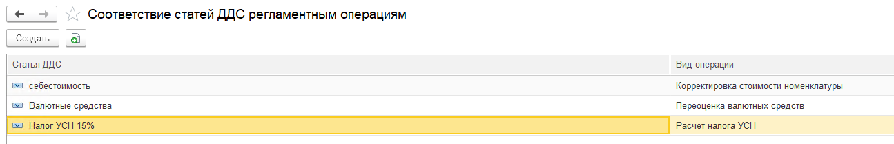

В **1С:Бухгалтерия предприятия** в  бухгалтерском учете при закрытии месяца выполняются регламентные операции (например, расчет себестоимости, переоценка валюты). Для целей управленческого учета по методу начисления необходимо отражать финансовый результат.

В системе реализовано соответствие статей с регламентными операциями.

:::tip 

На данный момент реализованы следующие операции:

-  Корректировка стоимости номенклатуры

-  Переоценка валютных средств

-  Расчет налога УСН

-  Амортизация и износ основных средств

-  Начисление налогов на единый налоговый счет

-  Расчет налога на прибыль

-  Расчет транспортного налога

:::

### **Шаг 1: Настройки соответствия**

Нужно перейти во вкладку настройки -> P&L

[image:./reglamentnye-operacii-2.png:::0,0,100,100::square,41.5698,64.5429,31.4922,8.3102,,top-left:1032px:361px:center]

Отразить по операциям статьи

{width=1295px height=209px}

Все последующие документы будут заполнятся автоматически. Операции по этим статьям будут отражаться в отчете ОПиУ методом начисления.