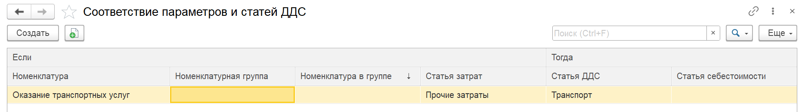

В модуле требуется распределять суммы документов по статьям. Чтобы автоматизировать процесс подстановки статей ДДС в табличные части документов, используется механизм **«Соответствие параметров и статей ДДС»**.

С его помощью можно задать правила, по которым система сама будет проставлять нужные статьи в зависимости от значений номенклатуры, статьи затрат и других параметров.

## **Где находятся настройки**

1. Перейдите в раздел **Настройки** -> **P&L**.

2. Выберите пункт **«Соответствие параметров и статей ДДС»** (возможно название «Соответствие параметрам статей ДДС» или «Параметры распределения статей ДДС»).

   [image:./nastroyka-sootvetstviya-parametrov-i-statey-dds.png:::0,0,100,100::square,88.8729,0,9.7631,9.2702,,top-left&square,0,82.8402,43.2879,16.9625,,top-left&square,45.5851,73.9645,28.2843,7.1006,,top-left:1393px:507px:center]

## **Структура правила (блок «Если»)**

В окне настройки представлена таблица или конструктор, где каждая запись соответствует условию «Если … то …».

{width=1863px height=262px}

#### **Условия (блок «Если»)**

В левой части задаются параметры, по которым система будет выбирать правило. Доступны следующие реквизиты:

-  **Номенклатура** – конкретный товар, услуга или работа.

-  **Номенклатурная группа** – справочник «Номенклатурные группы» 

-  **Номенклатура в группе** – группа, в которую входит номенклатура.

-  **Статья затрат** – если в документе используется справочник «Статьи затрат».

Вы можете указать как **один** параметр (например, только номенклатуру), так и **несколько** (например, связку «Номенклатура» + «Статья затрат»). В последнем случае правило сработает только при одновременном совпадении обоих значений.

#### **Результат (что подставляется)**

В правой части для каждого условия задаются:

-  **Статья ДДС** – статья движения денежных средств, которая будет автоматически проставлена в документ.

-  **Статья себестоимости** (если необходимо, например, для отчета о розничной продажи, или реализации).

## **Документы, в которых работает автоматическая подстановка**

Механизм срабатывает при проведении следующих документов:

-  Реализация (акт, накладная, УПД)

-  Отчёт о розничных продажах

-  Поступление (акт, накладная, УПД)

## **Как это работает при проведении документа**

1. Пользователь создаёт и заполняет документ обычным образом (указывает номенклатуру, количество, сумму и т.д.).

2. При проведении документа система автоматически проверяет наличие настроенных правил (соответствий) для комбинации параметров из табличной части.

3. Если подходящее правило найдено, то при проведении документ распределяется с уже проставленными статьями. 

:::tip Важные замечания

Если для одной комбинации параметров задано несколько правил, система может использовать первое подходящее (зависит от реализации, обычно правила проверяются в порядке их списка).

Правила можно комбинировать: для одной номенклатуры можно задать разные статьи ДДС в зависимости от статьи затрат или других условий.

После настройки правил рекомендуется протестировать их на одном из документов, чтобы убедиться в корректности подстановки.

:::