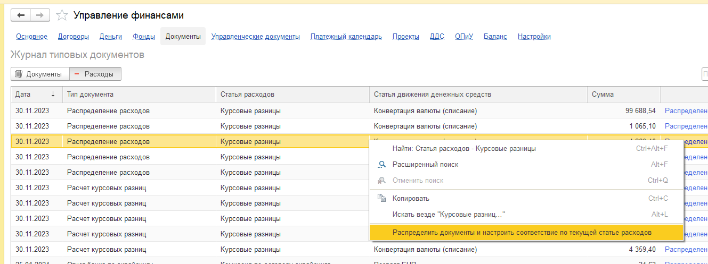

В конфигурации Управление торговлей документы разделены на 2 части. Остальные расходные документы отражены на вкладке **Расходы**

{width=374px height=104px}

Ответственному сотруднику необходимо контролировать, чтобы все документы были со статусом **Распределено** для корректного отражения данных в отчете ОПиУ.

Для того, чтобы распределить документы, необходимо выполнить команду в контекстном меню **Распределить документы и настроить соответствие по текущей статье расходов**

{width=1329px height=497px}

Настроить соответствие между статьями расходами со статьями ДДС необходимо установить в [настройках](./../nastroyki/nastroyki-p-l#соответствие-статей-затрат-и-статей-ддс).