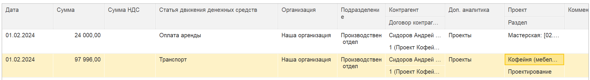
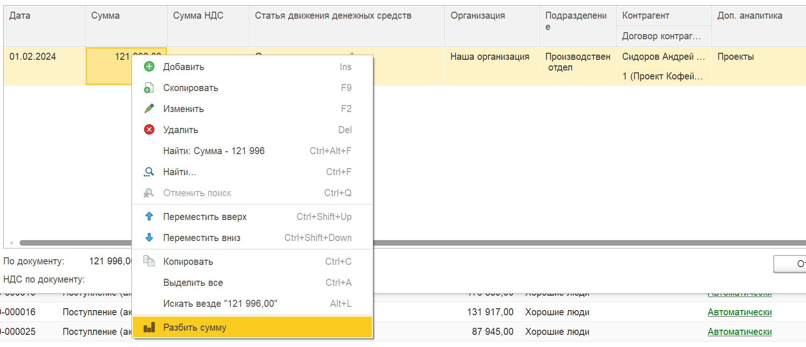
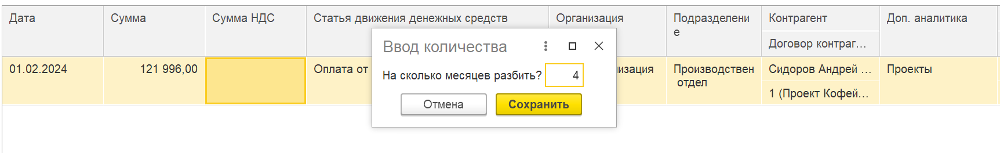
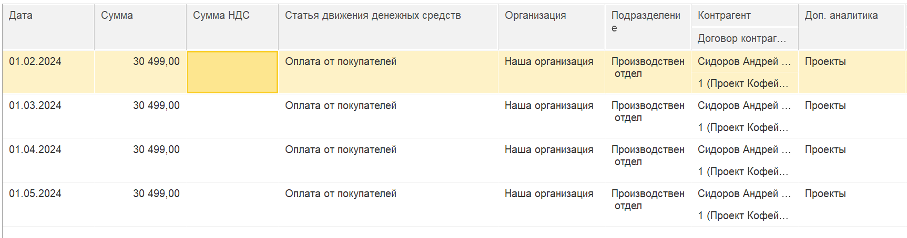
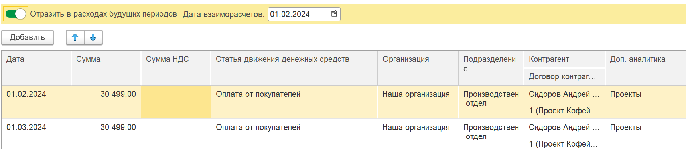

Каждый документ в модуле P&L имеет статус. Первичный статус -- **«Не распределено»**. Это означает, что документ ещё не отражён в отчётах, так как по нему не указана статья доходов/расходов.

**Статья** -- ключевой аналитический признак для учёта прибылей и убытков. Если документу автоматически или вручную присвоена статья, он сразу отражается в отчёте о прибылях и убытках по этой статье.

**Ручное распределение** -- механизм, позволяющий перераспределить сумму документа вручную: разбить её на несколько частей с разными статьями, проектами, направлениями деятельности или периодами.

## **Включение ручного распределения**

#### **1\. Через документ**

Откройте нужный документ (например, поступление, акт выполненных работ, расходную накладную).

[image:./ruchnoe-raspredelenie-dokumentov.png:::0,0,100,100::square,33.2153,0,13.0383,20.5224,,top-left:1695px:268px:center]

#### 2\. Через вкладку «Документы»

Нажмите на статус документа

[image:./ruchnoe-raspredelenie-dokumentov-2.png:::0,0,100,100::square,90.8565,22.792,9.1435,77.208,,top-left:1977px:402px:center]

#### 3\. Установите флажок **«Включить ручное распределение»**.

Справа от флажка отображается информация о последнем изменении: кто и когда редактировал распределение (для сохранения истории).

[image:./ruchnoe-raspredelenie-dokumentov-3.png:::0,0,100,100::square,0.2354,12.3786,24.2496,12.3786,,top-left&square,68.864,12.8641,30.6651,11.4078,,top-left:1699px:412px:center]

## **Заполнение табличной части распределения**

Вы можете добавлять строки, копировать их, менять суммы и реквизиты.

{width=2016px height=277px}

## **Разбивка по расходам будущих периодов (РБП)**

Для документов типа «Акт выполненных работ», «Поступление (накладная)», «Расходная накладная» предусмотрена возможность автоматического распределения суммы на несколько месяцев в счёт расходов будущих периодов.

**Как сделать:**

1. В табличной части щёлкните правой кнопкой мыши по строке.

2. Выберите команду **«Разбить сумму»** (или аналогичную).

3. Укажите количество месяцев, на которое нужно разбить сумму.

4. Система равномерно распределит указанную сумму по месяцам, создав отдельные строки с соответствующими датами.

{width=1723px height=743px}

{width=1725px height=264px}

{width=1725px height=454px}

В результате в отчёте о прибылях и убытках операция будет отражаться частями в каждом периоде.

## **Влияние на взаиморасчёты с контрагентами**

:::info 

[Ссылка на статью, для чего нужны взаиморасчеты](./../balans/vzaimoraschety-2)

:::

:::info 

[Ссылка на статью, для чего нужны расходы будущих периодов](./../balans/raskhody-buduschikh-periodov)

:::

#### **Вариант А: Взаиморасчёты по периодам распределения**

По умолчанию взаиморасчёты с контрагентом будут закрываться в те же периоды, которые указаны в строках табличной части. То есть задолженность будет погашаться частями синхронно с отражением расходов/доходов.

#### **Вариант Б: Закрытие взаиморасчётов сразу с переносом остатка в РБП**

Если необходимо закрыть взаиморасчёты полностью в момент документа, а в расходах будущих периодов отражать только распределение по месяцам:

1. В форме ручного распределения установите флажок **«Отразить в расходах будущих периодов»** (название может отличаться в зависимости от конфигурации).

   {width=1720px height=376px}

2. Укажите дату взаиморасчётов. По умолчанию подставляется дата из первой строки табличной части (*рекомендуется оставить её без изменений, чтобы не нарушить баланс*).

3. После этого:

   -  Взаиморасчёты с контрагентом закроются (или возникнут) сразу на полную сумму документа.

   -  Остаток, подлежащий распределению по периодам, будет отражён в блоке **«Расходы будущих периодов»**.

   -  В отчёте о прибылях и убытках сумма будет показываться частями согласно строкам распределения (РБП), а взаиморасчёты на P&L не влияют.

**Важно:** Изменение даты взаиморасчётов вручную может привести к искажению баланса. Будьте внимательны.

## **Просмотр результатов**

-  В отчёте о прибылях и убытках операции отобразятся по тем датам и статьям, которые заданы в строках распределения.

-  В блоке **«Расходы будущих периодов»** можно видеть, как остаток списывается по месяцам.

-  Управленческие взаиморасчёты с контрагентом отразятся в соответствии с выбранным вариантом.

## **Примечания**

-  Функция доступна только при установленном флаге «Включить ручное распределение».

-  Общая сумма в табличной части должна строго равняться сумме документа.

-  При разбивке на РБП автоматически создаются строки с равными долями на каждый месяц.

-  История изменений сохраняется (кто и когда редактировал распределение).