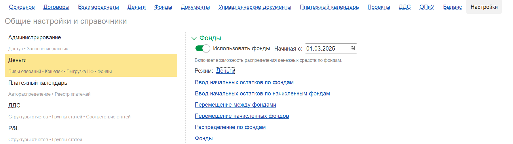
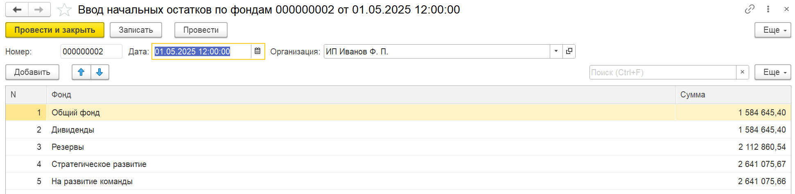
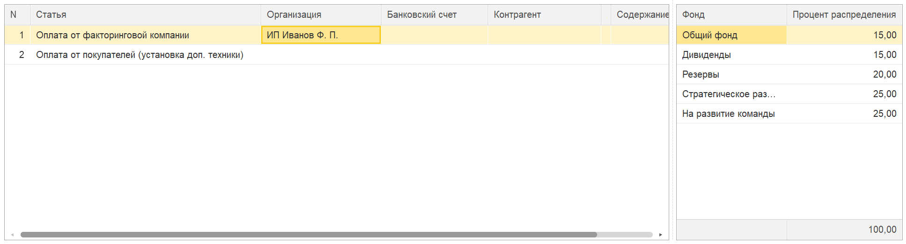
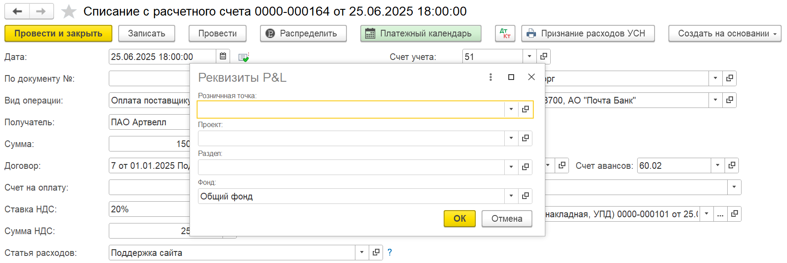
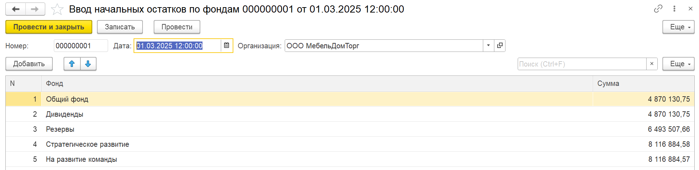
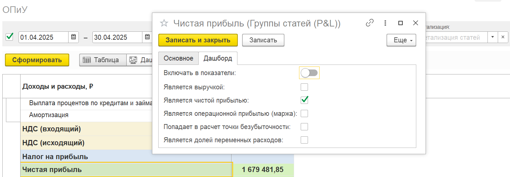
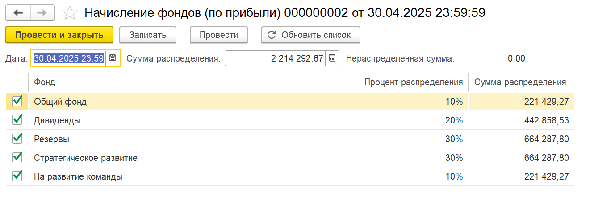
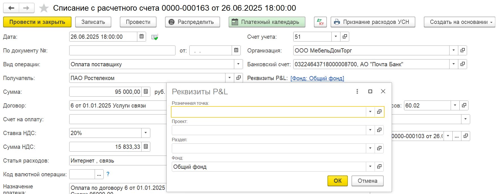
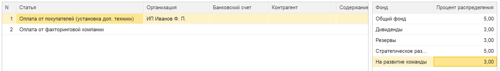
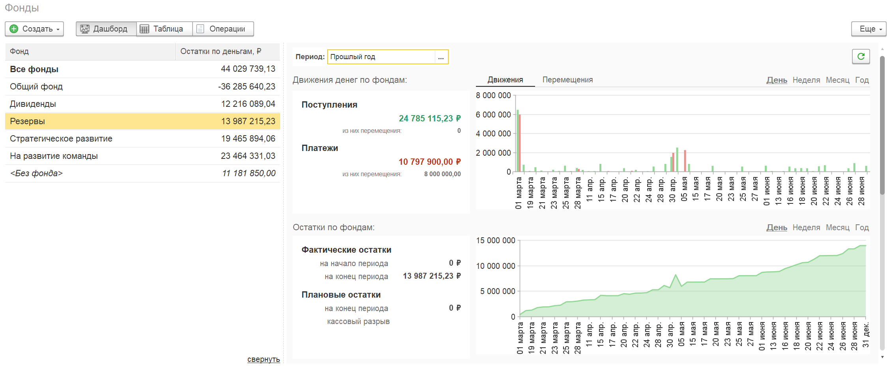

**Фонды в модуле P&L** -- это инструмент управления капиталом, позволяющий распределять средства по виртуальным «конвертам» (например, налоги, дивиденды, развитие). Это дает собственнику прозрачную картину и защищает от нецелевых трат (например, не позволяет потратить деньги, предназначенные для будущих налогов или дивидендов).

Система предлагает **три режима** работы. Выбор режима зависит от методики учета в компании:

1. **Деньги:** Учитывается только фактическое движение денег.

2. **Начисления:** Учитываются плановые начисления из чистой прибыли.

3. **Начисление + Деньги:** Комбинированный режим с двойным контролем (самый надежный вариант).

## **Общая настройка (для любого режима)**

Прежде чем начинать работу, необходимо включить функционал:

1. Перейдите в раздел **«Настройки»** -> **«Деньги»**.

2. Установите галочку **«Использовать фонды»**.

3. Укажите **«Дату начала учёта по фондам»**. С этой даты система начнет отслеживать движения.

{width=1782px height=501px}

## **1\. Режим «Деньги»**

Этот режим подходит, если вы хотите распределять по фондам все фактические денежные потоки (кассовые ордера и банковские выписки).

### **1\.1. Настройка режима**

1. **Создание справочника фондов:**

   -  Перейдите в справочник **«Фонды»**.

   -  Создайте элементы: *Фонд налогов*, *Резервный фонд*, *Фонд развития*, *Фонд дивидендов*, *Общий фонд* и т.д.

   -  Для упрощения работы выберите один фонд (например, «Общий фонд») и установите галочку **«Использовать по умолчанию при списании»**.

2. **Ввод начальных остатков:**

   -  Откройте документ **«Ввод начальных остатков по фондам»**.

   -  Укажите дату и внесите суммы по каждому созданному фонду.

      {width=1942px height=474px}

3. **Настройка автоспределения поступлений:**

   -  Создайте документ **«Распределение по фондам»**.

   -  Укажите, какой процент от каждой поступающей суммы должен идти в тот или иной фонд (например, налоги -- 5%, дивиденды -- 10%, общий фонд -- 85%).

      {width=1936px height=522px}

### **1\.2. Ежедневная работа**

1. **Поступления:** При проведении документа поступления (на р/с или в кассу) система автоматически разнесет сумму по фондам согласно заданным правилам в документе «**Распределение по фондам**».

2. **Списания (Расходы):**

   -  При создании расходного документа (списание с р/с, расходный ордер) в блоке **«Реквизиты P&L»** появилось поле **«Фонд»**.

      {width=1765px height=592px}

   -  Укажите, с какого фонда берутся деньги (например, оплата налога -- из фонда «Налоги», покупка оборудования -- из фонда «Развитие»).

   -  **Важно:** Если у вас настроен фонд по умолчанию, поле заполнится автоматически. Меняйте его только при списании из других фондов.

3. **Контроль:** Если на выбранном фонде недостаточно средств, система выдаст предупреждение, защищая от перерасхода.

## **2\. Режим «Начисления»**

Этот режим подходит, если фонды должны пополняться не по факту поступления денег, а по факту получения чистой прибыли (на основании отчета о прибылях и убытках).

### **2\.1 Настройка режима**

1. В настройках раздела «Деньги»  установите режим **«Начисления»**.

2. Создайте справочник **«Фонды»**.

3. Введите начальные остатки с помощью документа **«Ввод начальных остатков по начисленным фондам»** (укажите дату и сумму по каждому фонду).

   {width=1947px height=475px}

### **2\.2. Начисление и списание**

#### **Начисление в фонды:**

1. Сформируйте стандартный отчет **«Отчет о прибылях и убытках»** (например, за апрель).

2. Убедитесь, что в настройках отчета группа «Чистая прибыль» определена корректно. Для этого в самой группе в блоке «дашборд» укажите отметкой «является чистой прибылью»

   {width=1540px height=535px}

3. В сформированном отчете нажмите кнопку **«Начислить фонды»**.

   [image:./_index0.png:::0,0,100,100::square,71.0069,65.3659,12.1528,25.8537,,top-left:1849px:219px:center]

4. Система перенесет сумму чистой прибыли в документ начисления, где вы сможете распределить её по созданным фондам вручную.

   {width=1339px height=442px}

#### **Списание:**

-  При создании расходных денежных документов также появится поле «Фонд».

   {width=1759px height=691px}

-  Указывайте фонд только тогда, когда трата относится к накопленному резерву (например, выплата дивидендов).

## **3\. Режим «Начисление + Деньги» (Полная модель)**

Это самая надежная модель, совмещающая два предыдущих подхода и обеспечивающая двойной контроль. Она защищает от трат авансов и не позволяет «проесть» будущую прибыль.

### **3\.1. Настройка режима**

1. В настройках раздела «Деньги» установите режим **«Начисление + Деньги»**.

2. **Обязательные действия:**

   -  Создайте справочник **«Фонды»**.

   -  Введите остатки **по деньгам** (документ «Ввод начальных остатков по фондам»).

   -  Введите остатки **по начислениям** (документ «Ввод начальных остатков по начисленным фондам»).

3. **Настройка распределения поступлений:**

   -  Создайте документ **«Распределение по фондам»**.

   -  В отличие от режима «Деньги», здесь вы можете распределять не 100% поступлений, а только их часть. Например: 20% от всех поступлений уходят в фонды (дивиденды 3%, налоги 1%, развитие 16%), а остальное идет в общий оборот.

      {width=1938px height=277px}

### **3\.2. Работа и двойной контроль**

-  **Поступления:** Автоматически распределяются по «денежной» части фондов согласно правилам. (*Работает согласно пункту 1.2*)

-  **Начисления:** Периодически (раз в месяц) через отчет о прибылях и убытках вы нажимаете **«Начислить в фонды»**, добавляя средства в «начисленную» часть фондов. (*Работает согласно пункту 2.2*)

-  **Списания:** При расходных операциях указываете фонд (*Работает согласно пункту 2.2*)

-  **Контроль:** При попытке списать деньги система проверяет **оба показателя**:

   1. Достаточно ли денег на «денежном» остатке фонда?

   2. Достаточно ли средств начислено в этом фонде (*не пытаетесь ли вы потратить то, что еще не заработали*)?

## **Аналитика и перемещения**

Независимо от выбранного режима, для просмотра состояния фондов используйте вкладку **«Фонды»**.

-  Вы увидите все операции по фондам.

-  В комбинированном режиме («Начисление + Деньги») вы сможете видеть отдельно остатки по деньгам и остатки по начислениям.

-  Для корректировки или переброски средств между фондами используйте документ **«Перемещение»** (доступен во вкладке фонды).

{width=2263px height=931px}