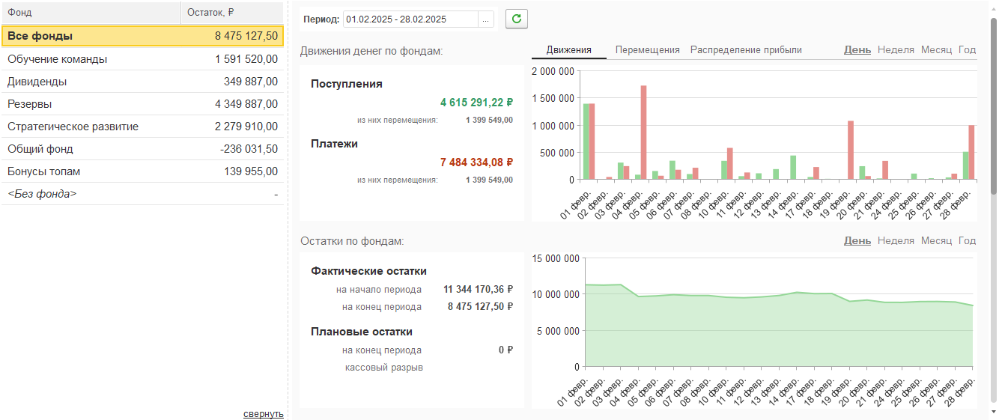
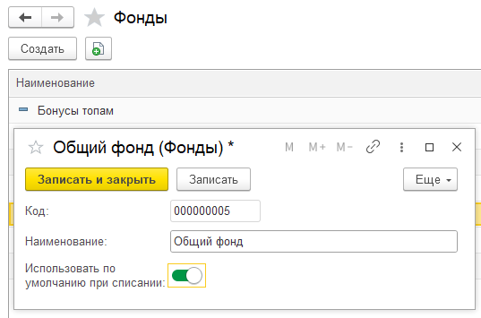
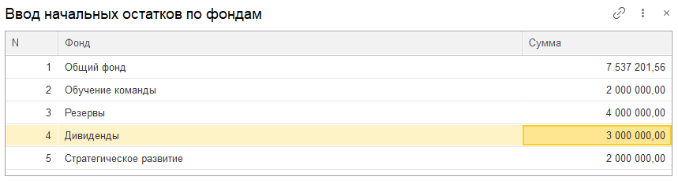
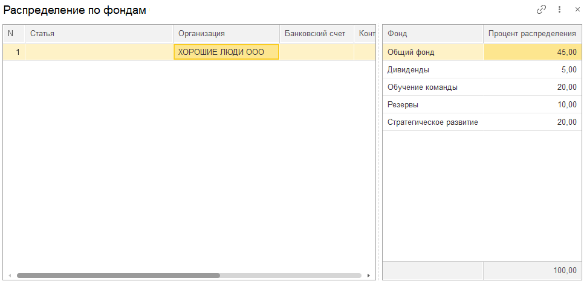
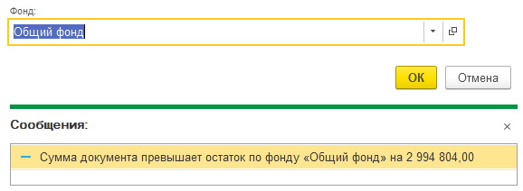
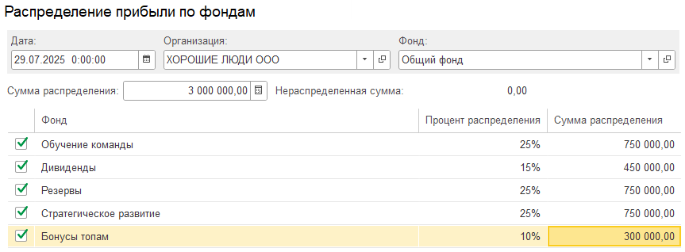
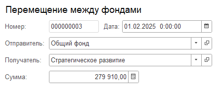
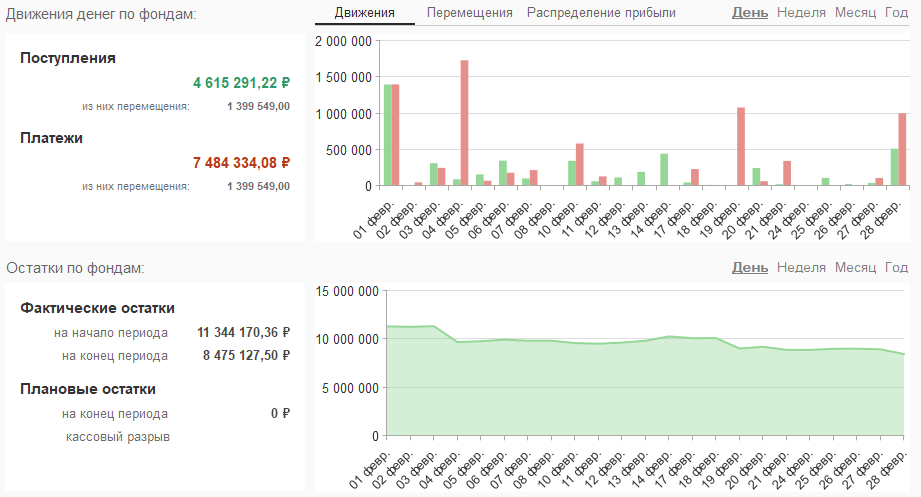

## **Что такое фонды и зачем они нужны?**

Представьте, что все деньги компании лежат в одной большой коробке. Фонды -- это система **целевых "конвертов" (папок, корзин)** внутри этой коробки. Вы разделяете общую денежную массу на части, каждая из которых предназначена для строго определенной цели.

**Главная цель:** Обеспечить финансовую дисциплину, прозрачность и контроль над использованием средств. Вы точно знаете, сколько денег уже зарезервировано под ключевые нужды, а сколько доступно для операций.

-  **Защита ключевых выплат:** Деньги на налоги и дивиденды не "растворяются" в общих расходах.

-  **Планирование:** Видите реальные остатки по целям (например, сколько *точно* можно потратить на развитие в этом месяце?).

-  **Контроль:** Невозможно случайно потратить деньги из "налогового" конверта на офисные ручки.

-  **Отчетность:** Понятная картина, как деньги распределяются по ключевым направлениям деятельности.

-  **Дисциплина:** Заставляет осознанно подходить к распределению прибыли.

   {width=1334px height=561px}

## **Примеры фондов:**

-  **Фонд налогов:** Деньги, отложенные *сразу* для уплаты налогов. Гарантия, что налоги будут заплачены вовремя.

-  **Резервный фонд:** "Подушка безопасности" на непредвиденные расходы или кризисные ситуации.

-  **Фонд развития:** Средства, выделенные *целенаправленно* на инвестиции в бизнес (новое оборудование, ПО, маркетинг).

-  **Фонд дивидендов:** Деньги, зарезервированные для выплаты владельцам (акционерам) компании. Позволяет планировать выплаты.

-  **Общий фонд (или Операционный фонд):** Средства для покрытия текущих операционных расходов (зарплаты, аренда, коммуналка, закупки).

## **Как настроить Фонды в системе? (Пошаговая инструкция)**

### **Шаг 0: Включение функционала**

-  Идем в **Настройки** системы.

-  Находим раздел **"Деньги"**.

-  **Ставим галочку "Использовать фонды"**. Это активирует весь функционал модуля.

-  **Указываем Дату начала учета по фондам.** С этой даты система начнет отслеживать движение денег по фондам. *Важно: Все операции до этой даты фондироваться не будут.*

   

   [image:./fondy.png:::0,0,100,100::square,0.4202,18.3267,43.3824,12.9482,,top-left&square,45.3782,61.5538,44.6429,16.7331,,top-left:952px:502px]

   

### **Шаг 1: Создаем сами Фонды**

-  Нужно завести значения в справочник **"Фонды"**

-  Создаем элементы справочника для каждого нужного вам "конверта": `Фонд_Налогов`, `Резервный_Фонд`, `Фонд_Развития`, `Фонд_Дивидендов`, `Общий_Фонд` и т.д.

-  **Важно для упрощения:** Для одного из фондов (чаще всего `Общий_Фонд`) можно установить галочку **"Использовать по умолчанию при списании"**. *Зачем? См. ниже в работе.*

   [image:./fondy-2.png:::0,0,100,100::square,45.8155,91.9118,12.5536,8.0882,,top-left:932px:408px]

   {width=537px height=355px}

### **Шаг 2: Задаем начальные остатки**

-  На дату начала учета у вас уже должны быть деньги, распределенные по фондам (или лежащие в одном общем фонде).

-  Для этого используется специальный документ: **"Ввод начальных остатков по фондам"** 

-  В этом документе:

   -  Указываете **Дату** (дату начала учета или чуть раньше).

   -  Выбираете **Фонды** из созданного справочника.

   -  Вносите **Сумму**, которая уже находилась на этом фонде на указанную дату.

-  Этот документ "стартует" ваш учет, задавая первоначальный баланс по каждому "конверту".

{width=859px height=234px}

### **Шаг 3: Настраиваем автораспределение**

-  Документ **"**Распределение по фондам**"**.

-  **Цель:** Автоматически распределять *поступающие* деньги (например, выручку от клиентов) по вашим фондам в заданной пропорции.

-  **Как настроить:**

   -  Создаете документ "Распределение по фондам".

   -  Указываете, **какой процент** от каждой поступающей суммы должен идти в `Фонд_Налогов`, `Фонд_Дивидендов`, `Фонд_Развития` и т.д.

   -  **Вариант упрощения:** Можно указать 100% на `Общий_Фонд`. Тогда *все* поступления сначала будут падать туда, а вы потом вручную или раз в период будете их распределять по другим фондам.

-  **Как работает:** После проведения этого документа, при регистрации поступления денег (Платеж от клиента), система *сама* разнесет сумму по фондам согласно вашим процентам при проведении документов.

   {width=966px height=471px}

### **Как работать с фондами в повседневных операциях?**

#### **При списании денежных операции:**

-  Когда вы создаете любой денежный документ на расход (Кассовый расходный ордер, Списание с расчетного счета, Выплата зарплаты и т.д.), в форме документа появится дополнительный реквизит "Фонд" в блоке реквизиты P&L

-  Вам ОБЯЗАТЕЛЬНО нужно указать, с какого Фонда берутся деньги для этой операции.

-  **Упрощение:** Если вы настроили `Общий_Фонд` как "Фонд по умолчанию", это поле будет *автоматически* заполняться этим фондом. Вам нужно будет менять его **только если** списание идет с другого фонда (например, платите налоги – укажите `Фонд_Налогов`; покупаете новое оборудование за счет развития – укажите `Фонд_Развития`).

-  **Система контроля:** Если на указанном фонде недостаточно средств, система  выдаст предупреждение. Это ваша защита от перерасхода по целям.

   [image:./fondy-6.png:::0,0,100,100::square,59.2554,32.9457,25.1293,7.1705,,top-left&square,39.5036,77.907,54.8087,10.0775,,top-left:967px:516px]

   {width=578px height=212px}

#### **При поступлений денежных операции:**

Если вы настроили **Правила распределения**, то при вводе приходного документа, деньги автоматически распределятся по фондам согласно вашим процентам.

:::tip 

Обязательно нужно указать правила распределения. Иначе средства будут поступать в пустой фонд.

:::

 

## **Ручное перераспределение между фондами**

### **Распределение прибыли:**

**Сценарий 1:** Вы используете автораспределение на `Общий_Фонд` (100%). Поступающие деньги сначала копятся там.

**Сценарий 2:** У вас изменились планы или пропорции, нужно скорректировать остатки фондов.

**Инструмент:** Документ **"Распределение прибыли"** или **"Перераспределение по фондам"** (Находится во вкладке **"Фонды" -> "Создать распределение прибыли"**).

**Как использовать:**

1. Указываете **Дату** операции.

2. Выбираете **Фонд-источник** (чаще всего `Общий_Фонд`, откуда вы *забираете* деньги).

3. Указываете **Сумму**, которую хотите перераспределить (можно всю сумму источника или часть).

4. Задаете **Процентное соотношение**, в котором эта сумма должна быть *разделена* между **Фондами-получателями** (`Фонд_Налогов`, `Фонд_Развития` и т.д.). Проценты должны в сумме давать 100%.

**Когда делать?** Чаще всего – **раз в месяц**, после того как сформирован предварительный (или окончательный) отчет P&L. Глядя на финансовый результат, вы понимаете, *сколько* денег нужно направить на налоги (исходя из прибыли), сколько можно выделить на дивиденды, сколько отложить в резерв и инвестировать в развитие.

[image:./fondy-9.png:::0,0,100,100::square,2.5641,10.1408,26.6667,9.8592,,top-left&square,3.0769,27.6056,74.8718,9.0141,,top-left:390px:355px]

{width=863px height=318px}

### Перемещение между фондами

Если на вашем фонде не хватает денег или нужно перевести средства с другого фонда, воспользуйтесь документом «Перемещение между фондами».

**Как использовать:**

1. Выбираете **Фонд-Отправитель**(чаще всего `Общий_Фонд`, откуда вы *забираете* деньги).

2. Выбираете Фонд-Получатель

3. Указываете **Сумму**.

   [image:./fondy-12.png:::0,0,100,100::square,0,37.2549,77.6316,14.1176,,top-left:380px:255px]

   {width=451px height=190px}

## **Как контролировать? Вкладка «Фонды»**

Ключевые параметры данной вкладки

-  Список всех ваших Фондов.

-  Текущий остаток на каждом Фонде

-  Детальную историю всех операций по каждому фонду: Поступления, Списания, Перераспределения. Можно отфильтровать по дате, сумме, контрагенту.

-  Визуальные дашборды (графики/диаграммы): Показывают динамику остатков, структуру фондов, основные движения средств. Дают быстрый обзор.

   {width=921px height=497px}

## **Ключевые моменты**

1. **Фонды = Целевые Конверты:** Разделяйте деньги по назначению (налоги, дивиденды, развитие и т.д.) для контроля и дисциплины.

2. **Включите и настройте:** Активируйте функционал в Настройках -> Деньги. Создайте справочник фондов. Задайте начальные остатки.

3. **Автоматизируйте Поступления (Опционально):** Используйте "Правила распределения", чтобы деньги приходовались сразу в нужных пропорциях по фондам. Либо пусть все падает в `Общий_Фонд`.

4. **Указывайте Фонд при РАСХОДАХ:** Всегда выбирайте, с какого "конверта" списываете деньги. Используйте "Фонд по умолчанию" (`Общий_Фонд`) для упрощения рутинных трат.

5. **Перераспределяйте Осознанно:** Ключевой документ – **"Распределение прибыли"**. Используйте его (чаще раз в месяц), чтобы *осознанно* перемещать деньги из `Общего_Фонда` в целевые фонды, основываясь на финансовых результатах (P&L) и ваших планах.

6. **Контролируйте через Дашборд:** Регулярно смотрите вкладку "Фонды", чтобы видеть остатки и движение средств. Это ваша финансовая "панель управления".

:::tip Совет

Начните с простой схемы (например, только `Общий_Фонд`, `Фонд_Налогов`, `Фонд_Дивидендов`). Когда привыкнете, добавляйте `Резервный` и `Развития`. Использование "Фонда по умолчанию" и ежемесячного "Распределения прибыли" значительно упрощает жизнь. Главное – начать использовать инструмент контроля!

:::

