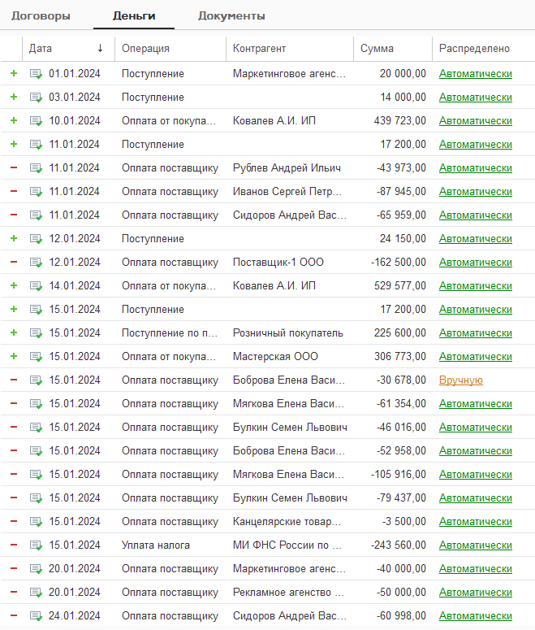

Представляет собой набор инструментов для ведения финансового учета.

Позволяет отслеживать ввод новых договоров и бухгалтерских документов: движение денежных средств и исполнение обязательств и определить, как будут отображаться бухгалтерские документы с точки зрения финансового учета. Распределяет деньги по проектам, направлениям деятельности или магазинам

## Левая сторона рабочего стола

[image:./nachalnaya-stranica.png:::0,0,100,100::square,0,1.4168,76.6002,5.4309,,top-left,&square,0,7.32,100,26.0921,,top-left,&square,0,34.0024,100,32.4675,,top-left,&square,0,66.8241,100,32.7037,,top-left,&square,1.469,21.3695,14.0609,4.0142,Каждая сумма кликабельная. Открывается справа документы с учетом отбора,top-left:953px:847px]

1. Отборы для анализ финансового состояния, движения денежных средств и исполнения обязательств за указанный период.

2. Показывает, какие договоры и документы уже обработаны, а какие еще требуют внимания или корректировки.

3. Данные по движению денежных средств формируется на основе основной структуры отчета ДДС: формирование данных происходит только по тем статьям ДДС, которые были отражены в структуре отчета. Для отражения основной структуры ДДС перейдите в [настройки](./nastroyki/nastroyki-dds).

4. Остатки денежных средств отражаются на основании данных по бухгалтерскому учету + учет по кошельку. 

5. Каждая сумма кликабельная. Открывается справа документы с учетом отбора

## Правая сторона рабочего стола

{width=659px height=775px}

Отражает договора и бухгалтерские документы за период, отраженный в левой части рабочего стола.

Здесь пользователь может сразу проверить, проверены ли новые договора, распределены ли правильно бухгалтерские документы и сразу же здесь с ними поработать.