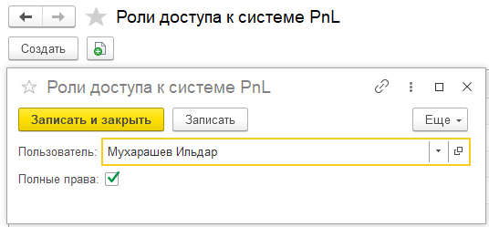

## Роли доступа к системе P&L

Необходима для выдачи прав доступа к системе. Данная система реализована для того, чтобы

ограничить пользователей с полными правами к этой системе.

Для того, чтобы выдать доступ к системе, необходимо добавить пользователя И выдать полные права.

{width=536px height=249px}

## Действия

Данные обработки необходимы для первичной настройки системы и для корректировки данных по необходимости после обновления.

## Дополнительная аналитика

Блок необходим для добавления дополнительного реквизита в каждый документ, что позволяет проводить более глубокую аналитику в отчетах. Если вас не устраивает название как **Дополнительная аналитика**, есть возможность назвать ее своим наименованием, указав в настройках. Реквизит может включать информацию о направлениях деятельности, подразделениях, магазинах и других важных аспектах.

{width=549px height=178px}