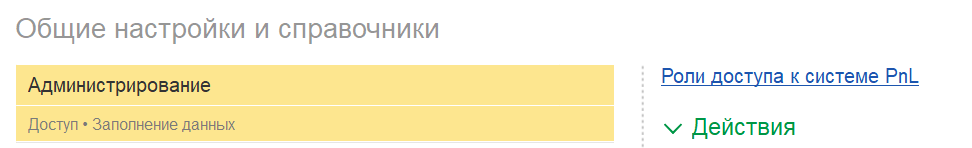
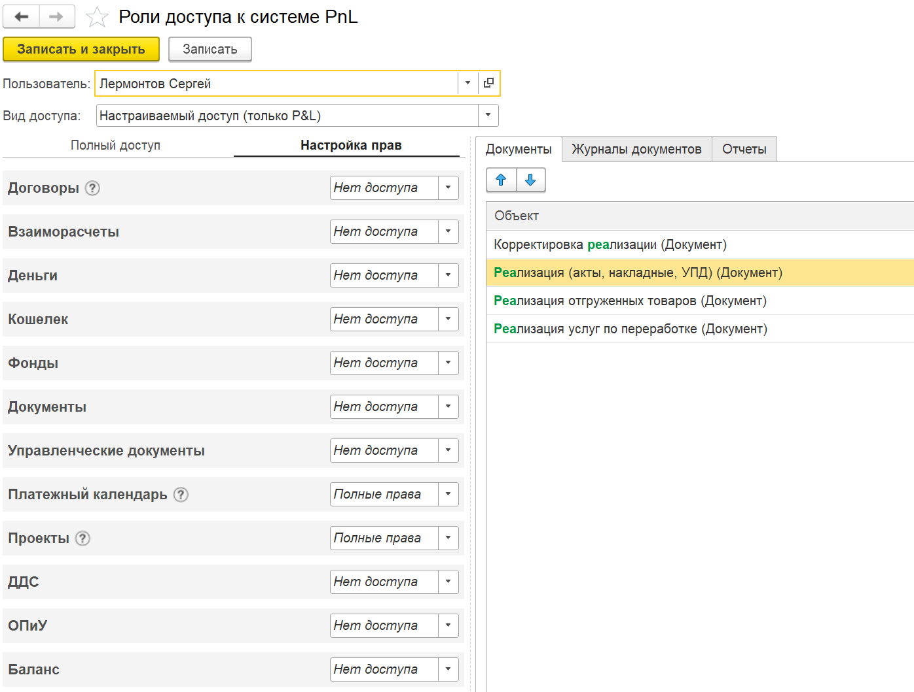
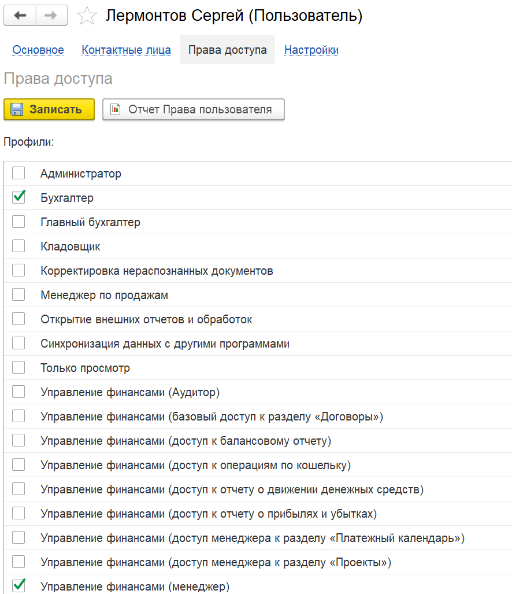

В стандартной конфигурации 1С существует ограниченная гибкость в настройке прав доступа для пользователей.

Часто возникает ситуация, когда необходимо предоставить сотруднику доступ только к определённым блокам данных или документам (например, к определённым блокам P&L, финансовым документам, счетам на оплату или актам), не открывая при этом полный доступ ко всей бухгалтерской системе.

В текущей модели для этого приходится назначать пользователю роль бухгалтера, что открывает ему доступ ко всем данным, включая лишние, что является небезопасным и неудобным.

Модуль решает эту проблему, предоставляя инструменты для **детальной настройки прав доступа** к блокам P&L и дополнительным документам.

Теперь можно гибко назначать доступ только к необходимым разделам, не нарушая безопасности и не перегружая пользователей избыточной информацией.

## **Пошаговая инструкция по настройке прав доступа**

### **Переход в блок настройки прав доступа**

-  Откройте раздел **«Настройки»**  -> **«Администрирование»**

-  Найдите подраздел **«Роли доступа к системе P&L (PNL)»**.

   {width=972px height=148px}

### **Обязательное добавление пользователя в блок P&L**

-  **Важно**: Каждый пользователь, который будет работать с блоком P&L, **должен быть добавлен в этот блок**, независимо от уровня его прав.

-  Если пользователь не добавлен, он **не сможет открыть подсистему P&L**, даже если у него есть полные права в 1С.

### **Создание новой роли доступа**

-  Нажмите **«Создать роль»** или **«Добавить пользователя»**.

-  Выберите сотрудника из списка пользователей системы.

   {width=1396px height=1059px}

### **Выбор вида доступа**

Доступно несколько вариантов:

#### **а) Полный доступ**

-  Пользователь получает доступ **ко всем блокам и функциям P&L**.

-  Подходит для  руководителей или финансовых директоров, которым нужен полный контроль.

#### **б) Настраиваемый доступ (для бухгалтеров)**

Позволяет предоставить доступ **только к определённым блокам P&L**.

-  **Пример**: Бухгалтер может видеть только блоки, связанные с платежным календарем или проектами.

-  **Важно**: Этому пользователю всё равно должны быть выданы **права бухгалтера в 1С**.

#### **в) Настраиваемый доступ только P&L (для менеджеров)**

-  Расширенный настраиваемый доступ, который включает:

   -  Выбор **определённых блоков P&L**.

   -  Возможность открыть доступ к **дополнительным документам** (например, счетам на оплату, актам, накладным).

-  **Пример использования**:

   Менеджеру можно открыть доступ к:

   -  Счетам на оплату

   -  Реализации (акты, накладные)

   -  Поступлениям (акты, накладные)

-  **Важно**:

   1. Пользователю **обязательно должны быть выданы права бухгалтера в 1С**.

   2. В интерфейсе 1С у него будет **только форма списка документов**, доступных согласно настройкам.

   3. Любые попытки открыть недоступные документы или разделы будут **автоматически блокироваться**.

\""){width=1704px height=383px}

#### **г) Роль «Аудитор»**

-  Пользователь **не видит блок P&L вообще**.

-  Все дополнительные реквизиты P&L скрыты в документах.

-  Не отображается блок распределения документов.

-  Подходит для аудиторов или сотрудников, которым не нужно работать с P&L.

#### **д) Нет доступа**

-  Пользователь **не имеет доступа к P&L**.

-  **Рекомендация**: Создавайте эту роль для всех сотрудников, которые не работают с P&L, чтобы избежать ошибок в системе.

### **5\. Сохранение и проверка настроек**

-  После настройки нажмите **«Сохранить»**.

-  Проверьте доступ, зайдя в систему под учётной записью пользователя.

---

## **Важные примечания**

1. **Обязательность добавления всех пользователей**:

   -  Даже если пользователю не нужен доступ к P&L, **создайте для него роль «Нет доступа»** во избежание системных ошибок.

2. **Базовые права в 1С**:

   -  Для работы с P&L пользователь **должен иметь как минимум права бухгалтера в основной системе 1С**.

   -  Если пользователю необходимо прикреплять файлы, создайте права доступа с ролью «**Добавление и изменение папок и файлов**»

      {width=886px height=1027px}

   

3. **Безопасность**:

   -  Даже если пользователь попытается получить доступ к заблокированным разделам через панель навигации или другими способами, система **автоматически запретит действие**.

4. **Гибкость настроек**:

   -  Вы можете комбинировать доступ к блокам P&L с доступом к конкретным документам (счета, акты, накладные).

## **Заключение**

Модуль P&L предоставляет **гибкий и безопасный инструмент** для управления правами доступа в 1С, позволяя точно настраивать видимость данных для разных ролей пользователей.

Это решение особенно полезно для предприятий с множеством сотрудников, где важно разграничивать доступ к финансовой информации.