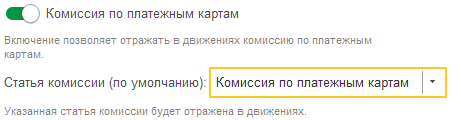
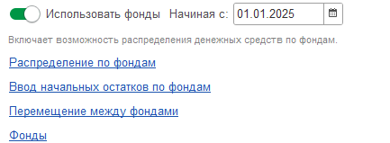
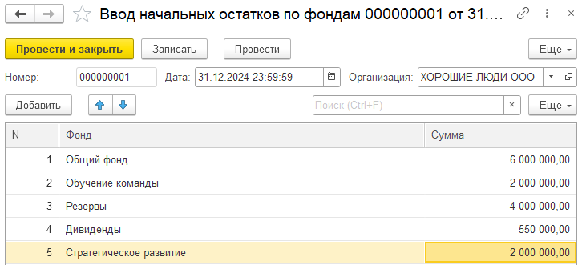
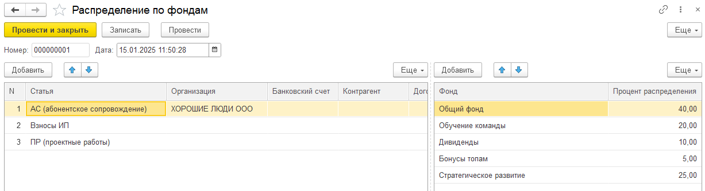

## Комиссия по платежным картам

В документе поступления на расчетный счет, если в качестве типа операции выбраны «Операции по платежным картам» и активировано отражение комиссии в настройках, то записи в регистры будут производиться с учетом суммы комиссии. 

После активации этого учета необходимо указать статью комиссии, на которую будет зафиксирована соответствующая сумма.

{width=461px height=120px}

## Фонды

Первичная настройка учета по фондам. Необходимо сначала активировать данный учет и указать дату начала использования данной системы.

{width=433px height=159px}

После необходимо ввести первоначальные остатки по фондам с помощью документа **Ввод начальных остатков по фондам**

{width=726px height=331px}

Далее необходимо задать правила распределения денежных поступлений на различные фонды.

Для этого необходимо создать документ **Распределение по фондам**

{width=1227px height=334px}

Слева задаются по условия, справа - процентное соотношение, как будут распределяться денежные средства.

