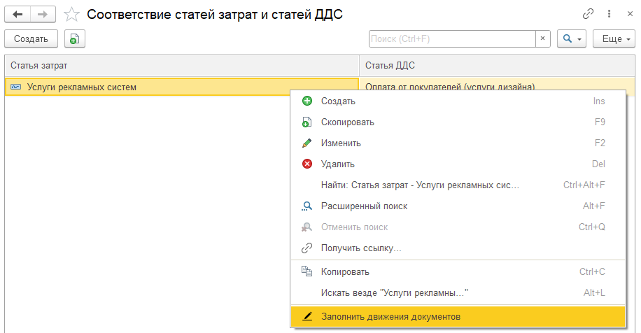

## Соответствие статей затрат и статей ДДС

Соответствие применяется для конфигураций «Бухгалтерия предприятия» и «Управление торговлей». Если в программе осуществлялся учет расходов по статьям в бухгалтерских документах, существует возможность связать данные статей расходов со статьями ДДС, чтобы отобразить информацию в отчете о прибыли и убытках.

После установки соответствия статей последующие документы при проведении будут автоматически сопоставляться и заполнять необходимые движения для отражения в отчетах.

Чтобы заполнить все прошлые документы, используйте инструмент **Заполнить движения документов**.

{width=916px height=476px}

## Заполнить движения УТ (пересчет себестоимости)

Инструмент, необходимый для конфигурации **Управление торговлей**. После закрытия месяца в данной конфигурации пересчитывается себестоимость товаров. Поэтому после закрытия месяца необходимо запустить данную обработку для корректного формирования отчетов.

## Статья себестоимости

Данная статьям будет проставляться автоматически в таких документах как:

-  Отчет о розничных продажах

-  Расходная накладная (в конфигурации **Управление нашей фирмой**)

-  Реализация (акты, накладная УПД) (в конфигурации **Бухгалтерия предприятия**)

