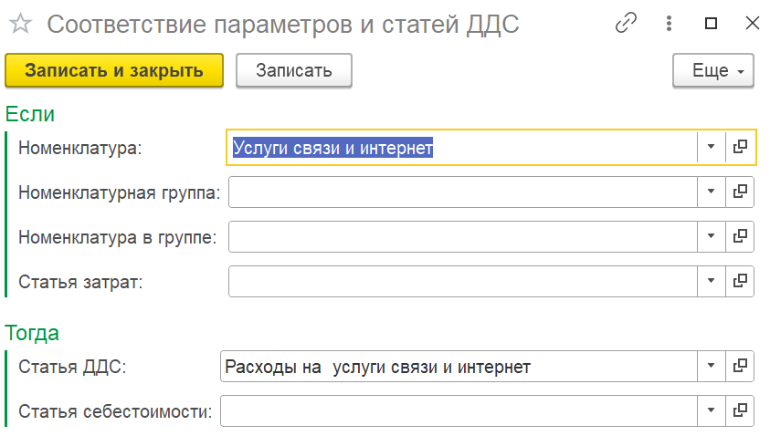
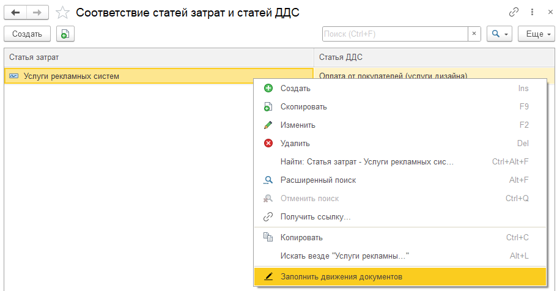

## Соответствие параметров и статей ДДС

Инструмент предназначен для автоматизации процесса распределения статей движения денежных средств (ДДС) и статей себестоимости при проведении первичных документов.

#### **Параметры распределения (Условия)**

Для того чтобы инструмент автоматически определял, какую статью подставить, необходимо настроить соответствие по следующим четырем ключевым параметрам:

1. **Номенклатура:** Конкретная позиция из справочника «Номенклатура».

2. **Номенклатурная группа:** Группа, к которой относится номенклатура (используется для укрупненного учета).

3. **Номенклатура в группе:** группы номенклатур.

4. **Статьи затрат:** Элемент справочника «Статьи затрат».

**Суть настройки:** Для каждого набора этих параметров (условия) вы указываете, какие статьи должны подставляться автоматически.

{width=843px height=478px}

#### **Результат настройки (Действия системы)**

В результате корректной настройки соответствия система будет автоматически проставлять:

-  **Статью ДДС** (Движения денежных средств).

-  **Статью себестоимости.**

### **Документы, в которых работает автоматизация**

Указанные правила проверяются и срабатывают в момент проведения следующих документов:

-  **Поступление (акт, накладная УПД).**

-  **Отчет о розничных продажах.**

-  **Реализация (акт, накладная, УПД).**

## Соответствие статей затрат и статей ДДС

Соответствие применяется для конфигураций  «Управление торговлей». Если в программе осуществлялся учет расходов по статьям в бухгалтерских документах, существует возможность связать данные статей расходов со статьями ДДС, чтобы отобразить информацию в отчете о прибыли и убытках.

После установки соответствия статей п[comment:hVu5O]оследующие документы [/comment]при проведении будут автоматически сопоставляться и заполнять необходимые движения для отражения в отчетах.

Чтобы заполнить все прошлые документы, используйте инструмент **Заполнить движения документов**.

{width=916px height=476px}

## Заполнить движения УТ (пересчет себестоимости)

Инструмент, необходимый для конфигурации **Управление торговлей**. После закрытия месяца в данной конфигурации пересчитывается себестоимость товаров. Поэтому после закрытия месяца необходимо запустить данную обработку для корректного формирования отчетов.

## Статья себестоимости

Данная статьям будет проставляться автоматически в таких документах как:

-  Отчет о розничных продажах

-  Расходная накладная (в конфигурации **Управление нашей фирмой**)

-  Реализация (акты, накладная УПД) (в конфигурации **Бухгалтерия предприятия**)