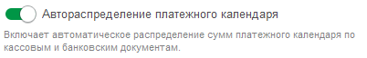
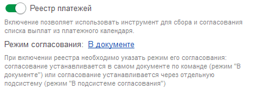

## Автораспределение платежного календаря

Модуль при обработке банковских или кассовых документов проверяет, есть ли соответствующий план в платежном календаре. Проверка осуществляется по таким критериям, как организация, статья, контрагент и договор, с ограничением по периоду в две недели до и после плана. В случае совпадения параметров статус у платежного календаря изменится на «выполнено», и будет указано, на основании какого документа это выполнение произошло.

{width=402px height=64px}

## Реестр платежей

При активации в платежном календаре появ[comment:aWZoi]ляется вкладка **Реестр платежей**[/comment]

Необходимо настроить, каким способом будет производиться согласование документа.

{width=450px height=152px}