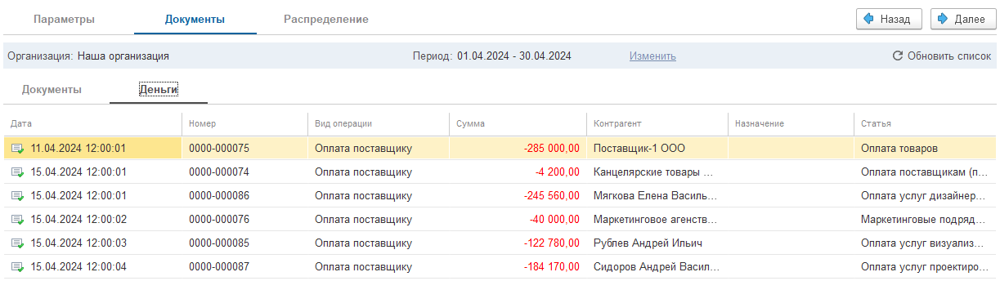

Документ позволяет распределить в соответствии с правилами на проекты, доп аналитику документы, которые ранее не были распределены.

### Порядок работы с документом. Заполнение шапки

[image:./dokument-raspredeleniya-zatrat.png:::0,0,100,100::square,0.116,28.2158,58.8167,30.2905,,top-left&square,59.3968,28.2158,37.123,29.8755,,top-left&square,0.232,58.9212,58.5847,12.4481,,top-left&square,0,82.5726,49.536,17.0124,,top-left:862px:241px]

Для распределения затрат необходимо:

1. Заполнить данные: Организация, Период.

2. Выбрать виды документов для распределения.

   1. Распределять движение денежных средств - это распределение всех денежных операции (Банковские выписки, кассовые документы, Кошелек)

   2. Распределять документы - это распределение всех бухгалтерских документов (все документы, которые расположены во вкладке [Документы](./../dokumenty/_index))

3. Выбрать режим распределения затрат (По проектам, по доп аналитике);

4. Выбрать вид распределения (Равномерно, пропорционально сумме проекта, вручную);

### Заполнение таблицы распределения

[image:./dokument-raspredeleniya-zatrat-2.png:::0,0,100,100::square,74.4508,9.0909,25.3865,29.3388,,top-left&square,0,24.7934,45.6469,51.6529,,top-left:1229px:242px]

1. Если вы указали режим «По доп. аналитике», то табличная часть заполнится автоматически на основе заполненного справочника.

   Если вы указали режим «По проектам», необходимо указать в отборах статус проекта. После указания статуса автоматически заполнится табличная часть.

2. После этого необходимо указать отметкой те проекты, по которым необходимо распределить операции. Процент распределения будет заполнятся автоматически в зависимости от вида распределения.

### Переход на вкладку «Документы», контроль операции

[image:./dokument-raspredeleniya-zatrat-3.png:::0,0,100,100::square,12.3467,0,14.1455,14.8256,,top-left&square,0,24.4186,22.4039,15.407,,top-left:1223px:344px]
<<<<<<< ours

<<<<<<< ours

=======
{width=1223px height=344px}
>>>>>>> theirs
=======
>>>>>>> theirs

1. Далее необходимо перейти на вкладку «Документы». Здесь отражены все операции, который подходят по данному отбору. Пользователь может самостоятельно откорректировать данные, то есть удалить документы, которые распределять ему не нужно.

2. Режим переключения: Документы, Деньги

### Переход на вкладку «Распределение»

[image:./dokument-raspredeleniya-zatrat-4.png:::0,0,100,100::square,25.7724,0,14.5528,7.8635,,top-left&square,0,93.6202,16.4228,6.2315,,top-left:1230px:674px]

Здесь отражены все операции в виде дерева, где отражена сумма документа и как эта сумма распределяется по проектам/доп аналитике.

Теперь необходимо нажать на команду «Распределить документы»

После этого документ необходимо **Провести.**

### Параметры документы

1. Заполнение списка документов происходит по следующему принципу:

   1. Происходит поиск всех документов по заданным параметрам, которые не распределены по проекту / доп. аналитике

   2. Документы не должны быть распределены вручную

   3. К списку добавляются все документы, которые были распределены текущим документом (в случае, если в документ вносятся изменения)

   4. Из списка исключаются все документы, которые были распределены другими документами распределения

2. Распределение документов происходит по следующему принципу:

   1. Берутся данные стандартного распределения документа (его можно посмотреть в самом документе, нажав кнопку Распределить)

   2. Из документа распределения собираются проценты распределения, заполненные на первом этапе

   3. По собранным процентам проводится распределение документа. Сумма документа берется согласно процентам и, если итоговая сумма не сходится с распределением по процентам, то остаток добавляется к последней строке

3. Для распределения необходимо провести документ

4. Если отменить проведение документа, то данные распределения будут стерты и проводки документа вернутся к стандартным