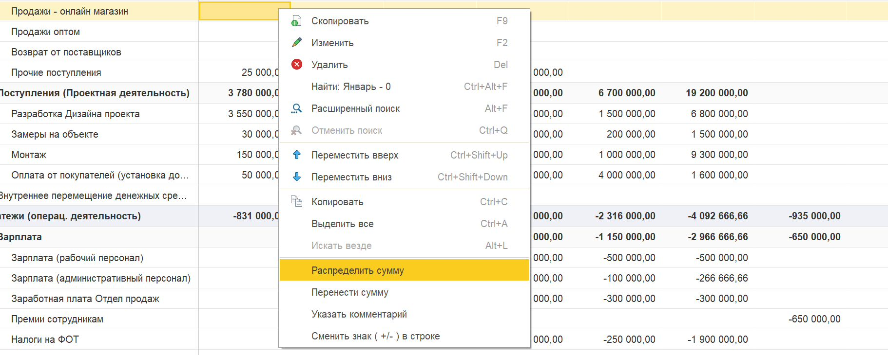

**БДДС** -- это финансовый план, который отражает ожидаемые поступления и выплаты денежных средств компании за определённый период.

Основные задачи БДДС для предпринимателя:

| Задача                             | Описание                                                                                                          |
|------------------------------------|-------------------------------------------------------------------------------------------------------------------|
| **Управление платежеспособностью** | Позволяет не допускать кассовых разрывов -- ситуаций, когда на счетах нет денег для оплаты срочных обязательств   |
| **Планирование денежных потоков**  | Помогает заранее видеть, когда поступят деньги и когда их нужно будет потратить                                   |
| **Распределение финансов**         | Даёт возможность эффективно распределять денежные средства по счетам, кассам и другим местам хранения             |
| **Контроль исполнения**            | Позволяет сравнивать плановые показатели с фактическими и своевременно корректировать бюджет                      |
| **Платёжный календарь**            | БДДС, составленный на месяц с разбивкой по дням, используется как платёжный календарь для оперативного управления |

БДДС и БДР дополняют друг друга: первый отвечает за ликвидность, второй -- за прибыльность. Вместе они дают полную картину финансового состояния компании.

## Как пользоваться инструментом БДДС

### Шаг 1. Создание финансового плана

1. Зайдите в блок **«Управленческие операции»**.

   [image:./finansovyy-plan-bdds.jpeg:::0,0,100,100::square,12.253,27.9683,25.9881,12.9288,,top-left:1012px:379px:center]

2. Выберите пункт **«Финансовый план БДДС»**

   [image:./finansovyy-plan-bdds-2.jpeg:::0,0,100,100::square,0,91.0476,13.7153,8.9524,,top-left&square,18.4028,5.7143,7.4074,8.9524,,top-left:2314px:703px:center]

3. Нажмите **«Создать»**, чтобы начать формирование нового финансового плана.

### Шаг 2. Заполнение верхних параметров плана

При создании финансового плана необходимо указать следующие параметры:



---

*  Параметр

*  Описание

---

*  **Версия финансового плана**

*  Название версии (например, «План 2026», «Оптимистичный» и т.д.). Можно создавать несколько версий для разных сценариев, сохраняя исторические данные для сравнения.

   Далее версию плана вы будете выбирать в отчете ДДС.

---

*  **Организация**

*  Выберите организацию, для которой создаётся план

---

*  **Год планирования**

*  Укажите начало года в формате `01.01.2026` (всегда указывается первое число года)

---

*  **Структура отчёта**

*  На основе этой структуры будет сформирована таблица БДДС. Структура определяет, какие статьи доходов и расходов будут отображаться в строках



### Шаг 3. Настройка дополнительных разрезов (аналитики)

Вы можете детализировать планирование, указав дополнительные параметры:

-  **Подразделение** -- позволяет планировать в разрезе ЦФО (центров финансовой ответственности)

-  **Доп. аналитика / Направление деятельности** -- группировка по видам бизнеса

-  **Проект / раздел проекта** -- планирование в разрезе конкретных проектов

:::quote 

**Важно:** если вы планируете использовать несколько разрезов (например, по подразделениям), всегда указывайте **одну и ту же версию плана**. Тогда в отчёте ДДС вы увидите данные, сгруппированные как по всей организации, так и по отдельным направлениям.

:::

### Шаг 4. Ввод плановых данных

Данные вносятся непосредственно в таблицу:

1. В ячейках таблицы укажите плановые суммы по каждой статье и периоду.

2. Данные можно вводить так же, как в Excel -- просто заполняя нужные ячейки.

#### Ключевое правило:

:::quote 

**Платежи (расходные статьи) заносятся со знаком «минус».** Поступления (доходные статьи) -- со знаком «плюс».

:::

### Шаг 5. Использование вспомогательных команд (контекстное меню)

При работе с таблицей доступны четыре полезные команды в контекстном меню (вызывается правой кнопкой мыши):

{width=1822px height=730px}

| Команда                 | Действие                                                                                                                                                  |
|-------------------------|-----------------------------------------------------------------------------------------------------------------------------------------------------------|
| **Распределить сумму**  | Открывается окно, где вы указываете общую сумму и период (например, с января по декабрь). Программа автоматически распределит сумму равномерно по месяцам |
| **Перенести сумму**     | Позволяет перенести часть суммы из одного месяца в другой (например, перенести платёж с июня на июль)                                                     |
| **Указать комментарий** | Добавляет комментарий к выбранной ячейке. Ячейка становится зелёной, что визуально отмечает наличие примечания                                            |
| **Сменить знак**        | Быстро меняет знак у всей строки (плюс на минус или наоборот). Удобно, если вы случайно перепутали знак по статье                                         |

## Детализация плана: по контрагентам и по проектам

По умолчанию план ведётся по статьям: одна строка -- одна статья поступления или выплаты. Если нужно планировать глубже -- например, отдельно по каждому крупному контрагенту или по каждому проекту -- включите детализацию.

Реквизит **«Детализация плана»** находится в шапке документа, рядом с организацией и годом планирования. Доступны три варианта:

| Значение                 | Что появляется под строкой статьи                      |
|--------------------------|----------------------------------------------------------|
| **Без детализации**      | ничего, обычный план по статьям (вариант по умолчанию)   |
| **Контрагент и договор** | строка контрагента, а под ней -- строка договора         |
| **Проект и контрагент**  | строка проекта, а под ней -- строка контрагента          |

Детализацию можно включить или переключить в любой момент, в том числе в уже созданном плане.

### Как добавить строку детализации

Строки детализации добавляются из контекстного меню таблицы (правая кнопка мыши). Набор доступных команд зависит от выбранного значения «Детализация плана» и от того, на какой строке вы стоите:

| Детализация плана        | Встали на строку статьи | Встали на строку детализации                                           |
|--------------------------|-------------------------|--------------------------------------------------------------------------|
| **Контрагент и договор** | «Добавить контрагента»  | «Добавить договор» -- если контрагент уже указан, а договор ещё нет     |
| **Проект и контрагент**  | «Добавить проект»       | «Добавить контрагента» -- если проект уже указан, а контрагент ещё нет  |

Порядок ввода задан самими командами: договор нельзя добавить раньше контрагента, а контрагента в проектном режиме -- раньше проекта.

### Как это выглядит и как считается

Строки детализации выводятся под статьёй **серым цветом** -- так их видно отдельно от строк структуры отчёта.

Суммы вводятся в строках детализации, а сумма самой статьи и групп выше пересчитывается автоматически как итог подчинённых строк. Вводить сумму в строке статьи, под которой есть детализация, не нужно. Правило знака действует и здесь: выплаты заносятся со знаком «минус».

При проведении контрагент, договор и проект из строки попадают в движения -- то есть план хранится в этих разрезах, а не только по статьям.

:::quote 

**Проект в шапке и проектная детализация несовместимы.** Если выбрать «Проект и контрагент», поле «Проект» в шапке очищается и становится недоступным: проект теперь указывается в каждой строке. При остальных вариантах детализации проект, наоборот, берётся из шапки и действует на весь документ.

:::

### Автоматическое заполнение

В БДДС автозаполнения по договорам и по проектам нет -- здесь для этого используется команда **«Заполнить по платёжному календарю»** в верхней командной панели.

:::info 

Команды «Заполнить по договорам» и «Заполнить по проектам» есть в документе «Финансовый план (БДР)». Как они работают и что делают с уже введёнными суммами -- см. [Финансовый план (БДР)](./finansovyy-plan-bdr).

:::

## **Где используется БДДС**

### **1\. Отчёт ДДС (план-факт)**

-  Вариант: **«Факт + БДДС»**, который позволяет сформировать как сводный отчет, так и в разрезе организаций/подразделений/направлений/проектов

-  В отборах укажите версию плана, организацию, период.

### **2\. Платежный календарь**

-  Блок «Платежный календарь» -> вкладка «Отчёт».

-  Вариант: **«Платежный календарь + БДДС»**.

-  В отборах выберите версию плана.

### **3\. Контроль лимитов остатков**

:::info 

[Как включить и использовать контроль лимитов остатков: пошаговая инструкция.](./../platezhnyy-kalendar/kontrol-limitov-byudzheta)

:::