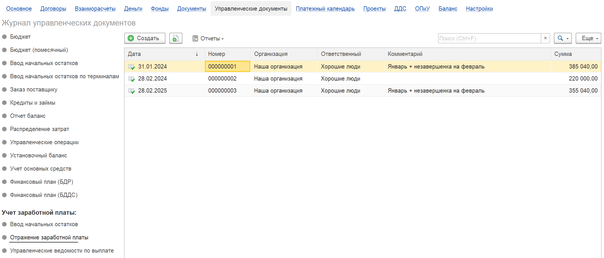
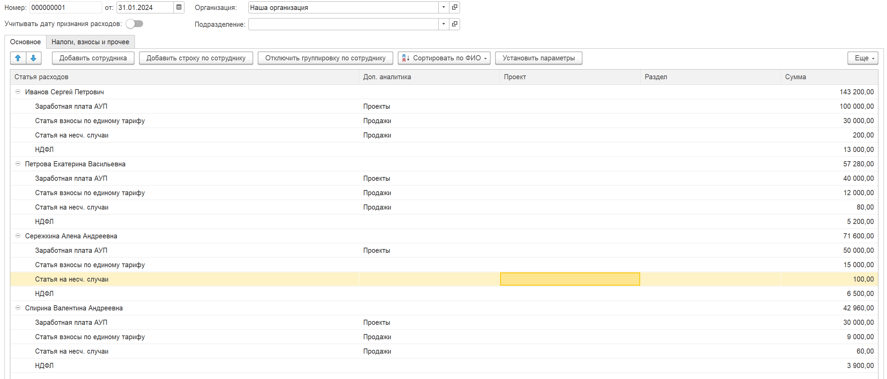
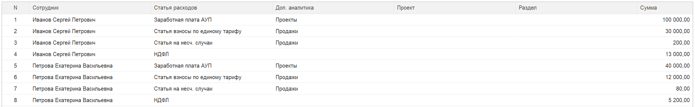
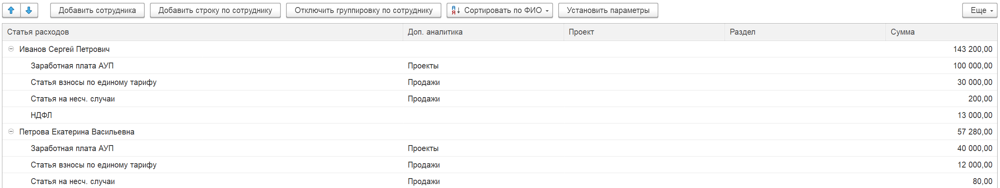
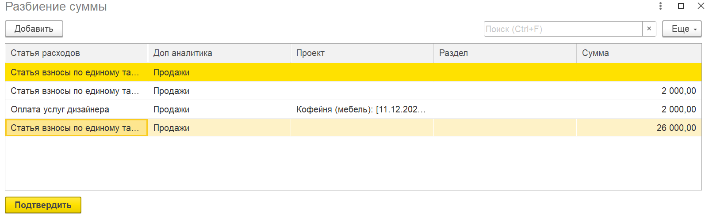

Документ предназначен для отражения заработной платы сотрудников в управленческом учёте. Он используется в компаниях, где управленческий учёт отличается от бухгалтерского, и стандартных бухгалтерских документов недостаточно для корректного распределения затрат на оплату труда.

С помощью документа вы можете распределить начисленную зарплату и налоги/взносы по:

-  статьям расходов;

-  направлениям деятельности;

-  проектам;

-  этапам проектов

Документ расположен в интерфейсе программы на вкладке **«Управленческие документы»** -> пункт **«Отражение заработной платы»**.

{width=2106px height=900px}

## **Структура документа**

Документ состоит из двух основных вкладок:

-  **«Основное»** – отражается начисленная заработная плата сотрудников.

-  **«Налоги, взносы и прочее»** – предназначена для учёта НДФЛ, страховых взносов (в т.ч. по единому тарифу, на травматизм) и других аналогичных начислений.

{width=2578px height=1105px}

## **Варианты ведения учёта**

В зависимости от потребностей компании вы можете использовать:

**Полный (детальный) учёт** – заполняются обе вкладки документа. Это позволяет в дальнейшем сопоставлять начисленные суммы с фактически оплаченными и вести полный управленческий учёт по заработной плате. [Один из способов ведения учета описан здесь](./otrazhenie-zarabotnoy-platy/upravlencheskiy-uchet-zarabotnoy-platy)

**Упрощённый учёт** – все данные (и зарплата, и налоги) отражаются только на вкладке «Основное». Такой вариант подходит, если нет необходимости в детализации налоговых обязательств.

## **Способы заполнения документа**

### **Загрузка данных из Excel**

Для быстрого заполнения используйте загрузку из электронных таблиц.

-  На панели команд документа находятся две кнопки:

   -  **«Загрузить зарплату»** – загружает данные на вкладку «Основное».

   -  **«Загрузить налоги и взносы»** – загружает данные на вкладку «Налоги, взносы и прочее».

**Порядок действий:**

1. Нажмите нужную кнопку – откроется мастер загрузки данных.

2. Вставьте скопированные из Excel данные в специальное поле мастера.

3. Следуйте подсказкам мастера для сопоставления колонок и завершения загрузки.

### **Ручное добавление записей**

Вы можете вводить данные вручную непосредственно в таблицах документа.

#### **Ввод в виде простого списка**

-  Табличная часть отображается как обычный список строк.

-  Добавляйте новые строки стандартным способом (кнопка «Добавить» или клавиша Ins).

-  В каждой строке указывайте сотрудника, статью расходов, сумму и необходимую аналитику.

   {width=2536px height=391px}

#### **Режим группировки по сотрудникам**

Для более наглядного ввода можно сгруппировать строки по сотрудникам.

1. Нажмите кнопку **«Сгруппировать по сотрудникам»** – таблица преобразуется в дерево значений.

2. Добавьте сотрудника командой **«Добавить сотрудника»** (появится узел дерева).

3. Выделите добавленного сотрудника и нажмите **«Добавить строку по сотруднику»**.

4. В открывшейся строке выберите статью расходов, укажите сумму и другие аналитические признаки.

5. При необходимости для одного сотрудника можно создать несколько строк (например, для разных проектов).

   {width=2535px height=478px}

### **Разбиение суммы на несколько частей**

Если нужно распределить сумму одного начисления по нескольким объектам аналитики (проектам, статьям и т.д.), используйте функцию разбиения.

{width=1594px height=490px}

1. Выделите строку с суммой, которую требуется разбить.

2. Нажмите правую кнопку мыши и выберите команду **«Разбить сумму»**.

3. В открывшейся форме укажите, на какие части разделить сумму, задав для каждой части нужные значения аналитик (проект, статья, направление и т.п.).

4. После подтверждения исходная строка будет заменена несколькими строками с распределёнными суммами.

:::quote 

**Примечание:** Первая строка при разбиении может быть нередактируемой – она создаётся автоматически и содержит исходные данные.

:::

### **Массовое изменение аналитики**

Для быстрого заполнения одинаковых аналитических признаков у нескольких строк:

1. Выделите нужные строки (с помощью Ctrl или Shift).

2. Нажмите кнопку **«Установить параметры»** (или аналогичную команду).

3. В появившемся окне укажите значения аналитик (проект, статью, раздел и т.д.), которые должны быть присвоены всем выделенным строкам.

4. Подтвердите действие – аналитика массово применится ко всем выбранным строкам.

Документ «Отражение заработной платы» в модуле P&L позволяет гибко настраивать распределение затрат на персонал в управленческом учёте. Используйте описанные выше способы заполнения для эффективного ввода данных в зависимости от объёма информации и принятой в компании методики учёта.