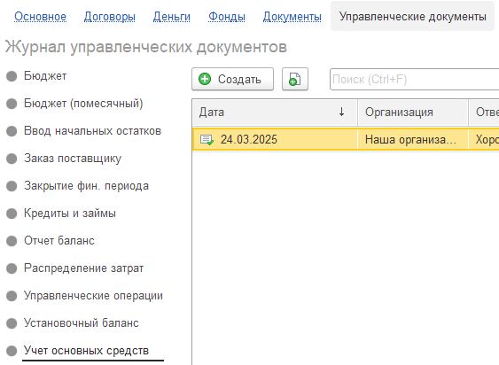

Документ «Учет основных средств» -- это центральный узел, где происходит всё, что связано с вашим основными средствами. С его помощью мы решаем три ключевые задачи:

-  **Учет ОС:** Фиксируем факт принятия объекта к учету.

-  **Расчет амортизации:** Система автоматически рассчитывает ежемесячное списание стоимости объекта.

-  **Формирование отчетности:**

   -  **В Отчете о Прибылях и Убытках (P&L):** Сумма амортизации отражается как расход.

   -  **В Балансе:** Остаточная стоимость ОС (первоначальная стоимость за вычетом накопленной амортизации) показывается в активах.

### **Пошаговая инструкция по созданию и проведению документа**

{width=563px height=412px}

**Шаг 1: Создайте логическую группу (если она еще не создана)**

Первое, что вам нужно сделать -- это сгруппировать ваши основные средства по смыслу.

[image:./uchet-osnovnykh-sredstv-2.png:::0,0,100,100::square,7.8748,27.0548,13.3776,13.6986,,top-left&square,21.0626,27.3973,11.4801,13.3562,,top-left&square,37.5712,61.3014,61.6698,31.8493,,top-left&square,47.8178,0,52.1822,15.0685,,top-left:1054px:292px:center]

**Шаг 1:** в документе нажмите кнопку **«Добавить группу»**.

:::tip 

1. Группы помогают структурировать ОС для удобного анализа и отчетности. 

2. **Пример:** Вы можете создать группы: `«Офисная техника»`, `«Мебель»`, `«Транспортные средства»`, `«Производственное оборудование»`.

   -  Для нашего ноутбука мы выберем или создадим группу **«Офисная техника»**.

:::

**Шаг 2:** Добавьте конкретный объект основных средств

Нажмите на нужную группу в списке и нажмите кнопку **«Добавить ОС»**. Откроется карточка для ввода данных об объекте.

:::tip 

**Пример:** В поле «Наименование» напишите: **«Ноутбук Dell Inspiron 15 для бухгалтерии»**.

:::

**Шаг 3:** в таблице, куда вы добавили новый ноутбук, необходимо заполнить несколько обязательных полей:

1. **«Дата покупки»:**

   Календарная дата, когда вы приобрели объект и он был готов к использованию.

    От этой даты система будет рассчитывать начало начисления амортизации.

2. **Дата ввода в эксплуатацию**

   Не обязательно к заполнению, если вам необходимо не сразу учитывать амортизацию данного ОС, вы можете указать дополнительную дату, с какого момента начнется амортизация

3. **«Стоимость»:**

   Первоначальная стоимость объекта, по которой он был принят к учету (например, цена покупки без НДС).

4. **«Срок амортизации (мес.)»:**

   Период, в течение которого стоимость объекта будет постепенно списываться на расходы.

   Срок определяется исходя из планируемого времени использования объекта.

    

**Шаг 4:** Укажите статью амортизации для отчетности 

Это поле связывает расчет амортизации с вашим управленческим отчетом о прибылях и убытках.

**Шаг 5:** Проведите документ

После того как все данные введены и проверены, обязательно нажмите кнопку **«Провести»**.

### **Предварительный просмотр**

После проведения документа, есть возможность воспользоваться встроенным инструментом **«Предварительный просмотр»**. Система сформирует для вас таблицу, где будет помесячно расписана вся история амортизации объекта на весь его срок службы. Вы наглядно увидите:

-  Как с каждым месяцем уменьшается остаточная стоимость вашего ОС (и, следовательно, его отражение в балансе).

-  На какую сумму ежемесячно будет увеличиваться расход на амортизацию (и, следовательно, его отражение в P&L).

Это лучший способ убедиться, что все расчеты происходят именно так, как вы ожидаете.

[image:./uchet-osnovnykh-sredstv-3.png:::0,0,100,100::square,5.603,0,19.8481,10.0543,,top-left:1053px:368px:center]