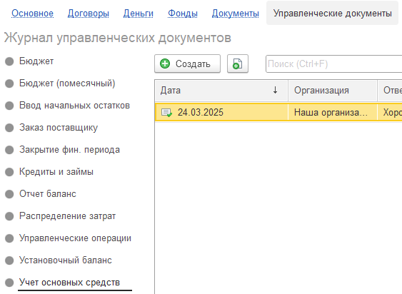
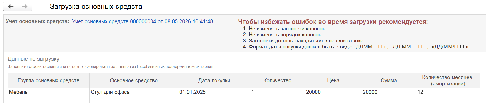
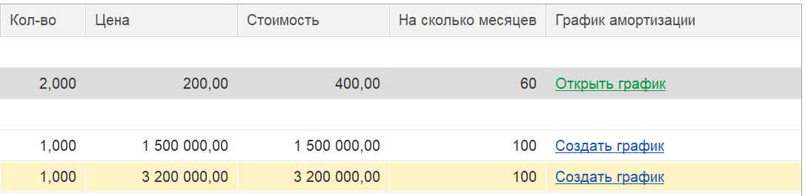
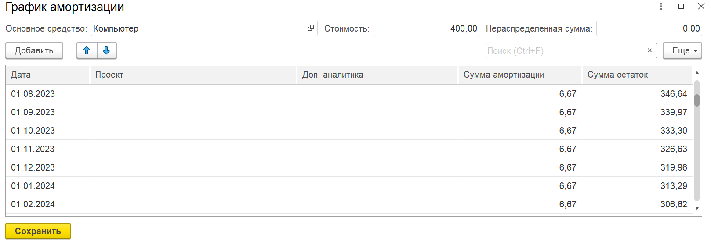
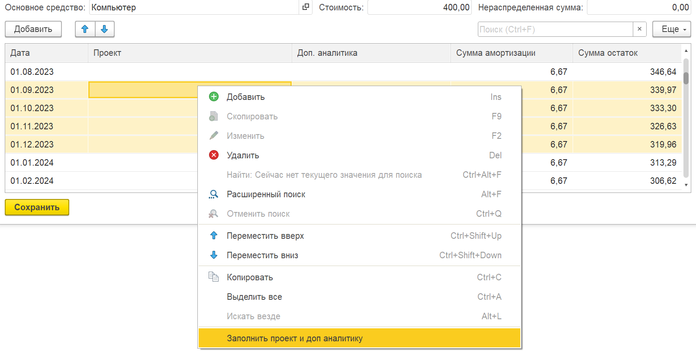

Документ «Учет основных средств» -- это центральный узел, где происходит всё, что связано с вашим основными средствами. С его помощью мы решаем три ключевые задачи:

-  **Учет ОС:** Фиксируем факт принятия объекта к учету.

-  **Расчет амортизации:** Система автоматически рассчитывает ежемесячное списание стоимости объекта.

-  **Формирование отчетности:**

   -  **В Отчете о Прибылях и Убытках (P&L):** Сумма амортизации отражается как расход.

   -  **В Балансе:** Остаточная стоимость ОС (первоначальная стоимость за вычетом накопленной амортизации) показывается в активах.

### **Пошаговая инструкция по созданию и проведению документа**

{width=563px height=412px}

**Шаг 1: Создайте логическую группу (если она еще не создана)**

Первое, что вам нужно сделать -- это сгруппировать ваши основные средства по смыслу.

[image:./uchet-osnovnykh-sredstv-2.png:::0,0,100,100::square,7.8748,27.0548,13.3776,13.6986,,top-left&square,21.0626,27.3973,11.4801,13.3562,,top-left&square,37.5712,61.3014,61.6698,31.8493,,top-left&square,47.8178,0,52.1822,15.0685,,top-left:1054px:292px:center]

**Шаг 1:** в документе нажмите кнопку **«Добавить группу»**.

:::tip 

1. Группы помогают структурировать ОС для удобного анализа и отчетности.

2. **Пример:** Вы можете создать группы: `«Офисная техника»`, `«Мебель»`, `«Транспортные средства»`, `«Производственное оборудование»`.

   -  Для нашего ноутбука мы выберем или создадим группу **«Офисная техника»**.

:::

**Шаг 2:** Добавьте конкретный объект основных средств

Нажмите на нужную группу в списке и нажмите кнопку **«Добавить ОС»**. Откроется карточка для ввода данных об объекте.

:::tip 

**Пример:** В поле «Наименование» напишите: **«Ноутбук Dell Inspiron 15 для бухгалтерии»**.

:::

**Шаг 3:** в таблице, куда вы добавили новый ноутбук, необходимо заполнить несколько обязательных полей:

1. **«Дата покупки»:**

   Календарная дата, когда вы приобрели объект и он был готов к использованию.

   От этой даты система будет рассчитывать начало начисления амортизации.

2. **Дата ввода в эксплуатацию**

   Не обязательно к заполнению, если вам необходимо не сразу учитывать амортизацию данного ОС, вы можете указать дополнительную дату, с какого момента начнется амортизация

3. **«Стоимость»:**

   Первоначальная стоимость объекта, по которой он был принят к учету (например, цена покупки без НДС).

4. **«Срок амортизации (мес.)»:**

   Период, в течение которого стоимость объекта будет постепенно списываться на расходы.

   Срок определяется исходя из планируемого времени использования объекта.

**Шаг 4:** Укажите статью амортизации для отчетности

Это поле связывает расчет амортизации с вашим управленческим отчетом о прибылях и убытках.

**Шаг 5:** Проведите документ

После того как все данные введены и проверены, обязательно нажмите кнопку **«Провести»**.

### **Предварительный просмотр**

После проведения документа, есть возможность воспользоваться встроенным инструментом **«Предварительный просмотр»**. Система сформирует для вас таблицу, где будет помесячно расписана вся история амортизации объекта на весь его срок службы. Вы наглядно увидите:

-  Как с каждым месяцем уменьшается остаточная стоимость вашего ОС (и, следовательно, его отражение в балансе).

-  На какую сумму ежемесячно будет увеличиваться расход на амортизацию (и, следовательно, его отражение в P&L).

Это лучший способ убедиться, что все расчеты происходят именно так, как вы ожидаете.

[image:./uchet-osnovnykh-sredstv-3.png:::0,0,100,100::square,5.603,0,19.8481,10.0543,,top-left:1053px:368px:center]

## **Загрузка основных средств через Excel в документ учета ОС**

Мастер загрузки данных позволяет импортировать информацию из Excel-таблицы и автоматически заполнить документ учета основных средств.

1. Нажмите команду **«Загрузить основные средства»**.

2. В открывшейся табличной части вставьте данные из Excel.\
   Важно: обязательно укажите группу основных средств для каждой позиции.

3. После загрузки система проверит наличие указанных групп и основных средств в справочнике.

   -  Если данные не будут найдены, программа предложит создать их автоматически.

   -  При необходимости вы можете самостоятельно выбрать нужные элементы из справочника.

{width=1843px height=393px}

[image:./uchet-osnovnykh-sredstv-8.png::Мастер форма по сопоставлению данных:0,0,100,100::square,0.9259,32.7138,57.1759,19.3309,,top-left&square,21.5278,63.5688,22.338,6.5056,,top-left&square,43.9236,63.9405,21.5856,6.1338,,top-left:2556px:796px:center]

## **Работа с графиком амортизации в документе учёта основных средств**

График амортизации позволяет распределять суммы амортизации основного средства по проектам и дополнительной аналитике. Это необходимо, когда одно основное средство используется в нескольких проектах (например, в строительстве) и его амортизация должна относиться на разные проекты в определённые периоды. После настройки графика амортизация автоматически отражается в отчёте о прибылях и убытках (ОПиУ) по соответствующим проектам.

В табличной части документа есть колонка **«График амортизации»**.

-  Если для основного средства график ещё не создан, в колонке отображается ссылка **«создать график»** (синим цветом).

-  Если график уже существует, ссылка называется **«открыть график»** (зелёным цветом).

   {width=1086px height=265px}

### **Создание нового графика амортизации**

1. Нажмите ссылку **«Создать график»** в строке нужного основного средства.

2. Откроется отдельная форма с таблицей, содержащей следующие поля:

   -  **Дата**

   -  **Проект**

   -  **Дополнительная аналитика**

   -  **Сумма амортизации**

   -  **Сумма остаток**

      {width=1618px height=552px}

3. График формируется автоматически на основании данных основного средства:

   -  дата покупки;

   -  первоначальная стоимость;

   -  срок полезного использования (в месяцах).

      Система рассчитывает помесячные суммы амортизации и заполняет таблицу.

### **Настройка распределения по проектам и доп. аналитике**

Вы можете указать проект и доп. аналитику для каждой строки графика двумя способами:

#### **Способ 1: Вручную**

-  Кликните в ячейку столбца **«Проект»** или **«Доп. аналитика»** нужной строки и выберите значение из справочника.

#### **Способ 2: Массовое заполнение**

1. Выделите несколько строк графика (с помощью `Ctrl` или `Shift`).

2. Нажмите правую кнопку мыши и выберите команду **«Заполнить проект и доп. аналитику»**

3. Укажите нужный проект (или доп. аналитику) -- значение будет присвоено всем выделенным строкам.

   {width=1608px height=823px}

## **Сохранение графика**

После завершения настройки нажмите кнопку **«Сохранить»**.

Теперь при расчёте амортизации:

-  Суммы амортизации будут относиться на указанные проекты.

-  В отчёте о прибылях и убытках (ОПиУ) эти суммы отразятся в разрезе соответствующих проектов и доп. аналитики.

## **Редактирование существующего графика**

Если необходимо изменить распределение, откройте график по ссылке **«открыть график»**, внесите правки и сохраните изменения.

## **Важно**

-  График амортизации создаётся для каждого основного средства отдельно.

-  При изменении параметров основного средства (стоимость, срок) график пересчитывается автоматически, но ранее указанные проекты и аналитика сохраняются (если не были удалены строки).

-  Убедитесь, что проекты и доп. аналитика, на которые распределяется амортизация, присутствуют в справочниках системы.