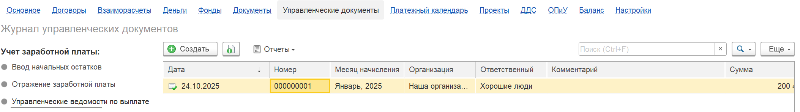
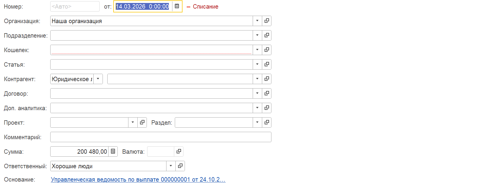

Документ предназначен для фиксации факта выдачи заработной платы в **управленческом учёте**.

В отличие от бухгалтерской ведомости, которая отражает официальные выплаты, данный документ позволяет:

-  Учитывать полный объем выплаченных средств сотрудникам.

-  Контролировать фактические остатки по зарплате и задолженность перед сотрудниками в рамках управленческого учета.

-  Работать как самостоятельный инструмент или в связке с бухгалтерской ведомостью (отражая только разницу/остаток).

## **Где найти документ**

Документ расположен в интерфейсе программы в разделе (блоке) **«Управленческие операции»**.

В списке документов выберите позицию **«Управленческая ведомость»**.

{width=2107px height=298px}

## **Заполнение документа**

Табличная часть содержит информацию о первичной задолженности перед сотрудниками.

Для заполнения списка сотрудников используйте следующие команды:

1. **«Заполнить»**

   -  Автоматически заполняет табличную часть всеми сотрудниками.

   -  В графах отобразится общая сумма к выплате, которая была зафиксирована ранее в документе «Отражение заработной платы» (для управленческого учёта).

   -  *Примечание:* Если ведомость работает в связке с бухучетом, здесь может отражаться не вся сумма, а только невыплаченный остаток (в зависимости от настроек).

2. **«Заполнить по подразделению»**

   -  Работает аналогично команде «Заполнить», но позволяет отобрать сотрудников по конкретному подразделению.

3. **«Сгруппировать по подразделению»**

   -  Команда служит для визуального структурирования данных. Она группирует строки сотрудников по подразделениям для удобства просмотра и не меняет суммы документа.

## **Закрытие ведомости (отражение факта выплаты)**

После того как ведомость сформирована и суммы указаны, необходимо зафиксировать факт выдачи денег сотрудникам. Ведомость должна быть "закрыта" денежной операцией.

Существует два способа закрыть документ:

### **Способ 1: Создание документа «Операции по кошельку»**

Необходимо создать документ на основании текущей ведомости. Это будут операции, отражающие движение денежных средств по кассе или расчётному счету (кошельку) именно в управленческом контуре.

{width=1358px height=105px}

В данной операции достаточно указать статью и кошелек.

{width=1692px height=628px}

### **Способ 2: Прикрепление существующей денежной операции**

Есть возможность привязать к ведомости уже созданный документ (например, операцию по банку или кассе). Для этого необходимо указать данную операцию и статью, которая будет отражена на закрытии данной выплаты (*данная статья необходимо для закрытия только зарплатной ведомости и в отчете ДДС и ОПиУ она не отразится*)

{width=997px height=129px}

**Важный нюанс:** Система позволяет прикрепить операцию, которая по типу может быть иной (например, «Оплата поставщику»), но по факту хозяйственной деятельности означала выплату зарплаты сотрудникам из данной ведомости. Также это может быть операция «Выплата зарплаты», проведенная по другим сотрудникам, но фактически деньги получили люди из вашего списка.