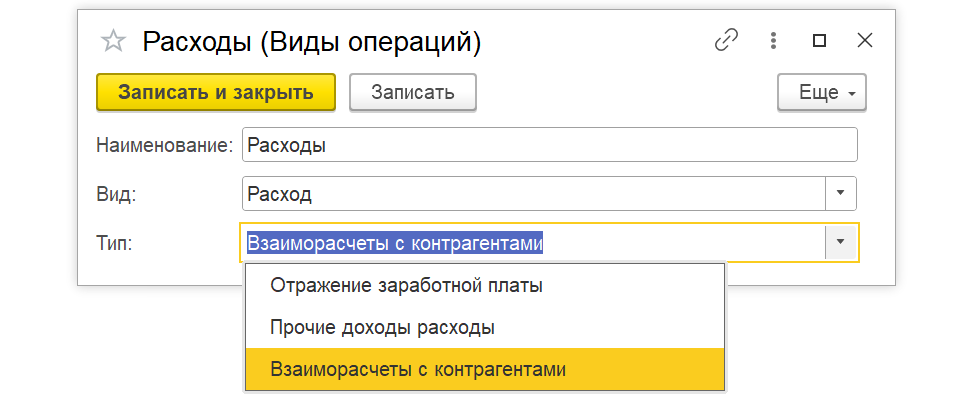

Документ «Управленческая операция» создан для отражения в управленческом учете  тех хозяйственных операций, которых нет в стандартных документах системы 1С.

Простыми словами: если в 1С нет подходящего документа для какой-либо управленческой проводки, но вам нужно отразить эту сумму в отчете о прибылях и убытках, вы используете этот документ.

#### **Примеры использования:**

-  Отражение дополнительных расходов (например, неучтенных в официальной бухгалтерии).

-  Отражение дополнительных доходов.

-  Начисление заработной платы.

-  Ввод начальных остатков по проектам за прошлые периоды.

##  **Как пользоваться документом: пошаговая инструкция**

### **Создание нового документа**

Перейдите в раздел «Управленческие операции» и создайте новый документ «Управленческая операция».

[image:./upravlencheskie-operacii.png:::0,0,100,100::square,50.3833,0,20.3484,10.5263,,top-left&square,0,92.0078,20.0697,7.9922,,top-left:1435px:513px:center]

### **Выбор вида операции**

В документе необходимо указать **«Вид операции»**. Вы можете выбрать один из предопределенных видов (доходы/расходы) или создать свой.

[image:./upravlencheskie-operacii-2.png:::0,0,100,100::square,0,57.2,44.83,22.4,,top-left:1441px:250px:center]

*Если вы создаете свой вид операции:*

1. Нажмите «Создать».

2. Укажите **Наименование** операции (например, «Доходы по контрагентам»).

3. Выберите **Вид** (Доход или Расход).

4. Выберите **Тип**. Это самый важный пункт, от него зависит, какие колонки появятся в таблице для заполнения.

{width=975px height=399px}

#### **Выбор типа операции и заполнение таблицы**

В зависимости от типа операции меняется набор реквизитов в табличной части:

-  **Тип «Отражение заработной платы»:**

   Используется для начисления зарплаты.

   В таблице появятся колонки: *Сотрудник, Подразделение* и другие соответствующие реквизиты, а также сумма.

-  **Тип «Прочие доходы и расходы»:**

   Используется для разовых или дополнительных доходов/расходов.

   В таблице появятся колонки: *Статья, Направление деятельности, Проект, Сумма*.

-  **Тип «Взаиморасчеты с контрагентами»:**

   Используется для отражения задолженностей или операций с поставщиками/клиентами.

   В таблице появятся колонки: *Контрагент, Договор, Статья, Направление деятельности, Проект, Сумма*.

## **Отражение в отчете о прибылях и убытках**

Чтобы введенная вами сумма попала в отчет о прибылях и убытках (P&L), **для каждой строки таблицы необходимо установить галочку**: **«Отражать методом начисления»**

## Итог

Документ «Управленческая операция» -- это универсальный инструмент для ручного ввода данных в управленческий учет. Главное при работе с ним:

1. Правильно выбрать **тип** операции (чтобы увидеть нужные колонки).

2. Не забыть поставить галочку **«Отражать методом начисления»** (чтобы сумма попала в отчетность).