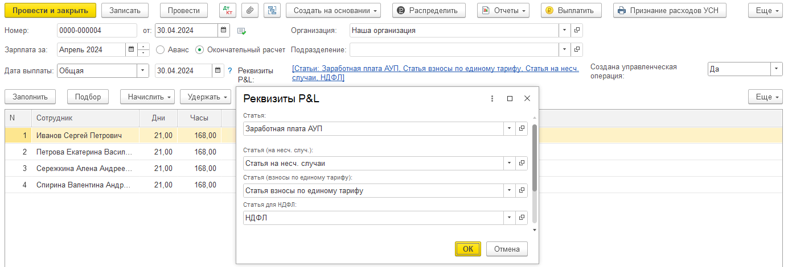
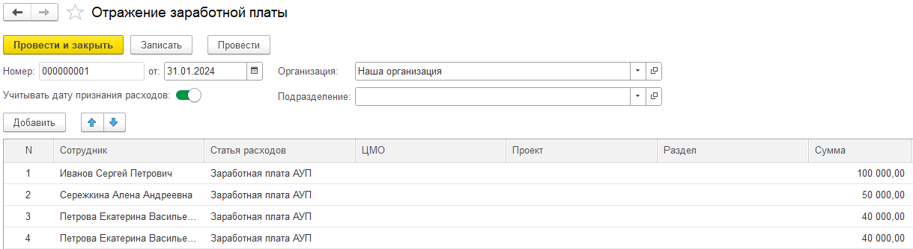
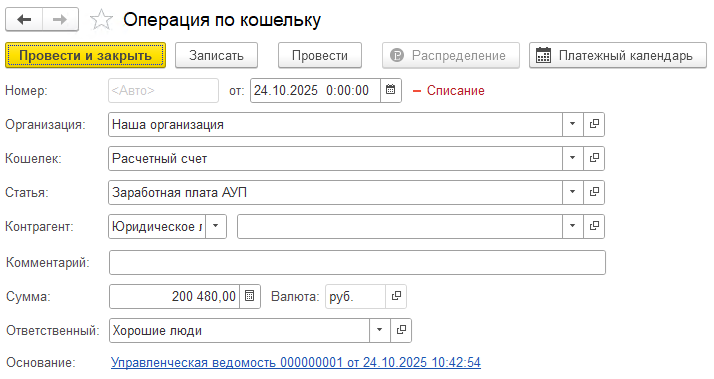
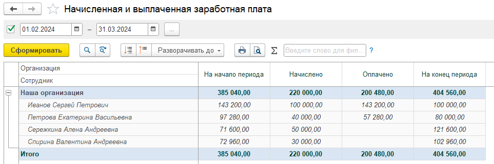
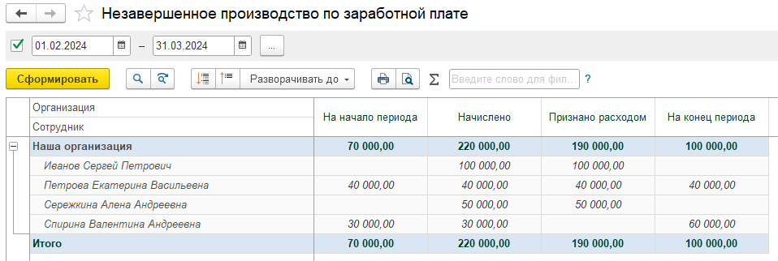
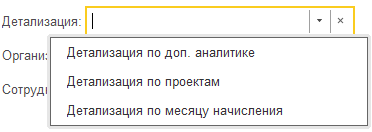
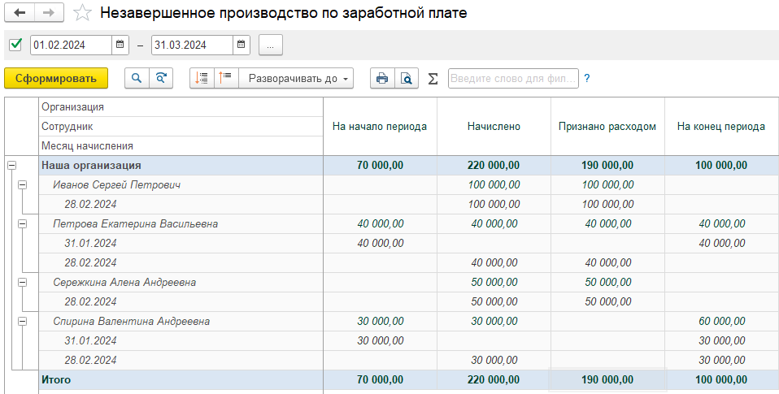

У компании есть главные задачи, связанные с заработной платой:

### **Задача 1: Понимать, кому, сколько и когда платить.**

Компании нужно четко видеть итоговую сумму к выплате каждому сотруднику. Эта сумма складывается из двух частей:

-  Официальная зарплата: Начисляется и проводится через стандартные бухгалтерские документы 1С.

-  «Дополнительная» зарплата: Выплачивается «в конверте» или через иные, не отраженные в бухгалтерии, каналы.

На практике это создает сложности:

-  Неполная картина: В стандартном учёте видна только официальная часть. Руководство не видит реальных затрат на фонд оплаты труда (ФОТ).

-  Ручной контроль: Трудно отслеживать, какую сумму по каждому сотруднику уже выплатили, а какую -- ещё нужно доплатить (особенно неофициально).

**Наше решение:**\
В системе создается специальный управленческий документ, который позволяет «доначислить» неофициальную часть зарплаты. Таким образом, в системе формируется полная картина задолженности перед сотрудником -- и по официальной, и по неофициальной части.

### **Задача 2: Упростить и систематизировать процесс выплат**

Оплачивать зарплату десяткам или сотням сотрудников через дополнительный инструмент «кошелек» -- неудобно и долго.

**Наше решение:**\
В системе появляется управленческий документ «Управленческая ведомость».

-  Как это работает? Пользователь нажимает кнопку «Заполнить», и система автоматически подгружает в ведомость всех сотрудников и суммы, которые им необходимо доплатить (рассчитанные на основе начислений, включая неофициальные).

-  Что дальше? После проверки и корректировок на основании этой ведомости можно одним кликом создать документ «кошелек» для массовой выплаты. Все проведенные оплаты автоматически отражаются в системе, уменьшая задолженность перед сотрудниками.

### **Задача 3: Корректно отражать расходы на зарплату в управленческой отчетности (P&L)**

Затраты должны признаваться в том периоде, к которому они относятся. С зарплатой есть нюанс: сотрудник работал в конце месяца, но результат его работы (например, изделие) не был завершен и не сдан на склад. Это -- Незавершенное Производство (НЗП).

-  Проще говоря: Это «зарплата, вложенная в незаконченные изделия».

-  Проблема: Если сразу списать всю начисленную зарплату в расходы, отчет о прибылях и убытках (P&L) будет искажен. Мы признаем расходы раньше, чем получили от них экономическую выгоду.

**Наше решение:**\
Система автоматически разделяет учет:

1. Факт начисления: Сумма зарплаты фиксируется в специальном регистре НЗП.

2. Факт признания расхода: В расходы (P&L) сумма списывается только тогда, когда работа считается завершенной. Для этого в документах предусмотрена специальная «Дата признания расходов».

Таким образом, в балансе аккумулируются затраты на незавершенные проекты (НЗП), а в P&L попадают только те затраты, которые относятся к реализованной продукции или завершенным услугам.

**Итог: Данная подсистема решает три ключевые бизнес-задачи:**

1. Полный контроль ФОТ: Учет всей зарплаты (официальной + неофициальной).

2. Автоматизация выплат: Упрощение процесса массовых расчетов с сотрудниками через «Ведомость в банк».

3. Корректная отчетность: Точное отражение расходов на зарплату в управленческом учете благодаря механизму НЗП.

## **Реализация в системе**

Реализация решений происходит через последовательность действий с определенными документами.

### **Шаг 1: Создание документа «Отражение заработной платы»**

Документ находится в разделе управленческих документов, в блоке, посвященном заработной плате.

Создать его можно двумя способами: вручную или автоматически на основании документов бухгалтерского начисления (Начисление зарплаты, Отражение заработной платы в бух. учете)

#### В случае, если создается документ на основании бухгалтерского начисления

1. Перед созданием документа на основании необходимо заполнить реквизиты, связанные со статьями отчета P&L (например, статья затрат). Для избежания дублирования данных устанавливается отметка «Созданная управленческая операция -- Да».

   {width=1384px height=470px}

2. После нажатия кнопки «Создать отражение заработной платы» система автоматически заполнит список сотрудников и статьи затрат.

   {width=1219px height=334px}

3. В открывшемся документе можно вручную скорректировать данные: добавить или удалить строки, изменить суммы, распределить затраты по проектам или направлениям деятельности.

4. Проведение этого документа сразу же отражает операцию в управленческом учете.

#### **Шаг 2: Настройка учета Незавершенного Производства (НЗП)**

-  Если требуется отложить признание расходов, в документе «Отражение заработной платы» устанавливается галочка «Учитывать дату признания расходов».

-  После этого появляется колонка «Дата признания расходов». Для каждой строки начисления можно указать дату, когда работа будет считаться завершенной и затраты можно будет списать в P&L.

[image:./upravlencheskiy-uchet-zarabotnoy-platy.png:::0,0,100,100::square,0,32.0359,20.424,11.0778,,top-left&square,86.1484,41.3174,13.2155,58.6826,,top-left:1415px:334px:center]

#### **Шаг 3: Формирование выплат через «Управленческую ведомость»**

1. После того как официальная часть зарплаты выплачена через стандартную банковскую ведомость, формируется документ «Управленческая ведомость».

   [image:./upravlencheskiy-uchet-zarabotnoy-platy-4.png:::0,0,100,100::square,33.3935,0,17.7798,9.4923,,top-left&square,0,84.5475,20.3971,7.5055,,top-left:1108px:453px:center]

2. В документе указывается расчетный месяц.

3. При нажатии кнопки «Заполнить» система автоматически рассчитывает разницу между всеми начисленными (включая неофициальные) и уже выплаченными суммами. В ведомость попадает список сотрудников и суммы, которые им необходимо доплатить.

   [image:./upravlencheskiy-uchet-zarabotnoy-platy-5.png:::0,0,100,100::square,0,37.8571,16.6432,12.5,,top-left&square,0,50.7143,16.1495,12.5,,top-left:1418px:280px:center]

4. После проверки и возможной ручной корректировки ведомости, на ее основании одним действием создается операция по электронному кошельку для массовой выплаты.

   [image:./upravlencheskiy-uchet-zarabotnoy-platy-6.png:::0,0,100,100::square,41.6945,22.8571,29.5429,52.1429,,top-left:897px:140px:center]

   {width=714px height=379px}

5. При необходимости выплаты из нескольких источников (кошельков) создаются несколько управленческих ведомостей.

6. После проведения операций по кошельку задолженность перед сотрудниками в системе автоматически уменьшается.

#### **Шаг 4: Использование отчетов для контроля**

Система предоставляет два ключевых отчета для анализа:

[image:./upravlencheskiy-uchet-zarabotnoy-platy-8.png:::0,0,100,100::square,33.6643,0,17.5993,12.3418,,top-left&square,0,91.1392,20.3069,8.8608,,top-left&square,34.4765,23.1013,39.6209,31.962,,top-left:1108px:316px:center]

1. **Отчет «Начисленная и выплаченная заработная плата»:** Позволяет видеть полную картину по каждому сотруднику: общую сумму начислений, сумму произведенных выплат и остаток задолженности на конец периода.

   {width=963px height=321px}

2. **Отчет «Незавершенное производство по заработной плате»:** Показывает, какие суммы зарплаты были начислены, но еще не признаны расходами в P&L, так как работы по ним не завершены. Это дает точное представление о объеме незавершенного производства.

   Данный отчет можно продетализировать по месяцу начисления, по проектам и по доп аналитике.

   {width=958px height=322px}

   {width=372px height=132px}

   {width=958px height=485px}

## **Итоговый результат**

Внедренная подсистема обеспечивает:

-  **Полный контроль ФОТ** за счет объединения официальных и неофициальных начислений.

-  **Автоматизацию выплат** через интеграцию с платежными сервисами и массовое создание платежных документов.

-  **Корректную управленческую отчетность P&L** благодаря точному учету расходов по принципу начисления и механизму Незавершенного Производства.