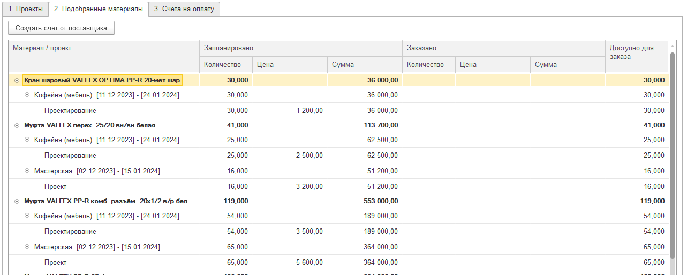

Документ предназначен для консолидации материалов из различных проектов и их этапов с целью формирования единых счетов на оплату для поставщиков. По своей сути, данный инструмент является связующим звеном между этапами планирования сметы и осуществления платежей.

**Назначение:** Документ используется ответственным сотрудником (например, за проекты или строительные объекты) для формирования заявки на материалы, необходимые для выполнения текущих этапов работ.

## **Порядок работы**

### **1\. Создание документа и выбор проектов**

[image:./zakaz-postavschiku.png:::0.6934812760055479,0,99.30651872399446,100:::721px:198px:center]

После создания документа «Заказ поставщику» открывается вкладка **«Проекты»**. На этом этапе необходимо выбрать проекты, материалы по которым подлежат включению в заказ. Для этого предусмотрено два сценария:

#### **Сценарий 1: Выборочный ручной подбор.**

-  Необходимо нажать кнопку **«Подбор»**.

-  В открывшемся списке следует выбрать требуемые проекты (поддерживается множественное выделение).

-  После выбора проектов в правой табличной части необходимо вручную указать, с каких именно этапов каждого проекта требуется собрать материалы, установив соответствующие флажки.

[image:./zakaz-postavschiku-2.png::Команда \"Подбор\":0,0,100,100::square,23.8806,53.0769,10.9453,14.6154,,top-left:804px:260px:center]

[image:./zakaz-postavschiku-3.png::Выберите необходимые проекты, достаточно нажать на каждый проект 2 раза, после чего нажать на команду \"Выбрать\". Выделенные проекты будут выделены серым цветом:0,0,100,100::square,0.1923,6.4732,9.4231,8.9286,,top-left:1040px:448px:center]

[image:./zakaz-postavschiku-4.png::В списке вы увидите выбранные проекты. Теперь в правой табличной части выберите этапы работ:0,0,100,100::square,63.3725,53.1722,31.6863,38.0665,,top-left:1275px:331px:center]

#### **Сценарий 2: Автоматический подбор по статусу проекта.**

-  Необходимо нажать кнопку **«Заполнить по текущим этапам»**.

-  Затем требуется выбрать статус проекта (например, «В работе»).

-  Система автоматически подберет все проекты с выбранным статусом и проставит флажки напротив их текущих (активных) этапов.

[image:./zakaz-postavschiku-5.png:::0,0,100,100::square,55.6911,63.9024,44.3089,20,,top-left:492px:205px:center]

:::lab 

**Определение текущего этапа:** Актуальный этап работы по проекту определяется непосредственно в карточке данного проекта, во вкладке «Этапы» (или «Мета»). Каждый этап имеет атрибут «Выполнено». Текущим считается этап, следующий за последним отмеченным как выполненный.

:::

### **2\. Анализ и работа со списком материалов**

После выбора проектов и этапов следует записать документ{width=90px height=28px}и перейти на вкладку **«2.Подобранные материалы»**. В данной вкладке система формирует сводный перечень всех материалов, сгруппированный в виде дерева для удобства навигации.

Таблица содержит следующие ключевые колонки:

-  **Материал:** Наименование позиции.

-  **Проект/Этап:** Источник происхождения материала.

-  **Запланировано:** Количество и стоимость материала согласно данным из сметы проекта.

-  **Заказано:** Количество и сумма, по которым уже были выставлены счета поставщикам на основании ранее созданных документов.

Таким образом, пользователь получает полную информацию о плановых и фактически заказанных объемах материалов.

{width=1283px height=514px}

### **3\. Формирование счета на оплату**

Для создания счета поставщику необходимо:

-  В таблице на вкладке «Подобранные материалы» выделить строки с материалами, подлежащими заказу. Доступно выделение отдельных позиций, групп материалов или всех позиций сразу.

-  Нажать кнопку **«Создать поставщика»**.

-  В результате будет автоматически сформирован и открыт для проверки новый документ «Счет от поставщика», содержащий выбранные позиции.

[image:./zakaz-postavschiku-8.png::Возможность выделить любую строку в иерархии, по этой строке и создастся документ счет от поставщика:0,0,100,100::square,0,0,16.5873,8.8773,,top-left:1260px:383px:center]

[image:./zakaz-postavschiku-9.png:::0,0,100,100::square,74.4384,64.9652,23.0054,31.3225,,top-left:1291px:431px:center]

:::tip 

В счете от поставщика пользователь может свободно редактировать документ. Важно сохранить связь между номенклатурой, проектом и разделом. Поэтому не рекомендуется добавлять номенклатуру вручную без привязки к проекту.

:::

### **4\. Отражение результатов проведения документа**

После проведения документа «Счет от поставщика» в системе:

-  Данные в колонке **«Заказано»** на вкладке «Подобранные материалы» документа «Заказ поставщику» будут автоматически обновлены с учетом вновь созданного счета.

-  Во вкладке **«Счета на оплату»** появится запись о созданном документе, что позволяет легко отслеживать историю платежей по данному заказу.

[image:./zakaz-postavschiku-10.png:::0,0,100,100::square,58.1974,27.4016,30.3807,72.5984,,top-left:1287px:635px:center]

**Заключение:** Документ «Заказ поставщику» является эффективным инструментом для управления закупками материалов, обеспечивая контроль над плановыми и фактическими показателями и значительно упрощая процесс формирования счетов.