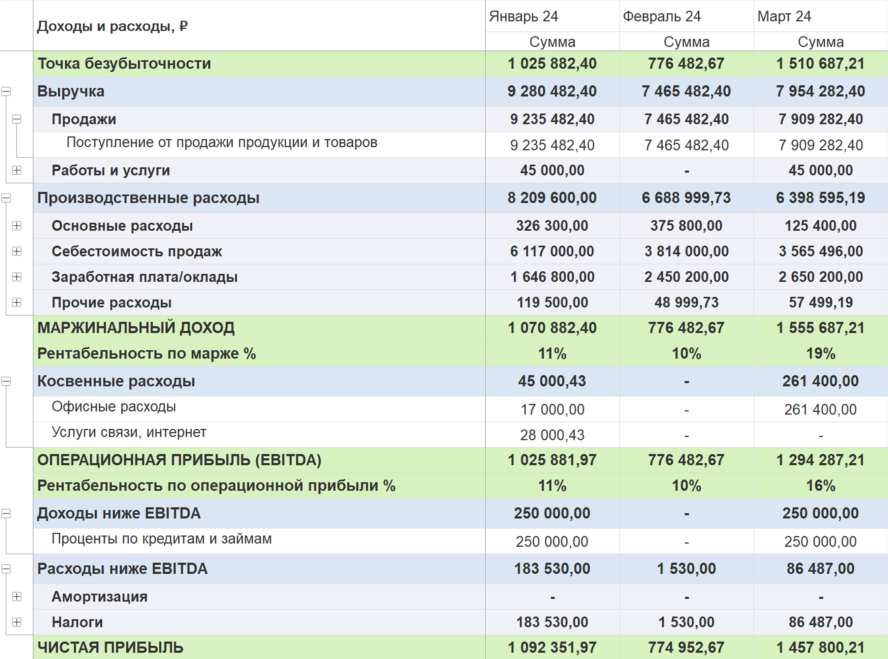

Отчет о прибылях и убытках (P&L) показывает доходы и расходы компании за определённый период времени, а также полученную прибыль или убыток.Отчет предоставляет пользователю гибкие настройки, позволяя самостоятельно [comment:Af8bi]определять структуру [/comment]и детализацию данных.

:::lab:true Основные функции отчета

1. Модуль 1С:P&L позволяет самостоятельно настраивать и сохранять структуру отчета с помощью инструмента [Структура отчета ОПиУ](./struktura-otcheta-p-l).

2. Имеет возможность создавать как сводные отчеты, так и разделять их по организациям

3. Доступно формирование отчетов по разным вариантам:

   -  по организациям

   -  по видам деятельности

   -  по подразделениям

   -  по проектам.

4. Возможность создавать план-фактные отчеты

5. Возможность детализировать статьи:

   -  по контрагентам

   -  по организациям

   -  по подразделениям

   -  по проектам

   -  по видам деятельности

   -  по денежным документам.

:::

{width=2692px height=2000px}

## Как сформировать отчет ОПиУ

1. Нажмите на вкладку **ОПиУ**.

2. Установите период, за который необходимо собрать отчет

3. Выберите [**структуру отчета**](./_index#структура-отчета) для группировки сумм по статьям

4. [**Установите параметры**](./_index#установка-параметров), по которым требуется собрать данные.

5. Выберите **вариант отчета**

6. Чтобы установить необходимые фильтры, нажмите на кнопку **Отборы**.

7. Нажмите кнопку **Сформировать**

#### Структура отчета

Структура отчета позволяет сгруппировать статьи  и распределить их по видам деятельности.

Сформировать отчёт по выбранной структуре можно выбрав в поле «Структура отчета» соответствующий элемент и нажать на кнопку **Сформировать**.

:::lab 

Как создать новую или изменить существующую структуру отчета читайте [здесь](./struktura-otcheta-p-l).

:::

#### Установка параметров

Параметры определяют структуру, периодичность и уровень детализации данных. В отчет доступны следующие параметры:

-  **Периодичность** - отчет формируется в разрезе выбранной пользователем периодичности

-  **Детализация** - позволяет дополнительно детализировать статьи отчета

-  **Вариант** - Позволяет формировать отчет по разным видам

## Как установить параметры и отборы отчета

:::info:true Как установить периодичность отчета

Для установки периодичности, по которой нужно сформировать отчет, в поле **Периодичность** нажмите на раскрывающийся список и выберите один из следующих вариантов:

-  **по дням**

-  **по неделям**

-  **по месяцам**

-  **по кварталам**

-  **по годам**

По умолчанию отчет формируется в периодичности **по месяцам**.

**Совет:** не собирайте отчет с детализацией “по дням” для больших периодов.

:::

:::info:true Как детализировать статьи отчета

Для установки детализации статей и их групп в отчете в поле **Детализация** нажмите на раскрывающийся список и выберите один из следующих вариантов:

-  **Контрагент**

-  **Организация**

-  **Доп. аналитика**

-  **Проект**

-  **Подразделение**

***Примечания:***

-  В при выборе варианта **P&L + доп. аналитика** недоступна детализация по **Доп. аналитике**

-  В при выборе варианта **P&L + проекты** недоступна детализация по **Проектам**

-  В при выборе варианта **P&L + Подразделения** недоступна детализация по **Подразделениям**

:::

:::info:true Как использовать отборы в отчете

Чтобы установить фильтры на отчет в правой части шапки формы нажмите на кнопку **Отборы**.

Доступные значения отборов:

-  **Организация** - по выбранным организациям устанавливается отбор на весь отчет

-  **Подразделение** - по выбранным организациям устанавливается отбор на раздел “Поступления платежи”

-  **Проект** - по выбранным проектам устанавливается отбор на раздел “Поступления и платежи”

-  **Доп. аналитика** - по выбранным значениям доп. аналитики устанавливается отбор на раздел “Поступления и платежи”

## 

## 

:::