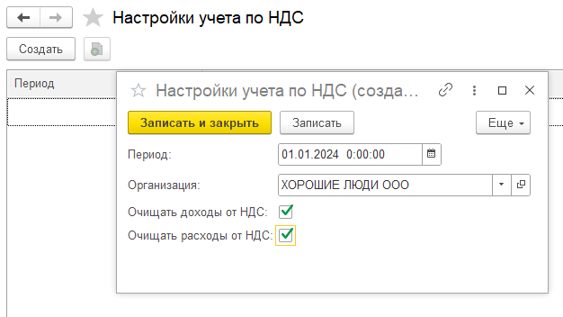
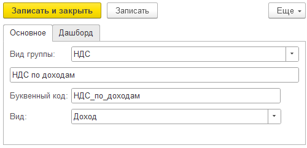

## Первичная настройка

Модуль позволяет исключить сумму НДС из документов в отчете.

Для начала следует настроить учет в соответствующих параметрах.

Пользователь должен указать дату начала применения данной настройки, выбрать организацию и определить, будет ли данная настройка применяться к доходам и расходам.

[image:./nastroyka-nds.png:::0,0,100,100::square,92.6141,0,7.3859,13.1105,,top-left,&square,0.4979,78.4062,33.361,14.653,,top-left,&square,35.7676,71.4653,16.0166,15.6812,,top-left:1205px:389px]

{width=626px height=352px}

## Документы

После установки настроек, последующие проведенные документы (в зависимости от данной настройки) будет для отчета ОПиУ исключать сумму НДС.

Во вкладке **Документы** все операции будут отражены с пометкой как **(НДС исключен)**

## ОПиУ

В отчете ОПиУ можно также отобразить исключенную сумму НДС в соответствующих группах. Для этого нужно создать новую группу, выбрав вид группы **НДС** и вид операции: **Доход; Расход**. В группе будет накапливаться сумма НДС по каждой операции.

{width=500px height=242px}

В сформированном отчете данная группа расшифровывается: будут представлены все документы, по которым был исключен НДС

