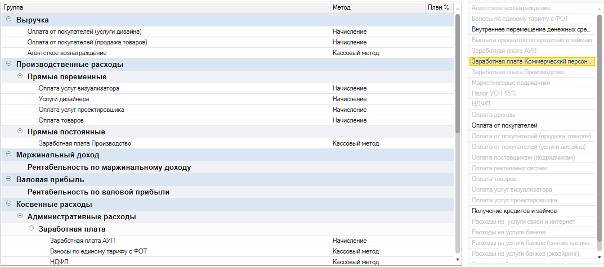

Модуль позволяет пользователям самостоятельно определить структуру групп и статей для формирования отчета ОПиУ.

{width=1073px height=475px}

## Как создать структуру отчета ОПиУ

1. Перейдите в раздел **Настройки**

2. В списке выберите пункт **P&L**

3. Нажмите на гиперссылку **Структуры управленческих отчетов**.

4. Нажмите кнопку **[icon:badge-plus] Создать**

5. В поле **Наименование** введите имя структуры

6. Сформируйте структуру отчета, добавив в него Группы и Статьи

   **Совет:** в правой части формы отображаются все используемые в указанном периоде статьи ДДС. Двойным нажатием на них можно быстро добавить статью в структуру.

   **Предупреждение:** чтобы избежать ошибок при формировании отчета не рекомендуем добавлять одну и ту же статью более 1 раза в структуру.

7. Нажмите на кнопку **Записать** или **Записать и закрыть**, чтобы применить значения.

## Как создать группы статей

1. Перейдите в раздел **Настройки**

2. В списке выберите пункт **P&L**

3. Нажмите на гиперссылку **Группы статей**.

4. Нажмите кнопку **Создать**

5. Введите наименование группы и наименование, которое будет отображаться в отчете

6. В поле Родитель при необходимости укажите группу, которому должна быть подчинена создаваемая группа.

7. Во вкладке Дашборд укажите соответствие для отображения в дашбордах

## Форма структуры отчета ОПиУ

[image:./struktura-otcheta-p-l-2.png:::0,0,100,100::square,0,28.2511,5.2246,6.5022,,top-left&square,5.8662,27.8027,29.5142,6.9507,,top-left&square,0,35.6502,75.1604,64.3498,,top-left&square,76.1687,28.2511,22.4565,71.7489,,top-left&square,53.7122,42.8251,14.5738,53.5874,,top-left:1091px:446px]

1. **Упорядочивание групп и статей** - позволяет менять порядок групп и статей

2. **Команды добавления новой группы и статьи в структуру**

   -  ***Добавить корень*** - добавление корневой группы статей в структуру отчета

   -  ***Добавить группу*** - добавление группы статей в выделенную группу

   -  ***Добавить статью*** - добавление статьи в выделенную группу

3. **Дерево формируемой структуры отчета** - отображает текущую формируемую структуру в виде дерева. Для изменения порядка и иерархии групп и статей есть возможность перетащить элементы интерактивно

4. **Помощник подбора статьи в структуру отчета** - отобранный по периоду список используемых в денежных операциях статей . Позволяет двойным нажатием мышки (или при нажатии на Enter) добавить статью в выделенную группу.

5. По «классике» отчет ОПиУ собирается методом начислений. Однако жизнь предпринимателя несколько сложнее и иногда при расчете чистой прибыли опираться на другую информацию. Уникальность модуля P&L в том, что по каждой статье можно указать свой метод получения данных:

   1. **метод «Начисление»** - собирает данные из бухгалтерских документов (накладные, акты, реализации, отчет о розничных продажах и др.)

   2. [comment:9MJyn]**метод «Кассовый»** - собирает данные из документов движения денег (банк, касса, \*кошелек)[/comment]

   3. **метод «Бюджет»** - берет плановые данные из управленческого документа «Бюджет»

   4. **метод «Договор»** - берет данные из договора (в каждом договоре есть таблицы с доходами и расходами)

:::danger 

Для корректной работы отчета не следует использовать одни и те же группы в структуре отчета более одного раза.

:::