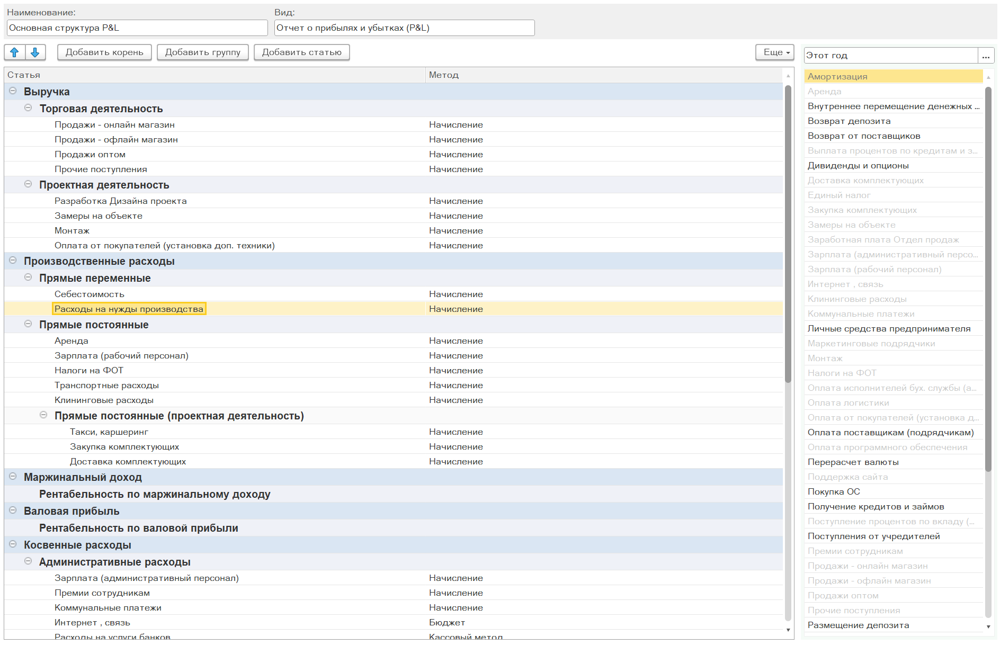
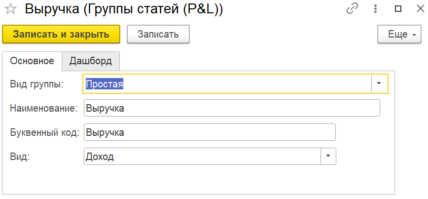

Структура отчета ОПиУ (Отчета о прибылях и убытках) представляет собой гибкий конструктор, позволяющий формировать из различных логических групп неограниченное количество иерархий и статей. Структура является основой отчета и состоит из групп, статей и рассчитываемых показателей. При установке модуля создается типовая структура, которую можно взять за основу и в дальнейшем адаптировать под потребности конкретного бизнеса.

Пользователь самостоятельно определяет:

-  перечень статей доходов и расходов;

-  логику их группировки в отчете;

-  формулы расчета промежуточных и итоговых показателей.

{width=1888px height=1218px}

## Как перейти в структуру отчета ОПиУ

Список структур ОПиУ находится

1. В самом отчете ОПиУ

   [image:./struktura-otcheta-p-l.png:::0,0,100,100::square,42.9472,27.8049,36.8006,34.1463,,top-left:1269px:205px:center]

2. Через «Настройки программы»  -> P&L -> Структуры управленческих отчетов.

   [image:./struktura-otcheta-p-l-2.png:::0,0,100,100::square,54.1528,17.9266,29.2359,7.7754,,top-left:1204px:463px:center]

## Форма структуры отчета ОПиУ

[image:./_index-2.png:::0,0,100,100::square,0,28.2511,5.2246,6.5022,,top-left&square,5.8662,27.8027,29.5142,6.9507,,top-left&square,0,35.6502,75.1604,64.3498,,top-left&square,76.1687,28.2511,22.4565,71.7489,,top-left&square,53.7122,42.8251,14.5738,53.5874,,top-left:1091px:446px:center]

1. **Упорядочивание групп и статей** - позволяет менять порядок групп и статей

2. **Команды добавления новой группы и статьи в структуру**

   -  ***Добавить корень*** - добавление корневой группы статей в структуру отчета

   -  ***Добавить группу*** - добавление группы статей в выделенную группу

   -  ***Добавить статью*** - добавление статьи в выделенную группу

3. **Дерево формируемой структуры отчета** - отображает текущую формируемую структуру в виде дерева. Для изменения порядка и иерархии групп и статей есть возможность перетащить элементы интерактивно

4. **Помощник подбора статьи в структуру отчета** - отобранный по периоду список используемых в денежных операциях статей . Позволяет двойным нажатием мышки (или при нажатии на Enter) добавить статью в выделенную группу.

5. По «классике» отчет ОПиУ собирается методом начислений. Однако жизнь предпринимателя несколько сложнее и иногда при расчете чистой прибыли опираться на другую информацию. Уникальность модуля P&L в том, что по каждой статье можно указать свой метод получения данных:

   1. **метод «Начисление»** - собирает данные из бухгалтерских документов (накладные, акты, реализации, отчет о розничных продажах и др.)

   2. **метод «Кассовый»** - собирает данные из документов движения денег (банк, касса, \*кошелек)

   3. **метод «Бюджет»** - берет плановые данные из управленческого документа «Бюджет»

   4. **метод «Договор»** - берет данные из договора (в каждом договоре есть таблицы с доходами и расходами)

:::danger 

Для корректной работы отчета не следует использовать одни и те же группы в структуре отчета более одного раза.

:::

## **Виды групп в структуре отчета**

Структура отчета строится на основе логических групп. В модуле P&L предусмотрено несколько видов групп.

---

### **Простая группа**

Простая группа -- это логическая группа, которая объединяет статьи доходов или расходов. При создании простой группы необходимо указать буквенный код, который в дальнейшем используется как параметр для формул.

{width=868px height=403px}

:::info 

**Важное правило:** при создании простой группы обязательно нужно указать вид -- доход либо расход. В группе «Доход» должны находиться только доходные статьи, в группе «Расход» -- только расходные. Смешивать доходные и расходные статьи в одной группе не допускается.

:::

---

### **Группа «Формула»**

Группа «Формула» позволяет создавать расчетные показатели на основе:

-  других логических групп (с использованием их буквенных кодов);

-  параметров;

-  статей (при условии, что в статье заполнен реквизит «Наименование для формулы»).

Для редактирования формулы необходимо нажать на значок карандаша, затем из списка дважды кликнуть по нужному показателю и расставить между ними необходимые математические знаки. В формулах допустимо использование любых арифметических знаков.

:::info 

[Подробнее о настройке групп, которые являются формулами, читайте по этой ссылке.](./sozdanie-formuly)

:::

---

### **Группа «НДС»**

Группа «НДС» предназначена для выделения доходов или расходов, очищенных от налога на добавленную стоимость. При создании такой группы необходимо:

-  указать наименование (например, «НДС по доходам»);

-  обязательно указать вид -- доход либо расход.

В отчете данная группа будет отображать, на какую сумму уменьшился НДС по доходам или расходам.

---

### **Группа «Косвенные расходы»**

Группа «Косвенные расходы» предназначена для расходов, которые не распределяются по направлениям деятельности или проектам напрямую (например, административные расходы). При создании такой группы указывается **база распределения** -- формула, на основе которой косвенные расходы будут распределяться в момент формирования отчета.

База распределения может быть любой формулой: например, процент от выручки или от другого параметра. Распределение происходит непосредственно при формировании отчета, сами данные не сохраняются.

**Важное правило:** в группе косвенных расходов должны находиться только группы и статьи, связанные с косвенными расходами.

---

## **Статьи и единый справочник**

В модуле P&L используется **единый справочник статей ДДС** (движения денежных средств). Такой подход позволяет:

-  объединять все начисления и оплаты в рамках одной статьи;

-  анализировать взаиморасчеты с контрагентами не только в разрезе контрагентов, но и в разрезе статей;

-  контролировать как начисленные, так и оплаченные суммы по каждой статье в разрезе контрагентов.

Использование единого справочника снижает количество ручных настроек и делает отчетность более сопоставимой.

Возможность задавать разные методы для разных статей позволяет гибко настраивать учет: одни статьи удобнее анализировать по оплате, другие -- по начислению, а часть расходов целесообразно закладывать в управленческий учет еще до появления первичных документов.

---

## **Практические рекомендации**

1. **Начинать с типовой структуры.** При установке модуля создается типовая структура отчета, которую можно взять за основу и адаптировать под нужды бизнеса.

2. **Соблюдать группировку.** Доходные и расходные статьи должны находиться в отдельных группах. Смешение не допускается.

3. **Использовать единый справочник статей.** Это обеспечивает сопоставимость данных и упрощает анализ взаиморасчетов.

4. **Настраивать методы для каждой статьи.** Для разных статей могут требоваться разные методы признания доходов и расходов.

5. **Использовать параметры для гибких расчетов.** Параметры позволяют вводить в формулы значения, которые не привязаны к конкретным документам