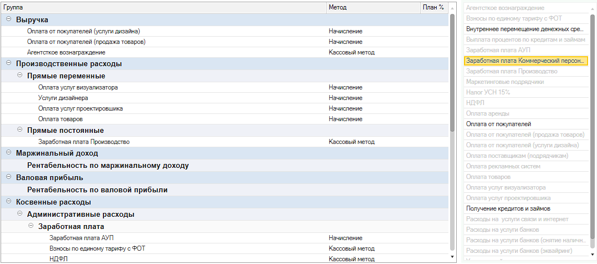

Модуль позволяет пользователям самостоятельно определить структуру групп и статей для формирования отчета ОПиУ.

{width=1073px height=475px}

## Как перейти в структуру отчета ОПиУ

Список структур ОПиУ находится

1. В самом отчете ОПиУ

   [image:./struktura-otcheta-p-l.png:::0,0,100,100::square,42.9472,27.8049,36.8006,34.1463,,top-left:1269px:205px:center]

2. Через «Настройки программы»  -> P&L -> Структуры управленческих отчетов.

   [image:./struktura-otcheta-p-l-2.png:::0,0,100,100::square,54.1528,17.9266,29.2359,7.7754,,top-left:1204px:463px:center]

## Форма структуры отчета ОПиУ

[image:./_index-2.png:::0,0,100,100::square,0,28.2511,5.2246,6.5022,,top-left&square,5.8662,27.8027,29.5142,6.9507,,top-left&square,0,35.6502,75.1604,64.3498,,top-left&square,76.1687,28.2511,22.4565,71.7489,,top-left&square,53.7122,42.8251,14.5738,53.5874,,top-left:1091px:446px:center]

1. **Упорядочивание групп и статей** - позволяет менять порядок групп и статей

2. **Команды добавления новой группы и статьи в структуру**

   -  ***Добавить корень*** - добавление корневой группы статей в структуру отчета

   -  ***Добавить группу*** - добавление группы статей в выделенную группу

   -  ***Добавить статью*** - добавление статьи в выделенную группу

3. **Дерево формируемой структуры отчета** - отображает текущую формируемую структуру в виде дерева. Для изменения порядка и иерархии групп и статей есть возможность перетащить элементы интерактивно

4. **Помощник подбора статьи в структуру отчета** - отобранный по периоду список используемых в денежных операциях статей . Позволяет двойным нажатием мышки (или при нажатии на Enter) добавить статью в выделенную группу.

5. По «классике» отчет ОПиУ собирается методом начислений. Однако жизнь предпринимателя несколько сложнее и иногда при расчете чистой прибыли опираться на другую информацию. Уникальность модуля P&L в том, что по каждой статье можно указать свой метод получения данных:

   1. **метод «Начисление»** - собирает данные из бухгалтерских документов (накладные, акты, реализации, отчет о розничных продажах и др.)

   2. [comment:9MJyn]**метод «Кассовый»** - собирает данные из документов движения денег (банк, касса, \*кошелек)[/comment]

   3. **метод «Бюджет»** - берет плановые данные из управленческого документа «Бюджет»

   4. **метод «Договор»** - берет данные из договора (в каждом договоре есть таблицы с доходами и расходами)

:::danger 

Для корректной работы отчета не следует использовать одни и те же группы в структуре отчета более одного раза.

:::