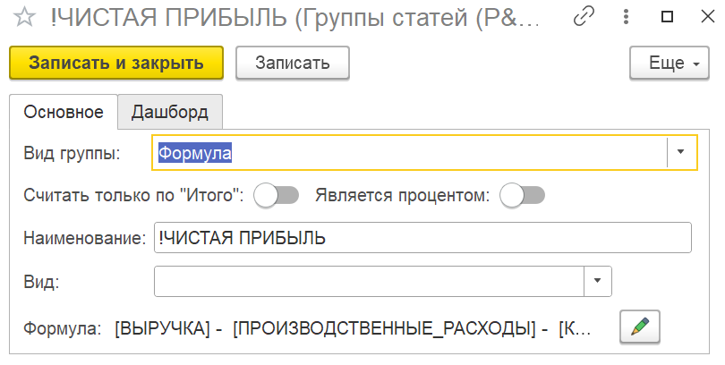
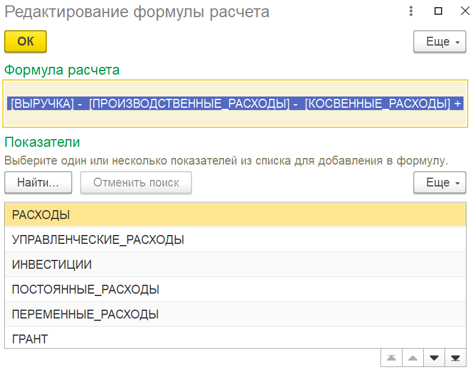

## **Алгоритм создания формулы расчета**

Для создания формулы необходимо выполнить следующие действия:

1. Создайте новую группу или откройте существующую для редактирования.

2. В настройках группы установите **«Вид группы»** в значение **«Формула»**. Это обязательное условие для работы с формулами.

3. В поле **«Формула расчета»** введите математическое выражение. Для корректировки формулы нажмите на иконку редактирования (карандаш).

4. При составлении формулы вы можете использовать показатели, которые представлены в специальном списке. Этот список содержит все **«Обычные группы»**, созданные в разделе P&L.

:::info 

**Критическое ограничение:** В формулах запрещено использовать результаты других формул (группы с видом **«Формула»**). Каждое расчетное выражение должно быть построено исключительно на основе исходных данных («Обычных групп»). Таким образом, формулы не могут быть иерархическими.

:::

{width=810px height=408px}

{width=798px height=625px}