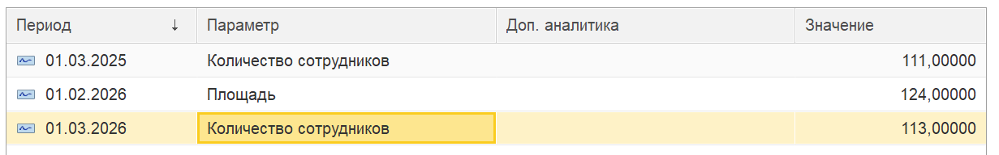

## **Алгоритм создания формулы расчета**

Для создания формулы необходимо выполнить следующие действия:

1. Создайте новую группу или откройте существующую для редактирования.

2. В настройках группы установите **«Вид группы»** в значение **«Формула»**. Это обязательное условие для работы с формулами.

3. В поле **«Формула расчета»** введите математическое выражение. Для корректировки формулы нажмите на иконку редактирования (карандаш).

4. При составлении формулы вы можете использовать показатели, которые представлены в специальном списке. Этот список содержит все **«Обычные группы»**, созданные в разделе P&L.

:::info 

**Критическое ограничение:** В формулах запрещено использовать результаты других формул (группы с видом **«Формула»**). Каждое расчетное выражение должно быть построено исключительно на основе исходных данных («Обычных групп»). Таким образом, формулы не могут быть иерархическими.

:::

Группа-формула -- один из видов логических групп в структуре отчета ОПиУ. Ее назначение -- создавать расчетные показатели, которые автоматически вычисляются на основе данных из других групп, статей или пользовательских параметров.

---

**Настройка формулы**

Для задания формулы необходимо:

1. Нажать на значок **«карандаш»** (редактирование) рядом с созданной группой.

2. В открывшемся редакторе формул из списка доступных показателей дважды кликнуть по нужному элементу, чтобы добавить его в формулу.

3. Между добавленными элементами расставить необходимые арифметические знаки: `+`, `-`, `*`, `/`, `(`, `)`.

4. Сохранить формулу.

В формулах допустимо использование любых математических операторов и скобок для задания приоритета вычислений.

---

## **Источники данных для формулы**

В формуле группы-формулы могут использоваться следующие источники:

### **Логические группы (не включая другие группы-формулы)**

Любая группа, имеющая буквенный код, может быть использована как параметр в формуле. Для этого в редакторе формул выбирается соответствующий буквенный код группы.

---

### **Статьи**

Статья может быть использована в формуле, если в ее карточке заполнен реквизит **«Наименование для формулы»**. После заполнения этого реквизита статья появляется в списке доступных элементов в редакторе формул.

[image:./sozdanie-formuly.png:::0,0,100,100::square,0,78.4232,79.0994,21.5768,,top-left:1177px:241px:center]

**Важно:** использовать статью в формуле можно только в том случае, если ей присвоено уникальное наименование для формулы.

---

### **Параметры**

Параметры -- это пользовательские значения, задаваемые в блоке **«Настройки программы PNL» -> «Значение параметра для отчета ОПиУ»**. Они могут быть:

-  общими для всего отчета;

-  в разрезе направления деятельности;

-  с дополнительной аналитикой.

   {width=1231px height=192px}

Параметры имеют **периодичность**: в момент формирования отчета система берет последнее значение на текущий период.

**Примеры параметров:**

-  средний чек;

-  количество сотрудников;

-  площадь арендуемых помещений.

Параметры также отображаются в списке доступных элементов в редакторе формул и могут быть использованы наравне с группами и статьями.

**Пример формулы с параметром:**

`REV / Количество_сотрудников` -- расчет выручки на одного сотрудника.

---

## **Примеры использования групп-формул**

| **Наименование группы**  | **Формула**                                                                     | **Назначение**                                                |
|--------------------------|---------------------------------------------------------------------------------|---------------------------------------------------------------|
| Валовая прибыль          | `Выручка - Себестоимость`                                                       | Расчет маржинального дохода                                   |
| EBITDA                   | `Валовая_прибыль - Расходы_на_продажи - Административные_расходы + Амортизация` | Показатель прибыли до вычета процентов, налогов и амортизации |
| Рентабельность продаж, % | `(Валовая_прибыль / Выручка) * 100`                                             | Процентный показатель эффективности                           |
| Выручка на сотрудника    | `Выручка / Количество_сотрудников`                                              | Производительность труда (с использованием параметра)         |