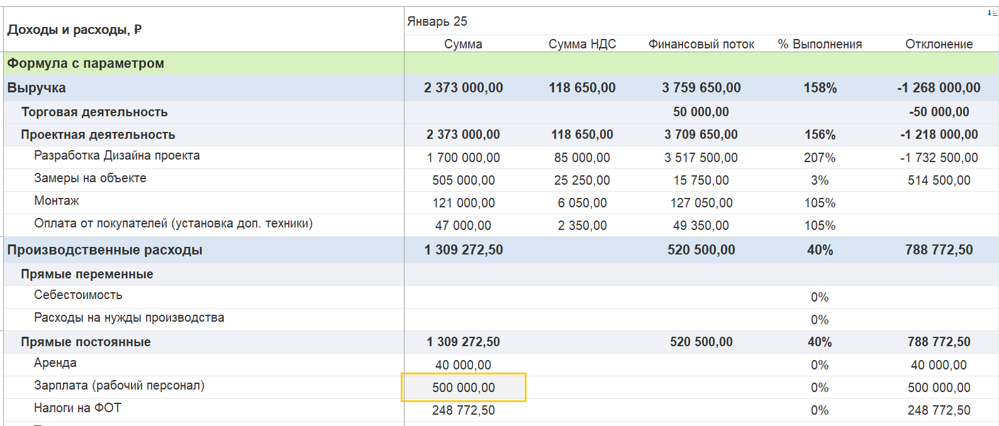
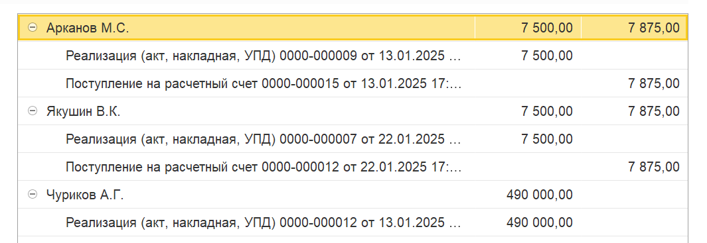
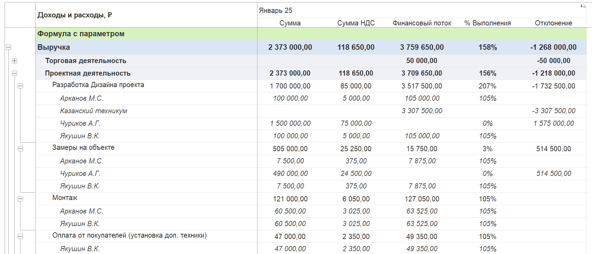
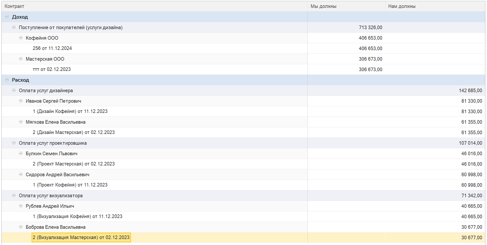
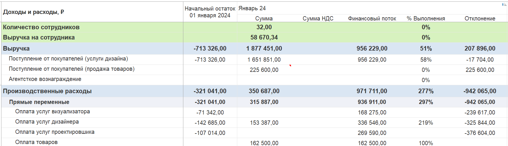

Отчёт «P&L + финансовый поток» позволяет совместить в одной таблице:

-  **Признанные доходы и расходы** -- данные из отчёта о прибылях и убытках (P&L).

-  **Фактическое движение денежных средств** (финансовый поток) по тем же статьям.

-  **Процент выполнения** (соотношение фактического потока к признанной сумме).

-  **Отклонение** -- разница между признанными доходами/расходами и фактическим движением денег (накопительно с начала года).

Отчёт помогает контролировать дебиторскую и кредиторскую задолженность, анализировать разрывы между учётом и реальными платежами.

{width=1588px height=678px}

## **Структура отчёта**

В отчёте присутствуют следующие колонки:

| **Колонка**                         | **Описание**                                                  |
|-------------------------------------|---------------------------------------------------------------|
| **Статья**                          | Статья дохода или расхода из единого справочника              |
| **Сумма (P&L)**                     | Признанная сумма дохода/расхода по выбранному методу учёта    |
| **Финансовый поток (ДДС)**          | Фактическое поступление/выплата денег по статье за период     |
| **% Выполнения**                    | (Финансовый поток / Сумма P&L) × 100%                         |
| **Отклонение**                      | Сумма P&L − Финансовый поток (накопительно с начала года)     |
| **Начальный остаток** (при наличии) | Остаток дебиторской/кредиторской задолженности на начало года |

## **Детализация данных**

**Двойной клик по сумме** в любой колонке откроет **основание** -- список документов, на базе которых сформирована сумма.

{width=1065px height=367px}

Можно включить **детализацию по контрагентам** -- тогда отчёт покажет задолженность в разрезе каждого партнёра.

{width=1699px height=729px}

## **Как ввести начальные остатки дебиторской/кредиторской задолженности**

Для корректного расчёта отклонений с начала года необходимо ввести начальные остатки:

1. Перейдите в раздел **«Управленческие документы»**.

2. Выберите документ **«Ввод начальных остатков»**.

3. Укажите:

   -  **Организацию**

   -  **Дату -- 01.01.текущего\_года**

4. В табличной части выберите **«Доходы»** или **«Расходы»**.

5. Нажмите **«Добавить статью»** -> выберите нужную статью.

6. Нажмите на добавленную статью -> **«Добавить контрагента»**.

7. Выберите контрагента -> **«Добавить договор»**.

8. Заполните колонки:

   -  **«Мы должны»** -- если есть кредиторская задолженность.

   -  **«Нам должны»** -- если есть дебиторская задолженность.

9. Проведите документ.

После этого в отчёте появится колонка **«Начальный остаток на 01.01.ГГГГ»**, а отклонения будут рассчитываться с учётом введённых данных.

{width=2038px height=1026px}

{width=1779px height=514px}

## **Интерпретация отклонений**

### **Для доходов**

-  **Положительное отклонение** (Сумма P&L > Финансовый поток) означает, что доход признан, но деньги ещё не поступили (дебиторская задолженность).

-  **Отрицательное отклонение** (Сумма P&L \< Финансовый поток) может означать предоплату или наличие кредиторской задолженности.

### Для расходов

-  **Положительное отклонение** (Сумма P&L > Финансовый поток) означает, что расход признан, но деньги еще не списали, то есть появляется задолженность перед поставщиком.

-  **Отрицательное отклонение** (Сумма P&L \< Финансовый поток) означает, что прошла оплата, но акт выполненных работ поставщик еще не выставил. То есть поставщик становится должником.