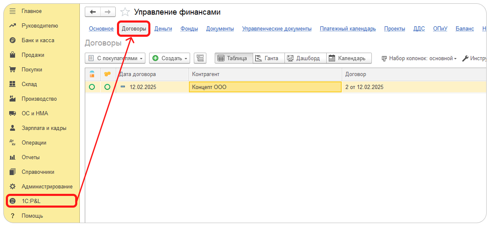

Раздел Договоры -- это незаменимый инструмент для эффективного управления всеми аспектами договорных отношений. Система обеспечивает полную прозрачность и контроль над процессом заключения, исполнения и закрытия договоров, что в свою очередь позволяет оптимизировать финансовые потоки и ресурсы компании.

Система позволяет автоматизировать процесс [создания актов и счетов](<app://obsidian.md/2. Создание актов и счетов>) и уведомлять контрагентов по электронной почте. Мониторинг договоров осуществляется с помощью привлекательных дашбордов и диаграммы Ганта, что делает процесс более наглядным и удобным.

Переход в раздел Договоры производится через переход по команде Договоры основной формы Управление финансами. При переходе по умолчанию отображается [список договоров](<app://obsidian.md/1. Список договоров>).

{width=1173px height=541px}

### Основные функции раздела Договоры:

Раздел Договоры предлагает широкий спектр возможностей, которые помогут эффективно управлять договорными отношениями и принимать обоснованные решения, а именно:

-  Отображение списка договоров с ключевыми показателями

-  Возможность настройки фильтров по ключевым показателям для более точного анализа состава и состояния договоров

-  Контроль статусов проверки данных, оплаты и отгрузки товаров и услуг

-  Назначение ответственных лиц и менеджеров

-  Контроль сроков исполнения договоров с помощью диаграммы Ганта

-  Распределение \[\[4. Распределение плановых доходов|плановых доходов\]\] и \[\[5. Распределение плановых расходов|плановых расходов\]\], а также контроль рентабельности договоров

-  Проведение план-фактного анализа доходов и расходов

-  Планирование платежей с помощью Платежного календаря

-  Автоматизация процесса выставления актов и счетов

-  Формирование шаблонов файлов по категориям договоров