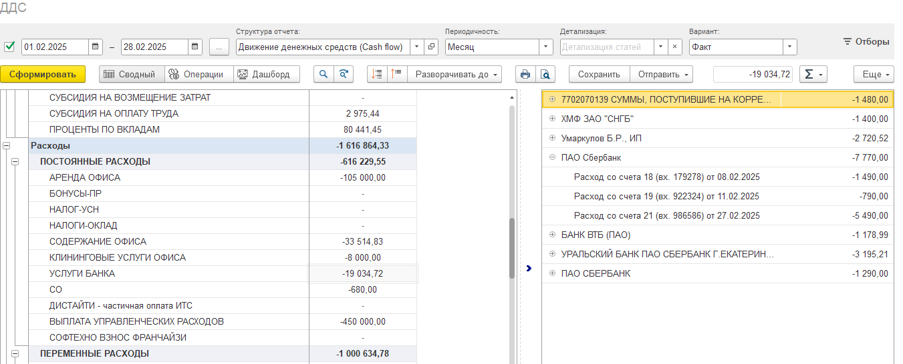

Отчет о движении денежных средств (ДДС, CashFlow) – это финансовый отчет, который показывает поступление и выбытие денежных средств компании. Отчета предоставляет пользователю гибкие настройки, позволяя самостоятельно определять структуру и детализацию данных.

:::tip:true Цели отчета ДДС

-  Показать, откуда компания получает деньги и на что их тратит.

-  Оценить платежеспособность и финансовую устойчивость.

-  Помочь инвесторам и кредиторам понять, генерирует ли бизнес достаточно денег для покрытия расходов.

:::

[image:./otchet-dds.png::Форма отчета ДДС:0,0,100,100:82::3867px:2868px]

## Как сформировать отчет ДДС

1. Нажмите на вкладку **ДДС**.

2. Установите период, за который необходимо собрать отчет

3. Выберите [**структуру отчета**](./_index#структура-отчета) для группировки сумм по статьям

4. [**Установите параметры**](./_index#установка-параметров), по которым требуется собрать данные.

5. Выберите **вариант отчета**

6. Чтобы установить необходимые фильтры, нажмите на кнопку **Отборы**.

7. Нажмите кнопку **Сформировать**

### Структура отчета

Структура отчета позволяет сгруппировать статьи движения денежных средств и распределить их по видам деятельности.

Сформировать отчёт по выбранной структуре можно выбрав в поле «Структура отчета» соответствующий элемент и нажать на кнопку **Сформировать**.

:::lab 

Как создать новую или изменить существующую структуру отчета читайте [здесь](./struktura-otcheta-dds).

:::

### Установка параметров

Параметры определяют структуру, периодичность и уровень детализации данных. В отчет доступны следующие параметры:

-  **Периодичность** - отчет формируется в разрезе выбранной пользователем периодичности

-  **Детализация** - позволяет дополнительно детализировать статьи отчета

-  **Вариант** - Позволяет формировать отчет по разным видам

## Как установить параметры и отборы отчета

:::info:true Как установить периодичность отчета

Для установки периодичности, по которой нужно сформировать отчет, в поле **Периодичность** нажмите на раскрывающийся список и выберите один из следующих вариантов:

-  **по дням**

-  **по неделям**

-  **по месяцам**

-  **по кварталам**

-  **по годам**

По умолчанию отчет формируется в периодичности **по месяцам**.

**Совет:** не собирайте отчет с детализацией “по дням” на больших периодов.

:::

:::info:true Как детализировать статьи отчета

Для установки детализации статей и их групп в отчете в поле **Детализация** нажмите на раскрывающийся список и выберите один из следующих вариантов:

-  **Контрагент**

-  **Организация**

-  **Доп. аналитика**

-  **Проект**

-  **Подразделение**

**Примечания**

-  В при выборе варианта **ДДС + доп. аналитика** недоступна детализация по **Доп. аналитике**

-  В при выборе варианта **ДДС + проекты** недоступна детализация по **Проектам**

-  В при выборе варианта **ДДС + Подразделения** недоступна детализация по **Подразделениям**

:::

:::info:true Как установить вариант отчета

Отчет ДДС может формироваться

-  **ДДС + БДДС** - позволяет сравнить план и факт движения денег

-  **ДДС + Платежный календарь** - позволяет сравнить факт движения денег c платежным календарем

-  **ДДС + доп. аналитика** - позволяет построить горизонтальный отчет по магазинам, ресторанам или направлениям

-  **ДДС + проекты** - позволяет анализировать движение денег в разрезе проектов

:::

:::info:true Как использовать отборы в отчете

Чтобы установить фильтры на отчет в правой части шапки формы нажмите на кнопку **Отборы**.

Доступные значения отборов:

-  **Организация** - по выбранным организациям устанавливается отбор на весь отчет

-  **Подразделение** - по выбранным организациям устанавливается отбор на раздел “Поступления платежи”

-  **Проект** - по выбранным проектам устанавливается отбор на раздел “Поступления и платежи”

-  **Доп. аналитика** - по выбранным значениям доп. аналитики устанавливается отбор на раздел “Поступления и платежи”

-  **Выводить остатки переводам в пути** - при включенном переключателе в остатках на начало и конец выводит остатки по переводам, находящимся в пути.

-  **Выводить остатки депозитных счетов** -  - при включенном переключателе в остатках на начало и конец выводит остатки депозитных счетов

:::

## Основные разделы отчета

Отчет содержит следующие разделы:

1. **Остатки  на начало периода** - деньги на счетах, кассах, кошельках и переводы в пути

2. **Поступления и платежи** - движения денег по видам деятельности и статьям

3. **Общий денежный поток** - сумма поступлений и платежей

4. **Контроль** - подтверждает корректность данных в отчете или указывает на ошибки

5. **Остатки на конец периода** - деньги на счетах, кассах, кошельках и переводы в пути

## Расшифровка

Расшифровать суммы поступлений и платежей по документам источникам можно двойным кликом левой кнопки мыши на саму сумму.

Справа от отчета откроется панель со списком документов, являющимися источниками для выбранной ячейки. Список документов для удобства сгруппирован по контрагентам.

{width=1351px height=546px}

## **Описание разделов отчета**

### Остатки денежных средств на начало и конец периода

Отображает остатки денежных средств на начало и конец периода формирования отчета с детализацией на ключевые подразделы

:::info:true Детализация остатков денежных средств

Остатки денежных средств дополнительно детализируются на подразделы:

-  **Деньги в кассе** - остаток наличных средств, которая находится в кассах организации.

-  **Деньги на расчетных счетах** - остаток денежных средств на расчетных счетах.

-  **Переводы в пути** - остатки денежных средств, которые уже отправлены, но ещё не зачислены на счёт получателя или не оприходованы.

:::

### Доходы и расходы

Раздел отчета Доходы и расходы отображает движения денежных средств, сгруппированных по статьям согласно [структуре отчета ДДС](./struktura-otcheta-dds).

Суммы доходов и расходов по статьям могут быть дополнительно детализированы по контрагентам, организациям, подразделениям, проектам и видам деятельности через настройку отчета [Детализация](./forma-otcheta-dds/_index#основные-параметры-формирования-отчета).

Суммы доходов и расходов группируются за каждый временной промежуток, указанный в настройке [Периодичность](./forma-otcheta-dds/_index#основные-параметры-формирования-отчета).

В зависимости от выбранного [варината отчета](./_index#варианты-отчета-ддс) суммы доходов и расходов можно сравнить с платежным календарем, Бюджетом движения денежных средств (БДДС), а также отобразить движения денежных средств по подразделениям, проектам и видам деятельности.

## Варианты отчета ДДС

Варианты отчета позволят отображать движения денежных средств и **??????что-то что-то"??????**

### Факт

### Факт + Платежный календарь

### Факт + БДДС

### Факт + П/П + План

### ДДС + доп. аналитика

### ДДС + проекты

### ДДС + Подразделения

/////////////////////////////////////////////////////////////////////////////////////////////////////////////////////

## Основные функции отчета

1. Модуль 1С:P&L позволяет самостоятельно настраивать и сохранять структуру отчета с помощью инструмента [Структура отчета ДДС](./new-article).

2. Имеет возможность создавать как сводные отчеты, так и разделять их по организациям

3. Доступно формирование отчетов по разным вариантам:

   -  по организациям

   -  по видам деятельности

   -  по подразделениям

   -  по проектам.

4. Возможность создавать план-фактные отчеты в рамках контроля бюджета движения денежных средств (БДДС) и платежного календаря.

5. Возможность детализировать статьи:

   -  по контрагентам

   -  по организациям

   -  по подразделениям

   -  по проектам

   -  по видам деятельности

   -  по денежным документам.

6. Данные движений денежных средств также отображаются в рамках показательных дашбордов.

Предназначен для ….

……

по поступлениям и выбытиям денежных средств. Он позволяет детализированно контролировать финансовые потоки и контролировать остатки денежных средств средств в кассах и на счетах компании.

:::info:true Детализация остатков денежных средств

Остатки денежных средств дополнительно детализируются на подразделы:

-  **Деньги в кассе** - остаток наличных средств, которая находится в кассах организации. Эта сумма отражает количество наличности, доступной в каждой кассе, и используется для контроля за движением денежных средств в организации.

   В бухгалтерском учете остаток денежных средств в кассе отражается **на счете 50 «Касса»**

-  **Деньги на расчетных счетах** - остаток денежных средств на расчетных счетах. Отражает доступные средства на каждом расчетном счете организации, которые компания может использовать для проведения платежей, оплаты расходов или других финансовых операций

   В бухгалтерском учете остаток денежных средств на расчетных счетах отражается на счёте **51 «Расчётные счета»**

-  **Переводы в пути** - остатки денежных средств, которые уже отправлены (например, перечислены с расчётного счёта или переданы в кассу), но ещё не зачислены на счёт получателя или не оприходованы. Отключить отображение остатков денежных средств переводов в пути можно через [отборы отчета](./forma-otcheta-dds/_index#отборы-отчета)

   В бухгалтерском учете остаток денежных средств на расчетных счетах отражается на счёте **57** **«Переводы в пути»**

:::