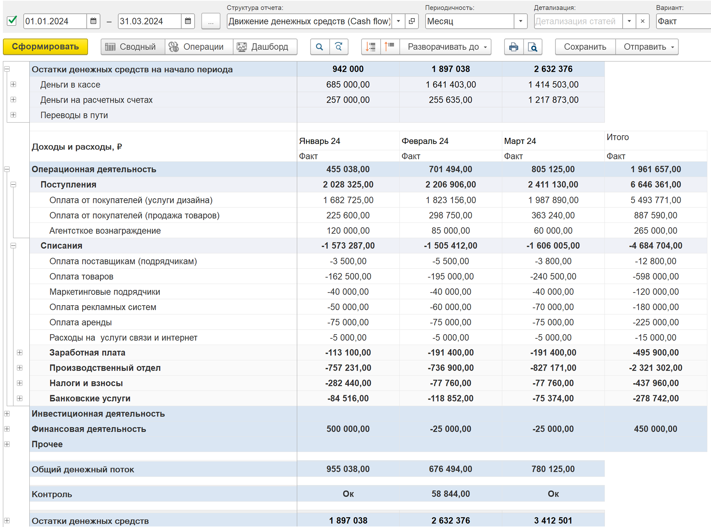

Отчет о движении денежных средств (ДДС, CashFlow) – это отчет

*показывает, сколько денег есть на счетах, откуда они приходят и куда уходят*

{width=3867px height=2868px}

#### Структура отчета

Позволяет выбрать ранее созданную структуру отчета где сгруппировать статьи движения денежных средств и распределить 
их по видам деятельности

#### Периодичность

Позволяет выбрать ранее созданную структуру отчета где сгруппировать статьи движения денежных

#### Детализация

Позволяет выбрать ранее созданную структуру отчета где сгруппировать статьи движения денежных

#### Вариант

Позволяет выбрать ранее созданную структуру отчета где сгруппировать статьи движения денежных

### Отчет содержит следующие разделы:

1. **Остатки  на начало периода** - деньги на счетах, кассах, кошельках и переводы в пути

2. **Поступления и платежи** - движения денег по видам деятельности и статьям

3. **Общий денежный поток** - сумма поступлений и платежей

4. **Контроль** - подтверждает корректность данных в отчете или указывает на ошибки

5. **Остатки на конец периода** - деньги на счетах, кассах, кошельках и переводы в пути

## Расшифровка

:::info Разделы отчета ДДС

1. **Остатки  на начало периода** - деньги на счетах, кассах, кошельках и переводы в пути

2. **Поступления и платежи** - движения денег по видам деятельности и статьям

3. **Общий денежный поток** - сумма поступлений и платежей

4. **Контроль** - подтверждает корректность данных в отчете или указывает на ошибки

5. **Остатки на конец периода** - деньги на счетах, кассах, кошельках и переводы в пути

:::

#### Отчет состоит из следующих разделов:

Отчет ДДС формируется по [структуре отчета](./struktura-otcheta-dds). Пользователь может сгруппировать статьи ДДС по группам и видам деятельности.

## **Описание разделов отчета**

#### Остатки денежных средств на начало и конец периода

Раздел отчета Остатки денежных средств на начало и на конец периода отображает остатки денежных средств на начало и конец периода формирования отчета с детализацией на ключевые подразделы

:::info:true Детализация остатков денежных средств

Остатки денежных средств дополнительно детализируются на подразделы:

-  **Деньги в кассе** - остаток наличных средств, которая находится в кассах организации. Эта сумма отражает количество наличности, доступной в каждой кассе, и используется для контроля за движением денежных средств в организации.

   В бухгалтерском учете остаток денежных средств в кассе отражается **на счете 50 «Касса»**

-  **Деньги на расчетных счетах** - остаток денежных средств на расчетных счетах. Отражает доступные средства на каждом расчетном счете организации, которые компания может использовать для проведения платежей, оплаты расходов или других финансовых операций

   В бухгалтерском учете остаток денежных средств на расчетных счетах отражается на счёте **51 «Расчётные счета»**

-  **Переводы в пути** - остатки денежных средств, которые уже отправлены (например, перечислены с расчётного счёта или переданы в кассу), но ещё не зачислены на счёт получателя или не оприходованы. Отключить отображение остатков денежных средств переводов в пути можно через [отборы отчета](./forma-otcheta-dds#отборы-отчета)

   В бухгалтерском учете остаток денежных средств на расчетных счетах отражается на счёте **57** **«Переводы в пути»**

:::

#### Доходы и расходы

Раздел отчета Доходы и расходы отображает движения денежных средств за период, сгруппированных по статьям согласно [структуре отчета ДДС](./struktura-otcheta-dds), которая позволяет самостоятельно определять структуру движения денежных средств по своим организациям.

Суммы доходов и расходов по статьям могут быть дополнительно детализированы по контрагентам, организациям, подразделениям, проектам и видам деятельности через настройку отчета [Детализация](./forma-otcheta-dds#основные-параметры-формирования-отчета).

Суммы доходов и расходов формируются за каждый временной промежуток, указанный в настройке [Периодичность](./forma-otcheta-dds#основные-параметры-формирования-отчета).

В зависимости от выбранного [варината отчета](./_index#варианты-отчета-ддс) суммы доходов и расходов можно сравнить с платежным календарем, Бюджетом движения денежных средств (БДДС), а также отобразить движения денежных средств по подразделениям, проектам и видам деятельности.

## Варианты отчета ДДС

Варианты отчета позволят отображать движения денежных средств и **??????что-то что-то"??????**

### Факт

### Факт + Платежный календарь

### Факт + БДДС

### Факт + П/П + План

### ДДС + доп. аналитика

### ДДС + проекты

### ДДС + Подразделения

/////////////////////////////////////////////////////////////////////////////////////////////////////////////////////

## Основные функции отчета

1. Модуль 1С:P&L позволяет самостоятельно настраивать и сохранять структуру отчета с помощью инструмента [Структура отчета ДДС](./new-article).

2. Имеет возможность создавать как сводные отчеты, так и разделять их по организациям

3. Доступно формирование отчетов по разным вариантам:

   -  по организациям

   -  по видам деятельности

   -  по подразделениям

   -  по проектам.

4. Возможность создавать план-фактные отчеты в рамках контроля бюджета движения денежных средств (БДДС) и платежного календаря.

5. Возможность детализировать статьи:

   -  по контрагентам

   -  по организациям

   -  по подразделениям

   -  по проектам

   -  по видам деятельности

   -  по денежным документам.

6. Данные движений денежных средств также отображаются в рамках показательных дашбордов.

Предназначен для ….

……

по поступлениям и выбытиям денежных средств. Он позволяет детализированно контролировать финансовые потоки и контролировать остатки денежных средств средств в кассах и на счетах компании.