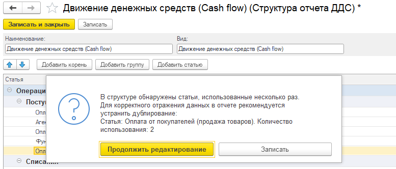

## Разберем часто задаваемые вопросы по отчету ДДС

**Вопрос**: В отчете есть дублирование суммы. Хотя в расшифровке сумма указана правильно.

**Ответ**: Скорее всего, эта статья в структуре отчета повторяется. Сейчас есть проверка на дублирование статей в отчете о движении денежных средств. Необходимо удалить все дублирующие статьи в структуре.

{width=777px height=332px}

