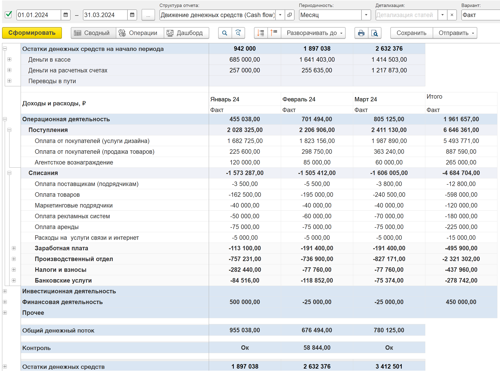

Отчет ДДС может быт сформирован по следующим вариантам:

-  **Факт** - отображает фактические движения денежных средств по структуре отчета

-  **Факт + Платежный календарь** - позволяет сравнить факт движения денег c платежным календарем

-  **Факт + БДДС -** позволяет сравнить план и факт движения денежных средств

-  **Факт + П/П + План**

-  **ДДС + доп. аналитика**

-  **ДДС + проекты**

-  **ДДС + Подразделения**

:::info:true Как сформировать вариант отчета Факт

Вариант отчета **Факт** отображает фактические движения денежных средств по структуре отчета.

{width=3867px height=2868px}

:::

:::info:true Как сформировать вариант отчета Факт + Платежный календарь

Вариант отчета **Факт + Платежный календарь** позволяет сравнить факт движения денег c платежным календарем.

Отчет будет сформирован со следующими колонками:

-  **Факт** - сумма фактических движений денежных средств.

-  **План** - сумма, спланированная документом [Платежный календарь](./../new-article-4).

-  **Отклонение** - разница плана с фактом.

-  **% Выполнения** - рассчитанный процент выполнения плана

:::

:::info:true Как сформировать вариант отчета Факт + БДДС

Вариант отчета **Факт + Бюджет движения денежных средств (БДДС)** позволяет сравнить план и факт движения денежных средств

Отчет будет сформирован со следующими колонками:

-  **Факт** - сумма фактических движений денежных средств.

-  **План** - ???.

-  **Отклонение** - разница плана с фактом.

-  **% Выполнения** - рассчитанный процент выполнения плана

:::

:::info:true Как сформировать вариант отчета Факт + БДДС

Вариант отчета **Факт +** 

:::

## 

При выборе варианта отчета Факт 

[tabs]

[tab:Факт::]

Вариант отчета **Факт** отображает фактические движения денежных средств по структуре отчета

[image:./otchet-dds-4.png:::0,0,100,100:91::3867px:2868px]

[/tab]

[tab:+ Платежный календарь::]

Вариант отчета **Факт + Платежный календарь** позволяет сравнить факт движения денег c платежным календарем.

Отчет будет сформирован со следующими колонками:

-  **Факт** - сумма фактических движений денежных средств.

-  **План** - сумма, спланированная документом [Платежный календарь](./../new-article-4).

-  **Отклонение** - разница плана с фактом.

-  **% Выполнения** - рассчитанный процент выполнения плана

[/tab]

[tab:+ БДДС::]

Вариант отчета **Факт + Бюджет движения денежных средств (БДДС)** позволяет сравнить план и факт движения денежных средств

Отчет будет сформирован со следующими колонками:

-  **Факт** - сумма фактических движений денежных средств.

-  **План** - ???.

-  **Отклонение** - разница плана с фактом.

-  **% Выполнения** - рассчитанный процент выполнения плана

[/tab]

[tab:+ П/П + План::]

[/tab]

[/tabs]

Варианты отчета позволят отображать движения денежных средств и **??????что-то что-то"??????**