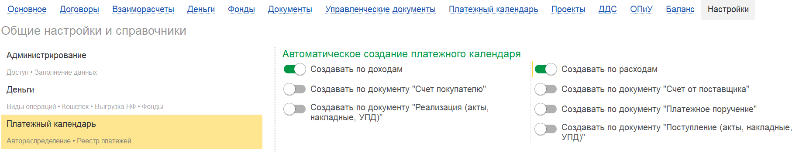

Чтобы плановые платежи (поступления и списания) автоматически отражались в платёжном календаре на основании первичных документов, необходимо выполнить настройку в модуле P&L.

1. Перейдите в блок **Настройки** модуля P&L.

2. Откройте подраздел **«Платёжный календарь»**.

3. Найдите блок **«Автоматическое создание платёжного календаря»**. Он разделен на две части: «По доходам» и «По расходам».

   {width=1830px height=350px}

Включите нужные опции в зависимости от того, на основании каких документов должны создаваться записи.

## **Настройка автоматического создания по доходам**

В блоке «Создать по доходам» доступны два типа документов-оснований:

-  **Счёт покупателю**

-  **Реализация (акты, накладные)**

### **Настройка для документа «Счёт покупателю»**

1. Включите опцию **«Создать по документу счёт покупателю»**.

2. **Обязательное условие:** В документе «Счёт покупателю» должна быть указана **статья движений денежных средств (Статья P&L)**.

   -  Статья может быть заполнена:

      -  В шапке документа (реквизиты P&L).

      -  В табличной части документа.

      -  В ручном распределении.

3. **Дата платежа:** Дата в календаре будет автоматически проставлена из реквизита счёта **«Оплата до»**.  Если срок оплаты не заполнен, платежный календарь заполнится датой документа.

   [image:./avtomaticheskoe-platezhny-calendar-3.png:::0,0,100,100::square,65.8831,72.8571,28.0054,24.7619,,top-left:1489px:210px:center]

### **2\.2. Настройка для документа «Реализация»**

1. Включите опцию **«Создать по документу реализация»**.

2. **Обязательные условия:**

   -  В документе реализации (акт, накладная) должна быть указана **Статья P&L** (в шапке, ТЧ или ручном распределении).

   -  В **договоре** контрагента, по которому выписана реализация, должен быть заполнен **срок оплаты**.

      -  Где найти: карточка договора -> Расчеты -> реквизит **«Срок оплаты»**.

3. **Дата платежа:** Рассчитывается на основании даты документа и срока оплаты, указанного в договоре. Если срок оплаты не заполнен, платежный календарь заполнится датой документа.

   [image:./avtomaticheskoe-platezhny-calendar-2.png:::0,0,100,100::square,0,92.1958,39.6071,7.8042,,top-left:1578px:756px:center]

## **3\. Настройка автоматического создания по Расходам**

В блоке «Создать по расходам» доступны три типа документов-оснований:

-  **Счёт поставщика**

-  **Платёжное поручение** (исходящее)

-  **Поступление (акты, накладные)**

### **3\.1. Настройка для документа «Счёт поставщика»**

1. Включите опцию **«Создать по документу счёт поставщика»**.

2. **Обязательное условие:** В документе «Счёт поставщика» должна быть указана **Статья P&L** (в шапке, ТЧ или ручном распределении).

3. **Дата платежа:** Дата в календаре будет автоматически проставлена из реквизита счёта **«Оплатить до»**. Если срок оплаты не заполнен, платежный календарь заполнится датой документа.

   [image:./avtomaticheskoe-platezhny-calendar-4.png:::0,0,100,100::square,49.0114,51.7073,21.6297,23.9024,,top-left:1669px:205px:center]

   

### **3\.2. Настройка для документа «Платёжное поручение»**

1. Включите опцию **«Создать по документу платёжное поручение»**.

2. **Обязательное условие:** Статья P&L должна быть указана (в самом документе или через ручное распределение).

3. **Дата платежа:** Берется из договора контрагента. В договоре должен быть заполнен реквизит **«Срок оплаты»**. Если срок оплаты не заполнен, платежный календарь заполнится датой документа.

   [image:./avtomaticheskoe-platezhny-calendar-5.png:::0,0,100,100::square,0,90.3448,38.1042,9.6552,,top-left:1593px:580px:center]

### **3\.3. Настройка для документа «Поступление»**

1. Включите опцию **«Создать по документу поступление»**.

2. **Обязательное условие:** В документе поступления (акт, накладная) должна быть указана **Статья P&L** (в шапке, ТЧ или ручном распределении).

3. **Дата платежа:** Берется из договора контрагента. В договоре должен быть заполнен реквизит **«Срок оплаты»**. Если срок оплаты не заполнен, платежный календарь заполнится датой документа.

## **Важные выводы и общая логика**

1. **Главное условие:** Для автоматического создания записи в платёжном календаре **обязательно** наличие **Статьи P&L** в документе-основании.

2. **Источник даты платежа:**

   -  Если документ-основание имеет реквизит **«Оплата до»** / **«Оплатить до»** (как счета)..

   -  Если документ-основание не имеет прямой даты оплаты (реализации, поступления), дата рассчитывается на основании срока из **договора**. 

3. **Поведение системы по умолчанию:**

   -  **Если срок оплаты в договоре не заполнен**, а документ требует его для расчета, система автоматически установит датой платежа **дату самого документа**.