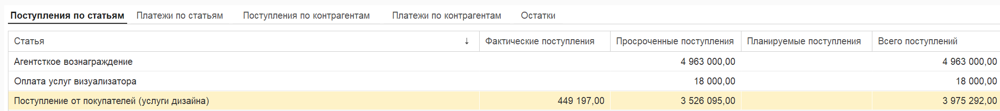

[image:./dashbord.png:::0,0,100,100::square,0.2315,14.1538,27.1412,64.3077,,top-left&square,28.125,12.9231,43.2292,83.0769,,top-left&square,71.7593,12.6154,27.2569,83.0769,,top-left:2553px:480px:center]

#### **1\. Блок «Фактические показатели»**

В этом блоке отображаются данные по фактическим движениям денег за выбранный период.

-  **Текущий остаток:**

   -  Если выбран **текущий месяц**, отображается остаток денежных средств на настоящий момент.

   -  Если выбран **прошлый месяц**, отображается остаток на конец этого месяца.

-  **Всего поступлений:** Общая сумма всех фактически поступивших денежных средств за период.

-  **Всего платежей:** Общая сумма всех фактически списанных денежных средств за период.

-  **Общий денежный поток:** Разница между фактическими поступлениями и платежами (сколько денег «пришло» минус сколько «ушло»).

#### **2 Блок «Диаграмма остатков»**

График, показывающий динамику остатков денежных средств.

-  **Зеленый цвет:** Фактические остатки (реальное положение дел).

-  **Синий цвет (пунктир/отрывистая линия):** Плановые остатки (прогнозные значения).

#### **3 Блок «Плановые показатели» (верхняя правая часть)**

Информация о том, сколько денег останется, если учитывать все запланированные операции.

-  **Планируемый остаток:** Остаток на счетах с учетом плана.

-  **План поступлений:** Сумма всех ожидаемых поступлений.

-  **План платежей:** Сумма всех запланированных списаний.

-  **Планируемый денежный поток:** Разница между планом поступлений и планом платежей.

{width=2139px height=238px}

#### **1 Поступления по статьям**

Таблица, детализирующая приход денег в разрезе статей движения денежных средств (ДДС).

-  **Статья:** Наименование статьи дохода.

-  **Фактические поступления:** Сколько денег реально пришло по данной статье.

-  **Просроченные поступления:** Сумма поступлений по этой статье, которые должны были быть получены, но на текущий момент еще не поступили (просрочены).

-  **Планируемые поступления:** Сумма поступлений, запланированных на будущие периоды по данной статье.

-  **Всего поступлений:** Итоговая сумма (рассчитывается как *Факт + Просрочка + План*).

-  **Доля фактических поступлений:** Процент, который составляет факт от общей суммы всех поступлений.

#### **2 Платежи по статьям**

Таблица, аналогичная предыдущей (п. 1), но отражающая расход денежных средств в разрезе статей ДДС. Колонки содержат те же показатели: факт, просрочка, план, итог и доля.

#### **3\. Поступления по контрагентам**

Детализация прихода денежных средств, сгруппированная по контрагентам (партнерам, покупателям, заказчикам). Структура таблицы повторяет логику блока «Поступления», но вместо статей указываются контрагенты.

#### **4 Платежи по контрагентам**

Детализация расхода денежных средств в разрезе контрагентов (поставщиков, подрядчиков и т.д.). Отображает фактические, просроченные и планируемые платежи по каждому партнеру.