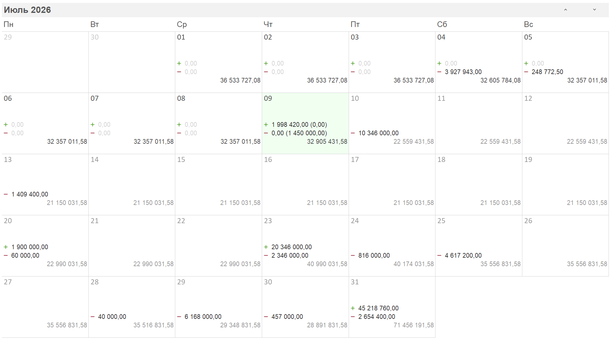

Календарь -- это отдельный график, построенный на основе платёжного календаря. Он предназначен для ежедневного контроля движения денежных средств (ДДС) и сопоставления фактических данных с плановыми показателями.

## **Структура отчёта**

Каждая ячейка соответствует **одному дню**. В ячейке отображаются:

-  **Все поступления и списания** за этот день (с разбивкой по операциям).

-  **Итоговый остаток** за текущий месяц по расчётным счетам и кассам.

{width=1945px height=1096px}

## **Принцип отображения данных в зависимости от периода**

### **1\. Прошлые периоды (до вчерашнего дня включительно)**

-  Показываются **фактические данные**, взятые из денежных операций (ДДС).

-  Плановые значения **не отображаются** -- отчёт отражает уже совершённые платежи и поступления.

-  Остаток выводится фактический на конец каждого дня

### **2\. Текущий день (сегодня)**

-  В основной части ячейки выводятся **фактические данные** по ДДС (уже проведённые операции за сегодня).

-  **В скобках** рядом с фактическими суммами указывается **плановый показатель** на этот день -- сумма, которая была запланирована, но **ещё не выполнена** (например, ожидаемые платежи или поступления, которые должны произойти сегодня, но пока не проведены).

-  Остаток выводится с учетом запланированных платежей

### **3\. Будущие дни (завтра и далее)**

-  Отображаются исключительно **плановые данные** из платёжного календаря.

-  Это суммы, которые **запланированы, но ещё не выполнены** (т.е. предстоящие операции).

:::quote 

**Важно:** Плановые невыполненные данные -- это те операции, которые обязательно должны быть проведены (согласно календарю), но срок их исполнения ещё не наступил или они ещё не проведены в системе.

:::