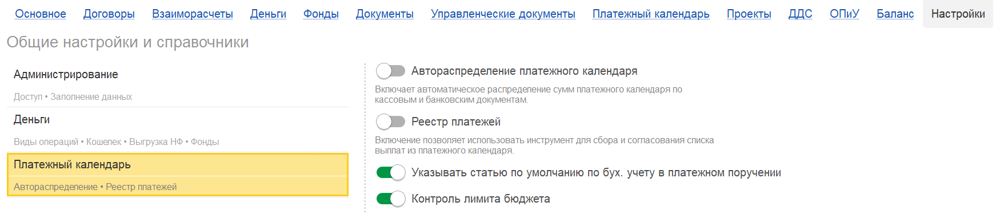
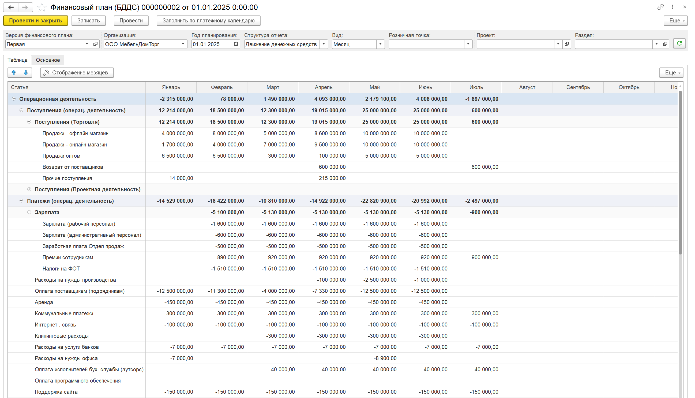
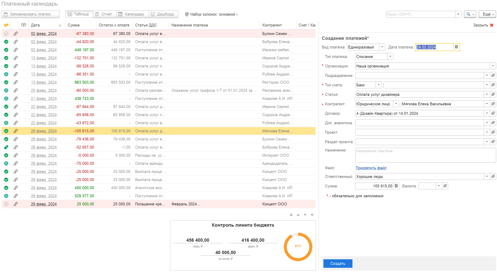
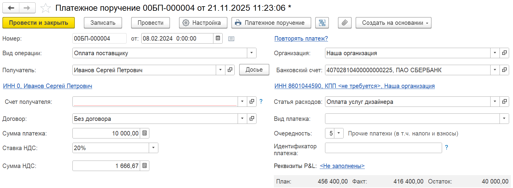

Эффективное управление денежными средствами -- основа финансовой стабильности любого бизнеса. Одним из ключевых инструментов для этого является система контроля лимитов расходов. Рассмотрим, как эта задача решается в модуле P&L для 1С:Предприятие.

## **Проблема: Руководство в темноте, риски -- на максимуме**

В динамичной бизнес-среде руководителям и финансовым директорам критически важно понимать, куда и сколько тратятся деньги. Без четкого контроля возникают системные проблемы:

-  **Кассовые разрывы:** Непредвиденные или несанкционированные расходы могут привести к ситуации, когда на счетах компании не остается денег для выполнения ключевых обязательств.

-  **Отсутствие прозрачности:** Руководитель не имеет оперативной и структурированной информации о том, как фактические расходы соответствуют утвержденным планам.

-  **Неэффективность и перегрузка:** Контроль каждой платежки вручную отнимает колоссальное время у топ-менеджеров и финансовых служб, тормозя процессы согласования.

-  **Стихийное бюджетирование:** Менеджеры подразделений не имеют четких ориентиров для планирования своих будущих платежей (через платежный календарь), что ведет к хаотичным запросам на оплату.

-  **Потеря финансовой устойчивости:** Компания теряет возможность осознанно формировать резервы, инвестировать в развитие или переживать кризисные периоды.

**Итог:** Бизнес действует реактивно, а не проактивно, постоянно сталкиваясь с рисками нехватки средств и принимая решения на основе неполных данных.

## **Что требуется: единая система бюджетного контроля**

Для решения этих проблем необходима система, которая:

1. **Автоматизирует контроль:** Сравнивает план и факт без ручного вмешательства.

2. **Обеспечивает детальную аналитику:** Позволяет контролировать лимиты не только по статьям, но и по проектам, направлениям деятельности, подразделениям и другим разрезам.

3. **Связывает планирование с исполнением:** Интегрирует процессы бюджетирования (БДДС), оперативного планирования (платежный календарь) и непосредственного списания денег.

4. **Дает наглядность:** В режиме реального времени показывает ответственным сотрудникам остаток доступных для расходования средств.

5. **Внедряет барьеры на ранних этапах:** Предупреждает о превышении лимита не на стадии подписания платежки, а уже на этапе ее планирования.

## **Решение: механизм контроля в модуле P&L**

Модуль P&L для 1С:Предприятие предлагает сквозное и простое решение данной задачи, связывая ключевые финансовые инструменты: Документ БДДС, Платежный календарь и Платежное поручение.

### **Как начать: Настройка**

Для активации контроля необходимо в настройках модуля -> платежный календарь и включить команду **«Контроль лимита бюджета»**.

{width=1750px height=375px}

### **Установка плана (Бюджет ДДС):**

В системе создается документ **«БДДС»**, структура которого соответствует отчету о движении денежных средств (ДДС).

В нем утверждаются плановые суммы поступлений и выплат. Детализация бюджета может быть любой: статья ДДС, организация, проект, раздел проекта и направление деятельности.

{width=2595px height=1492px}

### **Контроль в платежном календаре**

При создании новой позиции в Платежном календаре для планирования будущего платежа, система автоматически активирует **блок контроля лимитов бюджета.**

В этом блоке наглядно отображается:

-  **План:** Утвержденная сумма по данной связке аналитик (например, "Проект А, статья "Закупка материалов").

-  **Факт:** Сумма уже проведенных и оплаченных платежных поручений по этим же аналитикам.

-  **Остаток:** Разница между планом и фактом -- свободный для расходования лимит.

{width=2568px height=1413px}

Пользователь может проверить, сможет ли он запланировать новую выплату, не выходя за рамки бюджета.

### **Контроль в платежном поручении**

При создании документа «Платежное поручение» система также отображает информационный блок по лимитам бюджета.

{width=1714px height=630px}

## **Итого: Прозрачность, дисциплина и спокойствие**

Внедрение механизма контроля лимитов в системе P&L для 1С:Предприятие дает комплексный результат:

-  **Для Руководителя:** Прозрачность расходов, уверенность в соблюдении бюджета, защита от кассовых разрывов и возможность стратегического управления денежными потоками.

-  **Для Бухгалтерии и Финансовой службы:** автоматизированный контроль, сокращение количества конфликтных ситуаций с подразделениями и существенная экономия времени на согласованиях.

-  **Для Менеджеров проектов и подразделений:** Ясное понимание своих финансовых рамок, возможность самостоятельно планировать платежи в рамках выделенного бюджета и ответственность за его исполнение.

Таким образом, система переводит управление денежными средствами из режима «тушения пожаров» в режим **предсказуемого и управляемого процесса**, где каждый участник действует в рамках единых, понятных и автоматически контролируемых правил.