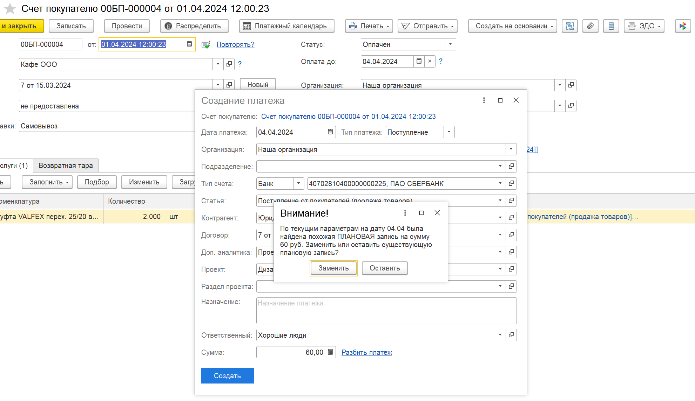

Работа с платежным календарем может быть построена на взаимодействии двух типов записей: **плановых** (созданных пользователем заранее) и **фактических** (созданных на основании поступившего счета).

#### **1\. Создание плановой записи:**

Пользователь может заранее внести прогнозируемый платеж в календарь. На этом этапе он указывает ключевые параметры будущей оплаты: примерную дату, организацию, статью движения денежных средств (ДДС), контрагента и сумму. 

Важно, что на этом этапе запись существует как «напоминание» и не привязана к конкретному счету.

#### **2\. Создание записи на основании счета:**

Когда поставщик выставляет счет, пользователь создает на его основании новую запись в платежном календаре.

#### **3\. Логика проверки и замещения (основной функционал):**

В момент создания записи из счета система автоматически проверяет, нет ли в календаре похожей *плановой* записи, созданной ранее пользователем.

-  **Критерии поиска дубликата:** Система ищет совпадение по следующим параметрам:

   -  Организация;

   -  Контрагент;

   -  Статья ДДС;

   -  Период (дата платежа из счета попадает в диапазон «дата планового платежа ± 14 дней»).

#### **4\. Действие системы:**

Если такая плановая запись найдена, программа выводит пользователю сообщение:

:::quote 

«По указанным параметрам уже существует плановая запись. Вы можете заменить её новой записью на основании счета».

:::

Это позволяет пользователю не создавать дубликаты, а актуализировать ранее запланированный платеж, подставляя в него точные данные из счета.

{width=1982px height=1146px}