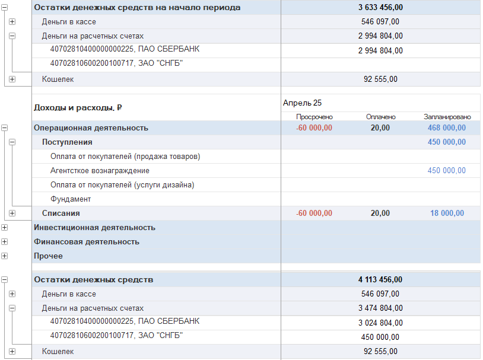
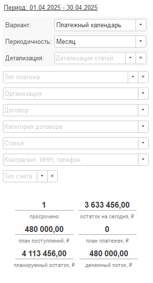

Отчёт формируется на основе структуры отчёта о движении денежных средств (ДДС), который содержит информацию о всех просроченных, выполненных и запланированных платежах.

## Возможности отчета

1. Возможность отслеживать состояние денежных средств на счетах и в кассах, учитывая текущие планы. Это поможет избежать кассового разрыва.

   {width=814px height=607px}

2. Расшифровать платеж 

3. Установить соответствующий отбор до вида счета и самого счета. 

{width=315px height=582px}

