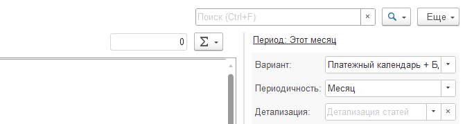

Отчёт формируется на основе структуры отчёта о движении денежных средств (ДДС), который содержит информацию о всех [comment:GhTUP]просроченных, выполненных и запланированных платежах[/comment].

## Возможности отчета

1. Возможность отслеживать состояние денежных средств на счетах и в кассах, учитывая текущие планы. Это поможет избежать кассового разрыва.

   [image:./otchet-platezhnyy-kalendar.png:::0,0,100,100::square,6.0197,15.1565,93.9803,5.9308,,top-left&square,5.8968,44.3163,94.1032,5.2718,,top-left&square,6.0197,90.4448,93.9803,6.0956,,top-left:814px:607px]

2. Расшифровать платеж

3. Установить соответствующий отбор до вида счета и самого счета.

{width=315px height=582px}