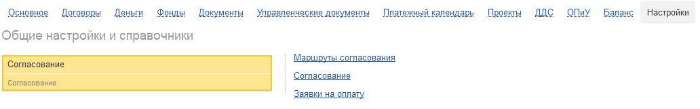
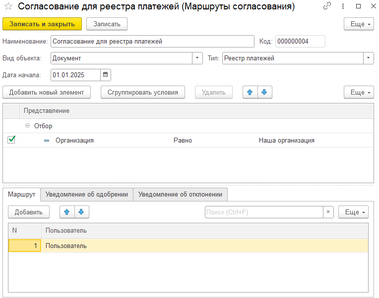

Реестр платежей -- это инструмент, который позволяет систематизировать и контролировать процесс оплат в компании.

1. **Централизация заявок:** Он служит для сбора всех платёжных поручений (заявок на оплату) от разных подразделений компании в одном месте.

2. **Управление платежами:** Помогает уйти от хаотичных ежедневных платежей. Компания начинает платить не сразу, а циклами -- сначала собирает все заявки за определённый период, затем их согласовывает и только после этого проводит оплату.

3. **Прозрачность и контроль:** Руководители видят полную картину: что оплачивается, какому контрагенту и на какую сумму. Это позволяет принимать обоснованные решения об утверждении или отклонении платежей.

## **Общий процесс работы с реестром**

1. **Формирование:** Бухгалтер или менеджер собирает все платёжные заявки за период (например, за неделю) в единый документ -- реестр.

2. **Согласование:** Руководители просматривают реестр, утверждают одни платежи и отклоняют другие.

3. **Оплата:** После согласования бухгалтер проводит оплату только по утверждённым позициям.

## **Режимы согласования реестра**

В системе предусмотрено два основных режима согласования.

### **Способ 1: Базовый режим согласования (в документе)**

Это упрощённый способ, при котором согласование происходит вручную, непосредственно в документе реестра.

#### **Шаг 1: Настройка режима**

1. Перейдите в настройки системы (блок «Настройки» -> «Платежный календарь»).

2. Включите режим «Реестр платежей»

3. В настройках найдите пункт **«Режим согласования»** и выберите вариант **«В документе»**.

[image:./reestr-platezhey.png:::0,0,100,100::square,36.9284,47.2222,36.5833,20.8333,,top-left&square,36.7558,68.75,36.497,28.8194,,top-left:1159px:288px:center]

#### **Шаг 2: Создание реестра платежей**

1. Перейдите во вкладку **«Платежный календарь»** -> **«Реестр платежей»**.

2. Нажмите «Создать» и заполните поля:

   -  **Дата реестра платежей:** На эту дату система автоматически подберет все созданные платёжные заявки.

   -  **Организация:** При необходимости укажите конкретную организацию.

3. Нажмите кнопки **«Записать»** и **«Провести»**.

[image:./reestr-platezhey-2.png:::0,0,100,100::square,70.1623,0,19.226,17.2414,,top-left&square,38.2022,33.0049,20.0999,19.2118,,top-left&square,0,32.0197,26.4669,20.6897,,top-left:801px:203px:center]

{width=1016px height=214px}

#### **Шаг 3: Печать и ручное согласование**

1. Распечатайте созданный реестр платежей.

2. Бухгалтер или менеджер передаёт распечатанный лист руководителю.

3. Руководитель вручную отмечает на бумаге, какие платежи согласованы, а какие -- нет.

[image:./reestr-platezhey-4.png:::0,0,100,100::square,49.6706,25.9259,21.3439,28.1481,,top-left:759px:135px:center]

{width=1629px height=380px}

#### **Шаг 4: Внесение решения в систему**

1. Бухгалтер возвращается к документу реестра в системе.

2. Вручную проставляет статус по каждой строке или по всему документу:

   -  **«Согласован»**

   -  **«Не согласован»**

3. Обязательно нажимает кнопку **«Провести»** (или «Провести обязательно»), чтобы зафиксировать изменения.

   Статус можно менять как по строкам, так и для всего документа целиком.

**Смена статуса по строкам:**

[image:./reestr-platezhey-7.png:::0,0,100,100::square,0.3886,63.3028,18.6528,33.0275,,top-left:772px:218px:center]

[image:./reestr-platezhey-6.png:::0,0,100,100::square,0.243,46.2898,30.7412,48.4099,,top-left:823px:283px:center]

**Смена статуса документа целиком:**

[image:./reestr-platezhey-8.png:::0,0,100,100::square,0,74.4898,35.4597,23.4694,,top-left:533px:98px:center]

#### **Шаг 5: Создание платежных поручений**

-  После смены статуса система позволяет сразу создать платёжные поручения по всем согласованным строкам.

-  В реестре и в общем списке платёжного календаря напротив каждой позиции будет отображаться статус «Согласован».

[image:./reestr-platezhey-7.png:::0,0,100,100::square,85.6518,33.3333,14.2607,58.3333,,top-left:1143px:120px:center]

## **Способ 2: В подсистеме согласования**

Это автоматизированный способ, при котором уведомления о необходимости согласования приходят ответственным лицам прямо в систему, и они согласовывают каждую заявку в цифровом виде.

В настройках найдите пункт **«Режим согласования»** и выберите вариант **«В подсистеме согласования»**.

{width=1043px height=281px}

### **Шаг 1: Настройка маршрута согласования**

1. Перейдите в блок **«Согласование»** (находится в настройках системы).

   {width=1032px height=162px}

2. Нажмите **«Создать маршрут согласования»**.

3. Заполните параметры нового маршрута:

   -  **Наименование:** Например, «Маршрут согласования реестра платежей».

   -  **Вид объекта:** Обязательно выберите **«Документ»** и найдите в списке **«Реестр платежей»**.

   -  **Дата начала:** Укажите, с какого числа эти правила вступают в силу.

   -  **Отборы:** Можете настроить условия, например, чтобы маршрут применялся только к определённой организации.

   -  **Согласующие:** Добавьте пользователей, которые должны согласовывать реестр.

   -  **Уведомления:** Настройте оповещения -- «Уведомление о добавлении» (для согласующих) и «Уведомление об отклонении».

      {width=764px height=602px}

4. Нажмите **«Записать и закрыть»**.

   

### **Шаг 2: Создание и отправка реестра на согласование**

1. Перейдите в **«Платежный календарь»** -> **«Реестр платежей»** и создайте новый реестр, указав дату и организацию.

   {width=820px height=202px}

2. Нажмите **«Провести»**.

3. Вместо ручного проставления статусов нажмите кнопку **«Отправить на согласование»**.

   [image:./reestr-platezhey-12.png:::0,0,100,100::square,62.4703,0,25.0594,16.2162,,top-left:842px:222px:center]

   

4. В появившемся окне можно добавить **комментарий** (например, «Необходимо согласовать три платежа за работы по проекту»).

   {width=637px height=474px}

5. Нажмите **«Отправить на согласование»**.

   

#### **Шаг 3: Процесс согласования ответственным лицом**

1. Ответственный руководитель получает уведомление в системе

2. Он заходит в раздел «**Настройки»** -> **«Согласование»** -> **«Согласование»**, где видит список всех заявок, требующих его внимания.

   [image:./reestr-platezhey-15.png:::0,0,100,100::square,90.3442,0,8.413,21.6561,,top-left&square,0,49.6815,39.1969,45.2229,,top-left&square,40.631,58.5987,11.2811,21.0191,,top-left:1046px:157px:center]

3. Платежи из реестра отображаются построчно. Согласующий может:

   -  **Просмотреть детали** по каждой платёжной заявке.

   -  **Согласовать** или **Отклонить** каждую позицию в отдельности.

      {width=1235px height=211px}

{width=1250px height=863px}

#### **Шаг 4: Результаты согласования**

1. После того как согласующий принял решение по всем строкам, бухгалтер открывает документ реестра платежей.

2. В документе бухгалтер видит, какие платежи согласованы, а какие отклонены.

3. Статусы согласования также отображаются в общем списке платёжного календаря.

---

## **Сравнение режимов**

| **Характеристика**      | **Базовый режим (в документе)**                   | **Усложненный режим (в подсистеме)**                        |
|-------------------------|---------------------------------------------------|-------------------------------------------------------------|
| **Способ согласования** | Ручной, на бумажном носителе                      | Цифровой, внутри системы                                    |
| **Уведомления**         | Отсутствуют                                       | Автоматические уведомления для согласующих                  |
| **Подход**              | Упрощённый, подходит для небольших компаний       | Автоматизированный, подходит для средних и крупных компаний |
| **Прозрачность**        | Статусы видны только после внесения их в систему  | Статусы видны в реальном времени в специальном разделе      |
| **Ответственность**     | Чётко зафиксирована в системе для каждого платежа | Чётко зафиксирована в системе для каждого платежа           |

Выбор режима зависит от потребностей вашей компании: используйте базовый для простоты и скорости, а усложненный -- для полного контроля и автоматизации процесса.