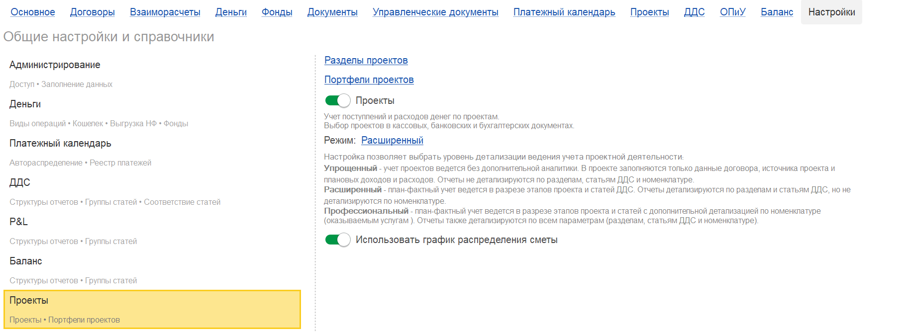
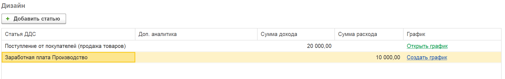
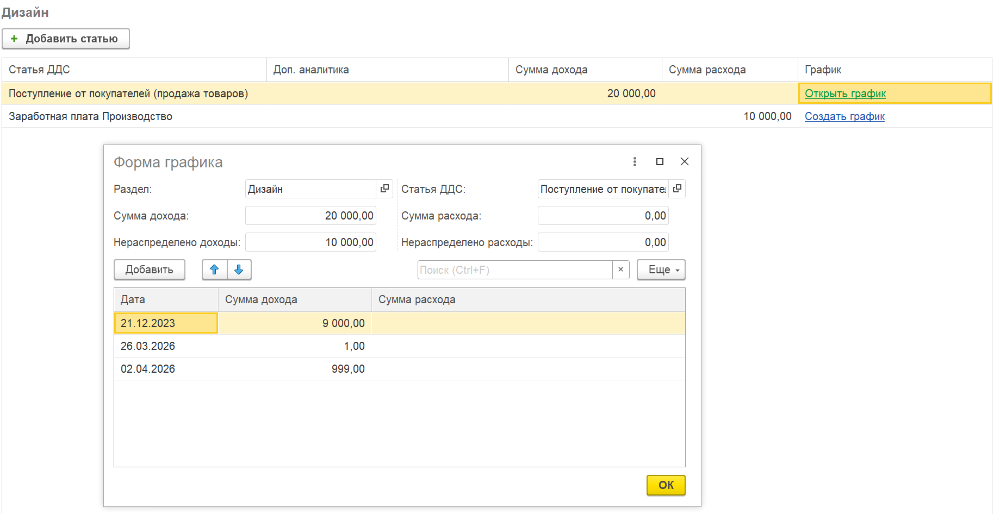
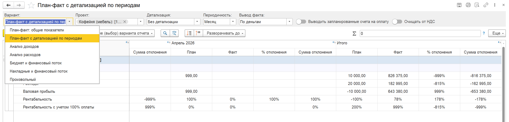
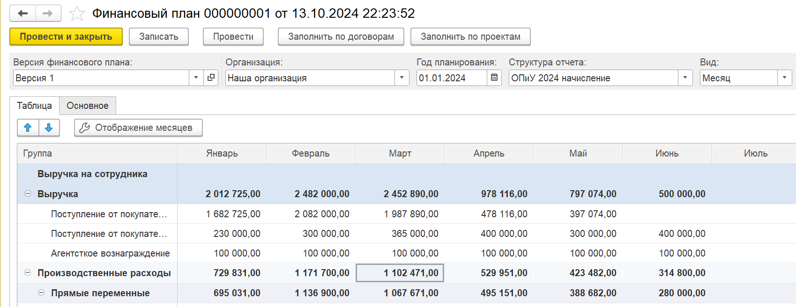

График распределения сметы предназначен для детализации плановых доходов и расходов по проектам с разбивкой по периодам (месяц, квартал, год). Он позволяет расширить аналитику учёта и получать более точные план-фактные отчёты.

Функционал доступен **только** при ведении проектного учёта в **расширенном режиме** (в настройках учёта по проектам должен быть выбран соответствующий режим).

## **Включение функционала**

1. Перейдите во вкладку **«Настройки»** -> блок **«Проекты»**.

2. В блоке настроек найдите опцию **«Использовать график распределения сметы»** и установите флажок.

   {width=1819px height=668px}

   После этого в интерфейсе проекта появятся дополнительные возможности для работы со сметой.

##  **Работа с графиком в смете проекта**

###  **Создание и открытие графика**

-  Перейдите на вкладку **«Смета»** проекта.

-  В колонке **«График»** для каждой строки сметы (статьи доходов/расходов) будет:

   -  кнопка **«Создать график»**, если график ещё не задан;

   -  ссылка **«Открыть график»**, если график уже существует.

{width=1840px height=292px}

### **Редактирование графика**

-  При открытии графика вы можете распределить плановую сумму по периодам:

   -  задать периодичность (месяц, квартал, год);

   -  указать сумму дохода и/или расхода на каждый период.

-  Распределение выполняется для каждой строки сметы отдельно.

{width=1839px height=946px}

### **Особенности работы**

-  При **удалении строки сметы** связанный с ней график автоматически очищается.

-  При **изменении общей суммы** в строке сметы график **не очищается автоматически** – необходимо вручную перезаполнить распределение по периодам (например, заново распределить изменённую сумму).

-  При **копировании сметы** на другой проект или в рамках того же проекта графики копируются вместе с ней.

## **Дополнительные возможности после включения графиков**

### **Отчёт «План-факт детализации по проекту»**

-  В разделе проекта перейдите на вкладку **«Отчёты»**.

-  Выберите отчёт **«План-факт детализации по проекту»**.

-  Настройте параметры:

   -  **Периодичность** – месяц, квартал, год;

   -  **Вид факта** – по деньгам (оплата) или по начислению.

-  Отчёт показывает план (из графиков сметы) и факт (из документов учёта) в разрезе периодов.

-  Все суммы в отчёте **кликабельны**:

   -  при нажатии на сумму открывается детализация;

   -  для фактических сумм можно увидеть, на основании каких документов они сформированы.

{width=2586px height=622px}

### **Финансовый план (БДР)**

-  В финансовом плане (бюджет движения денежных средств) появилась команда **«Заполнить по проектам»**.

{width=1699px height=657px}

-  При её использовании данные подтягиваются из графиков распределения сметы по проектам, что упрощает формирование бюджетов.

## **Итоговые преимущества**

-  Плановые доходы и расходы распределяются по периодам, что позволяет видеть динамику.

-  Повышается детализация план-фактного анализа по проектам.

-  Интеграция с отчётами и финансовым планом делает учёт более прозрачным и удобным.

-  Экономия времени за счёт автозаполнения БДР и кликабельной детализации