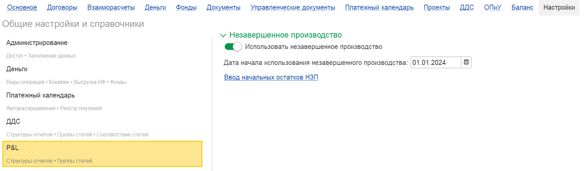
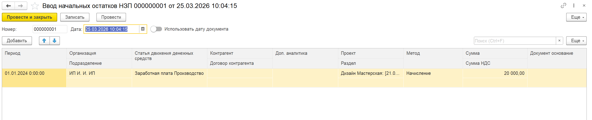
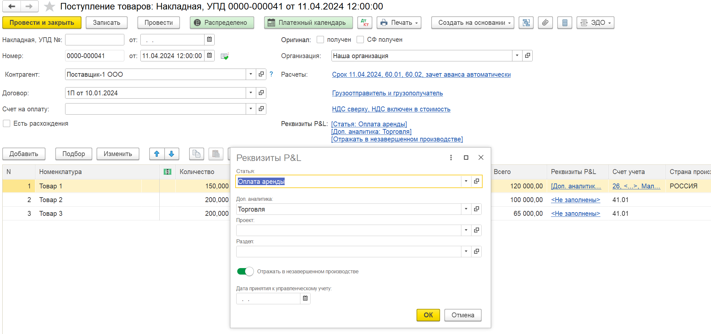
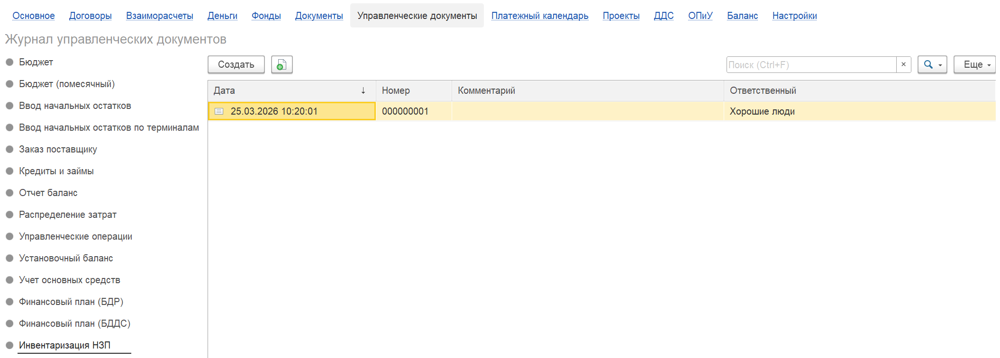
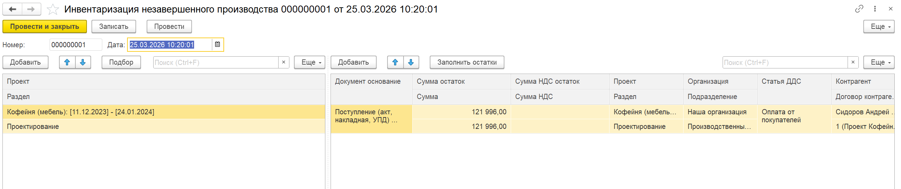
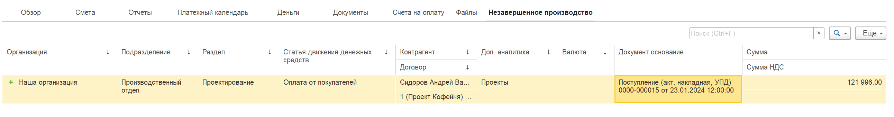
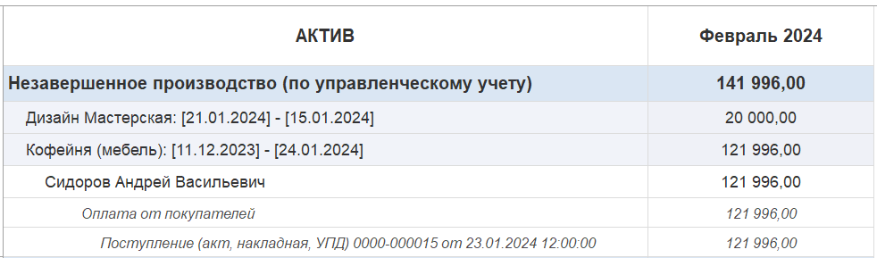

**Незавершённое производство (НЗП)** -- это затраты, которые уже понесены в рамках проекта (товары, услуги, зарплата и т.д.), но ещё не закрыты доходом. В управленческом учёте такие расходы накапливаются в балансе как актив и попадают в отчёт о прибылях и убытках только в момент признания выручки по проекту. Такой подход позволяет корректно оценивать финансовый результат и контролировать затраты на каждом этапе.

В модуле **P&L** для **1С:Предприятие** реализован гибкий механизм учёта НЗП с детализацией по статьям, контрагентам, договорам, проектам, этапам и даже документам-основаниям. Рассмотрим, как настроить и использовать этот функционал.

## **Настройка учёта НЗП**

1. Перейдите во вкладку **«Настройки»** -> блок **«P&L»**.

2. Найдите раздел **«Незавершённое производство»**.

3. Установите флажок **«Использовать незавершённое производство»**.

4. Укажите **дату начала использования НЗП**. С этой даты система начнёт отслеживать затраты, подлежащие отнесению в НЗП.

{width=1755px height=514px}

**Важно!** Если на момент включения учёта у вас уже есть остатки незавершённых затрат, их необходимо ввести **начальные остатки НЗП**. Это позволит корректно продолжить учёт.

{width=2587px height=526px}

## **Документы, участвующие в учёте НЗП**

После настройки в следующих документах появляется возможность отражать затраты в НЗП:

-  Поступление (акты, накладные, УПД)

-  Требование-накладная (расход материалов)

-  Списание товаров, материалов

-  Начисление зарплаты

-  Отражение зарплаты в бухгалтерском учёте

-  Отпуск, больничный лист

-  Операция управленческого учёта

-  Отражение зарплаты в управленческом учёте

В каждом из этих документов теперь доступна команда (флажок) **«Отразить в НЗП»**.

## **Как отразить затраты в НЗП: два способа**

Для того чтобы затраты по документу попали в состав НЗП, необходимо выполнить одно из двух действий: использовать флажок в самом документе или воспользоваться ручным распределением. Оба способа требуют обязательного указания **проекта** (и, при необходимости, этапа проекта).

### **Способ 1. Отражение в НЗП через сам документ**

Этот способ подходит, когда весь документ целиком должен быть отнесён в незавершённое производство.

1. Создайте или откройте документ, например «Поступление товаров и услуг».

2. Установите флажок **«Отразить в НЗП»** (название может варьироваться в зависимости от конфигурации).

3. Заполните реквизит **«Проект»** (а также **«Этап проекта»**, если требуется детализация).

4. Проведите документ.

{width=2173px height=1023px}

**Важно:** если флажок установлен, а проект не указан, программа выдаст ошибку и не позволит провести документ. Затраты по такому документу будут накапливаться в НЗП до момента закрытия.

### **Способ 2. Отражение в НЗП через ручное распределение**

Ручное распределение применяется, когда:

-  нужно отразить в НЗП **часть** документа, а остальную часть сразу признать расходами;

-  требуется более гибко распределить затраты по разным проектам, этапам или статьям.

1. В том же документе (например, «Поступление товаров и услуг») нажмите кнопку **«Ручное распределение»**.

2. В открывшейся форме распределения установите флажок **«Отражать в НЗП»**

3. В табличной части укажите для каждой строки:

   -  проект (обязательно);

   -  этап проекта (при необходимости);

   -  сумму, которая должна быть отнесена в НЗП.

4. Оставшиеся суммы (если флажок «Отражать в НЗП» для строки не установлен) будут отнесены на счета расходов текущего периода.

   [image:./kak-ispolzovat-nezavershennoe-proizvodstvo-v-modu-2.png:::0,0,100,100::square,0,0,25.5787,7.9167,,top-left&square,67.1296,13.75,32.6389,60,,top-left:2314px:643px:center]

**Особенность:** при использовании ручного распределения вы можете комбинировать отражение -- часть затрат уходит в НЗП, часть сразу списывается. Это удобно, например, когда в одной партии материалов часть используется в проекте (и её нужно накопить в НЗП), а часть -- на общехозяйственные нужды.

## **Как закрыть (списать) НЗП: два метода**

Накопленные в НЗП затраты могут быть закрыты (признаны расходами) двумя способами: автоматически при реализации или вручную через инвентаризацию НЗП.

### **Метод 1. Закрытие через реализацию**

#### **4\.1. Автоматическое закрытие при проведении реализации**

Когда вы проводите документ **«Реализация услуг»**, система автоматически находит все затраты, накопленные в НЗП по тому же проекту и этапу (если этап указан), и закрывает их **полностью**. Расходы признаются в том же месяце, что и выручка.

\""){width=2110px height=451px}

#### **4\.2. Частичное закрытие через ручное распределение в реализации**

Если нужно закрыть не всю накопленную сумму, а только её часть, используйте механизм ручного распределения в документе реализации:

1. Откройте документ **«Реализация услуг»**.

2. Перейдите в форму **«Ручное распределение»**.

3. В открывшемся окне появится отдельная вкладка **«Незавершённое производство»**.

4. На этой вкладке вы можете:

   -  отредактировать список строк НЗП, которые будут закрыты;

   -  изменить суммы закрытия по каждой строке;

   -  исключить ненужные строки.

5. После редактирования проведите документ.

\" появилась дополнительная вкладка"){width=2320px height=825px}

Такой подход позволяет гибко управлять признанием расходов: например, закрыть затраты только по одному этапу проекта или списать часть материалов, оставив остальное в НЗП.

### **Метод 2. Закрытие через инвентаризацию НЗП**

Этот способ используется, когда реализации нет, но необходимо списать остатки НЗП (например, при закрытии проекта или корректировке учёта).

{width=2110px height=756px}

1. Перейдите в раздел управленческих документов и выберите **«Инвентаризация НЗП»**.

2. Создайте новый документ.

3. В левой части укажите проекты и этапы, по которым нужно списать НЗП (можно подобрать все действующие и недействующие).

4. Нажмите кнопку **«Заполнить остатки»**. Справа отобразится детальная таблица всех накопленных остатков НЗП по выбранным объектам.

5. При необходимости отредактируйте суммы или строки.

6. Проведите документ.

{width=2581px height=544px}

После проведения все указанные остатки будут списаны и отразятся как расходы в отчёте о прибылях и убытках.

## **Отражение в отчётах и объектах**

### **В карточке проекта**

На вкладке **«Незавершённое производство»** в карточке проекта отображаются все остатки по документам, отнесённым в НЗП. Документы, находящиеся в НЗП, не влияют на P&L до момента закрытия.

{width=2584px height=340px}

### **В отчёте о прибылях и убытках (P&L)**

Расходы попадают в отчёт только после закрытия НЗП (через реализацию или инвентаризацию). В расшифровке расхода вы увидите **исходные документы** (поступление, зарплата и т.д.), что обеспечивает полную прозрачность.

### **В управленческом балансе**

В балансе появляется отдельная строка **«Незавершённое производство»**, где отражаются текущие остатки НЗП с детализацией до документа-основания.

{width=982px height=289px}

## **Ключевые преимущества**

-  **Полная детализация:** НЗП ведётся в разрезе статей, контрагентов, договоров, проектов, этапов, документов-оснований.

-  **Гибкость отражения:** можно направлять в НЗП как весь документ, так и его часть через ручное распределение.

-  **Гибкость закрытия:** автоматическое списание при реализации, возможность частичного закрытия через ручное распределение в реализации, а также списание через инвентаризацию.

-  **Прозрачность:** в момент признания расхода видно, из какого именно документа возникли затраты.

-  **Контроль:** исключается ситуация «чёрного ящика», когда закрытие происходит по номенклатурной группе без детализации.