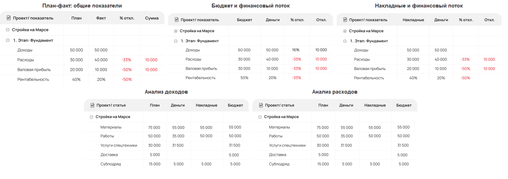
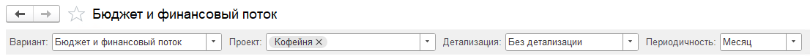

{width=1417px height=501px}

### **План-факт: общие показатели**

План собирается на основе плановых показателей из проекта. Факт собирается на основе денежных документов

[image:./otchety-po-proektu-2.png::Плановые показатели проекта:0,0,100,100::square,0.5525,71.453,55.0645,26.3248,,top-left:543px:585px]

### **Бюджет и финансовый поток**

Данн[comment:VelYo]ый по бюджеты [/comment]собираются на основе документа [Бюджет](./../../new-article-3/byudzhet). Отлично подходит для того, чтобы распределить бюджет по доходам и расходам [comment:qFI2q]как необходимо [/comment]для дальнейшего отражения данных в ОПиУ. Финансовый поток собирается на основе денежных документов.

### Накладные **и финансовый поток**

Накладные формируются на основе бухгалтерских документов (Акт выполненных работ, Поступление (акт, накладная, УПД), Реализация (акт, накладная, УПД) и т.д.). Финансовый поток собирается на основе денежных документов

### Анализ доходов и расходов

Сводные отчеты, где формируются все [comment:Ume3K]выше перечисленные[/comment] данные.

## Настройки отчета

Во всех вариантах отчетов есть возможность включить детализацию в зависимости от [режима проекта](./../../nastroyki/nastroyki-proekty)

{width=1106px height=78px}

:::note Обратите внимание!

Во всех документах должны быть указаны все дополнительные параметры для корректного отражения данных в отчетах, таких как: статья движения денежных средств, проект, раздел проекта (необходим в зависимости от режима проекта)

:::

