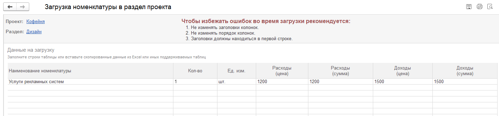

Данный инструмент позволяет на раздел этапа загрузить номенклатуру из внешних источников

[image:./zagruzka-nomenklatury-v-razdel-proekta.png:::0,0,100,100::square,79.0448,56.1753,16.9591,17.5299,,top-left:1026px:251px]

Открывается мастер форма по загрузке сметы. Необходимо вставить из внешних файлов в соответствующие колонки данные.

{width=1416px height=332px}

  

[image:./zagruzka-nomenklatury-v-razdel-proekta-3.png:::0,0,100,100::square,1.4382,31.9703,14.5733,6.1338,,top-left:1043px:538px]

Перед тем как загрузить данные, необходимо создать номенклатуру, не найденную в системе.

