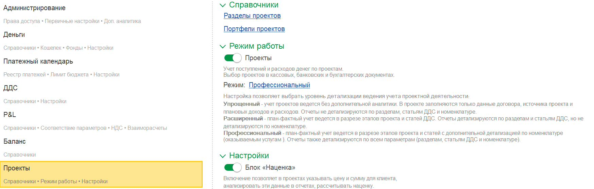
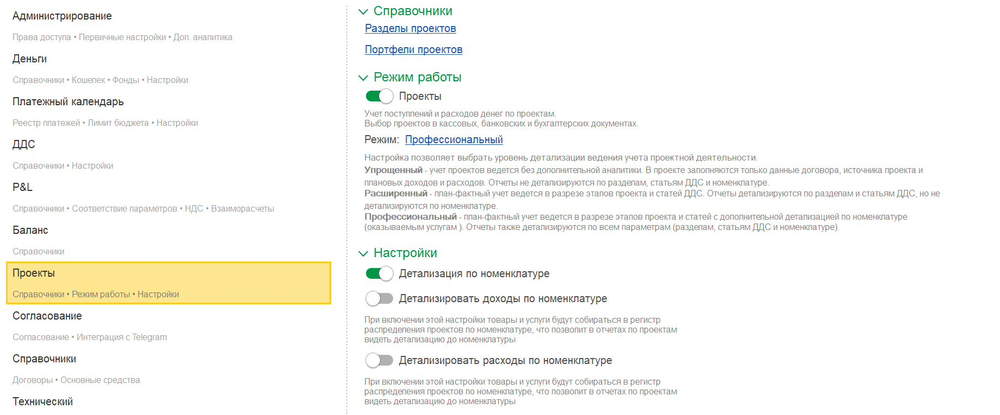
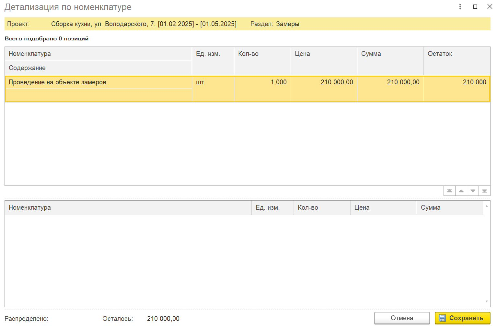

Данный режим позволяет вести **план-фактный анализ** **в разрезе номенклатуры** (товары, работы, услуги). Это даёт возможность получать отчёты с полной детализацией по каждому проекту.

Данная надстройка работает только для режима «**Профессиональный**»

{width=1747px height=559px}

## Подготовительные настройки

Прежде чем начинать распределение, выполните следующие действия:

### Включите «Профессиональный режим» в проекте

-  Откройте карточку нужного проекта.

-  В настройках проекта найдите переключатель или флажок **«Профессиональный режим»** и включите его.

:::quote 

**Важно:** Без этого режима детализация по номенклатуре будет недоступна.

:::

### Включите общую детализацию по номенклатуре

-  В том же блоке настроек проекта установите галочку напротив опции **«Детализация по номенклатуре»**.

-  Это действие активирует возможность распределять плановые суммы до уровня конкретных товаров/услуг.

{width=1839px height=765px}

## Выбор способа детализации

Система предлагает два режима работы. Выбор зависит от того, **совпадает ли номенклатура в управленческом (финансовом) учете с бухгалтерским учётом**.

### Способ 1. Ручное распределение (если номенклатура не совпадает с бухгалтерской)

**Используйте этот способ, если:**

-  В этапах проекта вы указываете одну номенклатуру (услуги/товары), а в бухгалтерии отражается другая.

-  Вы хотите вручную назначать статьи и номенклатуру независимо от первичных документов.

#### Порядок действий:

1. В документе перейдите в раздел **«Ручное распределение»** (доступно в любых операциях: денежных, бухгалтерских, накладных, реализациях).

2. После включения детализации в форме ручного распределения появится **дополнительный блок** – поле или таблица для **детализации по номенклатуре**.

   [image:./uchet-3.jpeg:::0,0,100,100::square,30.1505,12.6623,10.706,4.8701,,top-left&square,71.5278,52.9221,10.1852,34.5238,,top-left:1915px:1024px:center]

3. В этом блоке система автоматически подтягивает **всю плановую номенклатуру**, которая была заведена для данного проекта и конкретного этапа.

   {width=1534px height=1015px}

4. Вручную переместите (выберите) нужные позиции номенклатуры и укажите суммы для распределения.

   [image:./uchet-5.jpeg:::0,0,100,100::square,66.4918,75,20,15.0463,,top-left:1525px:432px:center]

:::quote 

**Результат:** Вы сами определяете, какая номенклатура и в каком объёме относится к проекту, без привязки к бухгалтерским документам.

:::

### Способ 2. Автоматическая детализация по документам (если номенклатура совпадает с бухгалтерской)

**Используйте этот способ, если:**

-  Номенклатура в финансовом учёте полностью соответствует бухгалтерской (например, вы используете одни и те же справочники товаров/услуг).

#### Порядок действий:

1. В настройках проекта **дополнительно** включите нужные флажки в зависимости от типа операций:

   -  **«Детализировать доходы по номенклатуре»** – для документов реализации, актов выполненных работ.

   -  **«Детализировать расходы по номенклатуре»** – для документов поступления товаров и услуг.

   [image:./uchet-6.jpeg:::0,0,100,100::square,35.9954,69.337,33.3912,30.663,,top-left:1819px:762px:center]

2. Теперь перейдите к оформлению первичных документов:

   -  В документе (например, «Реализация», «Поступление», «Акт-накладная») укажите реквизиты проекта и этапа (обычно это делается в табличной части или в шапке документа).

3. После указания проекта система **автоматически подтянет** данные о номенклатуре из самого документа (те товары и услуги, которые вы в нём перечислили).

4. Эти данные автоматически отразятся в отчётах по проектам с детализацией до каждой позиции.

:::quote 

**Результат:** Вся номенклатура, указанная в документах, автоматически попадает в проектный учёт, и вы получаете детализированные отчёты без ручного переноса.

:::

---

### 4\. Что в итоге?

-  При ручном способе – вы заполняете номенклатуру в отдельном окне распределения.

-  При автоматическом – номенклатура берётся из документов реализации/поступления.

-  В обоих случаях отчёты по проектам показывают не только суммы по этапам, но и **по каждой единице номенклатуры**, что позволяет проводить глубокий план-факт анализ.

---

### Полезные советы

-  Если вы сомневаетесь, какой способ выбрать, начните с ручного – он более гибкий.

-  Для повторяющихся операций с одинаковой номенклатурой удобнее использовать второй способ (автоматический), чтобы сэкономить время.

-  Убедитесь, что в справочнике номенклатуры корректно заполнены все коды и наименования – это важно для корректного подтягивания в документах.

---

Если у вас возникнут вопросы по настройке конкретных отчётов или распределению плановых сумм, обратитесь к администратору системы или в службу поддержки.