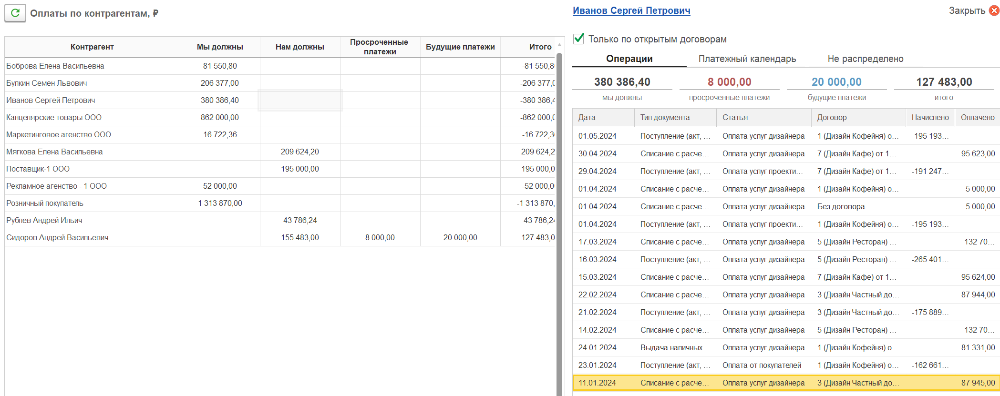

Отчет «Взаиморасчеты» предназначен для контроля задолженности между поставщиками и покупателями, а также для анализа планируемых платежей. Он может формироваться как по **бухгалтерскому**, так и по **управленческому учету**. В инструкции описаны все основные возможности и настройки.

{width=2581px height=613px}

{width=2568px height=706px}

:::tip 

**Для корректного отражения взаиморасчётов в управленческом учете необходима предварительная настройка.**\
[*Как настроить — см. в прикреплённой инструкции.*](./balans/vzaimoraschety-2)

:::

## **Доступные варианты отчёта**

При формировании отчёта можно выбрать один из двух режимов:

| **Вариант**                            | **Что показывает**                                                                               |
|----------------------------------------|--------------------------------------------------------------------------------------------------|
| **По остаткам**                        | Задолженность на выбранную дату, просроченные и будущие платежи (на основе платёжного календаря) |
| **Оборотно-сальдовая ведомость (ОСВ)** | Обороты за период: остаток на начало, начислено, оплачено, остаток на конец                      |

:::quote 

Для варианта «По остаткам» доступны дополнительные настройки (источник данных, дата платёжного календаря и др.).

:::

## **Основные блоки интерфейса**

Отчёт условно разделён на три смысловые части:

###  **Левый блок - настройки отчёта**

#### **1\. Вариант отчёта**

-  **По остаткам** или **Оборотно-сальдовая ведомость** 

#### **2\. Источник данных (только для «По остаткам»)**

-  **По бухучёту** – данные из бухгалтерских счетов (60, 62 и др.).

-  **По управленческому учёту** – данные из управленческого учёта (требуется предварительное включение в настройках модуля).

#### **3\. Вид договора**

-  **Покупатели** – отбор контрагентов-покупателей.

-  **Поставщики** – отбор контрагентов-поставщиков.

#### **4\. Дата платёжного календаря (только для варианта отчета «по остаткам»)**

Указывается дата, на которую формируется задолженность. Плановые данные о **просроченных** и **будущих** платежах подтягиваются из платёжного календаря именно на эту дату.

#### **5\. Отборы**

Позволяют сузить данные:

-  Организация

-  Контрагент

-  Статья движения денежных средств

-  Дополнительная аналитика 

-  Проект

#### **6\. Структура управленческого отчёта**

**Обязательна для заполнения** при использовании управленческого учёта. Определяет метод расчёта остатков взаиморасчётов. Если статья затрат/доходов не указана в структуре отчёта, по умолчанию используется **метод начисления**.

#### **7\. Группировка**

Задаёт уровень детализации **в строках отчёта** (сверху вниз). Можно включить группировку по:

-  Организациям

-  Видам договоров

-  Статьям

-  Дополнительной аналитике проекта

#### **8\. Детализация**

Уточняет данные **внутри контрагента**. Можно добавить несколько детализаций:

-  Договор

-  Статья

-  Дополнительная аналитика проекта

#### **9\. Сортировка**

Строки отчёта можно отсортировать:

-  По контрагенту (наименование)

-  По колонке «Мы должны» или «Нам должны»

## **Расшифровка суммы**

При нажатии на любую сумму в отчёте слева открывается **детальная расшифровка** (состав операций):

-  Какие операции были проведены

-  Данные платёжного календаря

-  Какие документы остались нераспределёнными

{width=2097px height=831px}

Состав расшифровки зависит от выбранного варианта отчёта.

##  **Блок остатков денежных средств (правый блок)**

-  **Остаток на дату отчёта** – фактические деньги на счетах/в кассе.

-  **Плановый остаток** – с учётом платёжного календаря (прогноз).

:::info Важные моменты.

Для работы с **управленческим учётом** необходимо предварительно включить соответствующую опцию в настройках модуля P&L.

Также перед формированием управленческого учета укажите структуру отчета ОПиУ.

Если по какой-то статье не задан метод учёта в структуре отчёта, система автоматически применяет **метод начисления**.

При выборе метода **«По деньгам»** задолженность по данной статье не возникает (обнуляется после оплаты).

:::